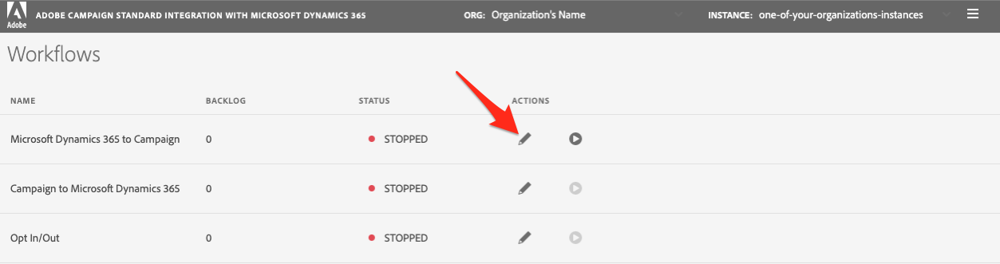

# Guida introduttiva all’app di integrazione self-service {#gs-self-service-app}

L’integrazione di Adobe Campaign Standard con l’applicazione di integrazione self-service di Microsoft Dynamics 365 consente di configurare i flussi di dati, controllare se sono in esecuzione o meno e in quale ambiente. È tuttavia necessario completare alcuni prerequisiti prima di iniziare a utilizzare l’applicazione di integrazione self-service.

## Concetti e restrizioni {#concepts-and-restrictions}

Prima di iniziare con lo strumento di integrazione, è necessario comprendere i concetti e le protezioni associati all’integrazione e adottare alcuni passaggi iniziali per ottenere l’accesso.

Ulteriori informazioni in queste sezioni:

* [Guida introduttiva all’integrazione con Microsoft Dynamics 365](../../integrating/using/d365-acs-get-started.md)
* [Best practice e limitazioni dell’integrazione](../../integrating/using/d365-acs-notices-and-recommendations.md)
* [Scopri i passaggi chiave per implementare questa integrazione](../../integrating/using/d365-acs-get-started.md#request-and-implement-this-integration)
* [Utilizzo dell&#39;integrazione con Microsoft Dynamics 365](../../integrating/using/d365-acs-using-the-integration.md)

## Prerequisiti {#self-service-app-prerequisites}

Devi configurare Microsoft Dynamics 365 e Adobe Campaign Standard in modo che l’app di integrazione possa accedere ai tuoi dati. La configurazione di Dynamics 365, Adobe Campaign Standard ed Adobe I/O richiederà del tempo; tuttavia, una volta configurati, potrai controllare l’integrazione tramite l’interfaccia utente dell’applicazione di integrazione self-service.

Ulteriori informazioni in queste sezioni:

* [Configurazione di Microsoft Dynamics 365 per l’integrazione con Campaign](../../integrating/using/d365-acs-configure-d365.md)
* [Configurazione di I/O Adobe](../../integrating/using/d365-acs-configure-adobe-io.md)
* [Mappatura delle risorse personalizzate di Campaign ed entità personalizzate di Microsoft Dynamics 365](../../integrating/using/d365-acs-notices-and-recommendations.md)

## Passaggi chiave per configurare l’app di integrazione self-service {#self-service-app-configuration-steps}

Puoi quindi iniziare con lo strumento di integrazione. Segui i passaggi seguenti:

1. [Accedere all’app di integrazione](../../integrating/using/d365-acs-self-service-app-control-access.md)
1. [Configurare l’app di integrazione per l’utilizzo](../../integrating/using/d365-acs-self-service-app-settings.md)
1. [Implementare la sincronizzazione dei dati](../../integrating/using/d365-acs-self-service-app-data-sync.md)
1. [Configurare i flussi di lavoro di sincronizzazione](../../integrating/using/d365-acs-self-service-app-workflows.md)

## Collegamento all’app di integrazione {#self-service-app-link}

Apri un browser e individua il connettore associato alla tua area geografica:

* [Asia-Pacifico](https://d365-acs-ap.ea.adobe.com/)
* [Europa, Medio Oriente o Africa (EMEA)](https://d365-acs-em.ea.adobe.com/)
* [Americhe](https://d365-acs-am.ea.adobe.com/)

## Conferma della richiesta di accesso a dati personali {#self-service-app-acknowledgement}

Quando si accede per la prima volta all’interfaccia utente self-service, viene visualizzato un messaggio di conferma della privacy. Prima di continuare, è necessario conoscere separatamente il proprio ruolo nell’esecuzione delle richieste di privacy in Campaign e Microsoft Dynamics 365.
Ulteriori informazioni sulle tue responsabilità in materia di privacy e su come gestire le richieste di privacy in [questa sezione](../../integrating/using/d365-acs-notices-and-recommendations.md#acs-msdyn-manage-privacy).

## Impostazione delle credenziali {#self-service-app-credentials}

Quando si passa all’interfaccia utente per la prima volta, viene visualizzata una pagina con un’intestazione simile al seguente:

>[!NOTE]
>
> È normale ricevere avvisi che indicano che non è &quot;possibile connettersi&quot; ad Adobe Campaign Standard o Microsoft Dynamics 365 se le impostazioni dell’app non sono ancora state configurate.

Verifica che le selezioni &quot;ORG&quot; e &quot;INSTANCE&quot; siano quelle che intendi configurare.  In caso contrario, fai clic sull’elenco a discesa e seleziona l’organizzazione e l’istanza corrette.

>[!IMPORTANT]
>
> Se stai configurando il connettore per la prima volta e/o sei nuovo di questo processo, allora **fortemente** ti invitiamo a selezionare l&#39;istanza &quot;stage&quot; o &quot;dev&quot;. Assicurati di verificare che la configurazione funzioni bene prima di tentare la configurazione in produzione.

Se hai l&#39;organizzazione e l&#39;istanza corrette, fai clic sul menu &quot;hamburger&quot; per esporre un menu a discesa. Quindi fai clic su **[!UICONTROL Settings...]** nel menu a discesa per visitare la pagina in cui immetti le tue credenziali per Microsoft Dynamics 365 e Campaign (vedi di seguito).

Nella pagina **[!UICONTROL Settings]** , compila le seguenti sezioni:

* Credenziali di Microsoft Dynamics 365
* Credenziali Adobe

Vai [qui](../../integrating/using/d365-acs-self-service-app-settings.md) per trovare informazioni più dettagliate su dove trovare le informazioni per ogni input. Al termine, fai clic sul pulsante **[!UICONTROL Save]** in basso.

## Controllare la configurazione iniziale {#self-service-app-initial-config}

Presupponendo di aver completato i prerequisiti di cui sopra e di aver aggiunto correttamente tutte le credenziali, passiamo ora alla pagina **[!UICONTROL Workflows]** . Ulteriori informazioni sui flussi di lavoro delle app di integrazione in [questa pagina](../../integrating/using/d365-acs-self-service-app-workflows.md).

Nella pagina **[!UICONTROL Workflows]** , fai clic sull’icona a forma di matita associata al flusso di lavoro **[!UICONTROL Microsoft Dynamics 365 to Campaign]** per modificarne la configurazione.

Nella pagina **[!UICONTROL Microsoft Dynamics 365 to Campaign]** puoi accedere all’elenco delle mappature delle tabelle configurate.  Per impostazione predefinita, viene impostata una mappatura contatto/profilo preconfigurata. Tutte le altre entità personalizzate dovranno essere configurate separatamente.

Nella pagina **[!UICONTROL Edit Table Mapping]** , seleziona la sezione **[!UICONTROL Mappings]** per verificare che i campi di Microsoft Dynamics 365 siano mappati sul campo corretto in Campaign. Per aggiungere altre mappature, effettua questa operazione ora, oltre a eventuali sostituzioni o filtri. [Ulteriori informazioni](../../integrating/using/d365-acs-self-service-app-data-sync.md).

Per aggiungere nuove mappature, consulta [questa sezione](../../integrating/using/d365-acs-self-service-app-data-sync.md#add-a-new-mapping) per ulteriori informazioni.

Una volta che la configurazione è corretta, fai clic sul pulsante **[!UICONTROL Play]** accanto al flusso di lavoro **[!UICONTROL Microsoft Dynamics 365 to Campaign]** per avviare l’integrazione e il flusso di dati.

>[!IMPORTANT]
>
>Si consiglia **fortemente** di eseguire prima questo nell&#39;ambiente Stage o Dev prima di essere eseguito in Produzione. Controlla che l&#39;istanza Stage/Dev sia selezionata nell&#39;intestazione.

Dopo l’esecuzione, è necessario essere in grado di eseguire il test aggiungendo o modificando le voci in Microsoft Dynamics 365 e osservando tali modifiche in Adobe Campaign in pochi minuti. Se in qualsiasi momento è necessario interrompere il processo, premere lo stesso pulsante per interromperlo. [Ulteriori informazioni](../../integrating/using/d365-acs-self-service-app-workflows.md#workflow-status)

## Area di lavoro dell&#39;app di integrazione {#self-service-app-workspace}

### Intestazione dell&#39;app {#app-header}

L’intestazione all’interno dell’app self-service ti consente di definire l’organizzazione e l’istanza che stai visualizzando e/o configurando.

Selezionare la **ORG** e la **ISTANZA** che si desidera visualizzare/modificare. Questi campi sono di sola lettura, tuttavia diventano modificabili quando si posiziona il cursore del mouse su di essi.

Quando fai clic sul pulsante con le tre linee orizzontali  a destra dell’intestazione viene visualizzato un menu a discesa.

Le voci nel menu a discesa sono:

* **Impostazioni**: Quando si seleziona questa opzione, viene visualizzata una schermata che consente di specificare le credenziali API per Microsoft Dynamics 365 e Adobe Campaign, nonché altre impostazioni generali per l’applicazione.

* **Documentazione**: Questa opzione è un collegamento alla documentazione Adobe Campaign specifica di questa integrazione

* **Assistenza** clienti: Questo è un collegamento alla documentazione di Experience Cloud relativa all’apertura di un ticket per l’Assistenza clienti

* **Disconnessione**: Questo ti disconnette dall’applicazione e ti consente di accedere nuovamente come un altro utente.

* **Informazioni su**: Viene visualizzata una finestra di dialogo contenente informazioni sull’applicazione, incluse le informazioni sul copyright.

### Breadcrumb {#app-breadcrumbs}

Le breadcrumb vengono visualizzate nella parte superiore di alcune schermate mentre navighi nell’app.

**Esempio:**

Di seguito è riportato un esempio dalla schermata **[!UICONTROL Edit Table Mapping]** che mostra le breadcrumb e il titolo della pagina. In questo caso, puoi fare clic sul testo **[!UICONTROL Workflows]** o **[!UICONTROL Microsoft Dynamics 365 to Campaign]** per passare a una delle schermate precedenti. **[!UICONTROL Edit Table Mapping]** in questo caso non è possibile fare clic sulle breadcrumb perché si tratta della schermata corrente.

### Pulsanti comuni {#app-buttons}

Le icone seguenti vengono utilizzate in più pagine nell’app self-service.

 - Aggiungi un nuovo elemento a un elenco.

 - Modifica qualcosa che esiste già

 - Eliminare un elemento da un elenco
