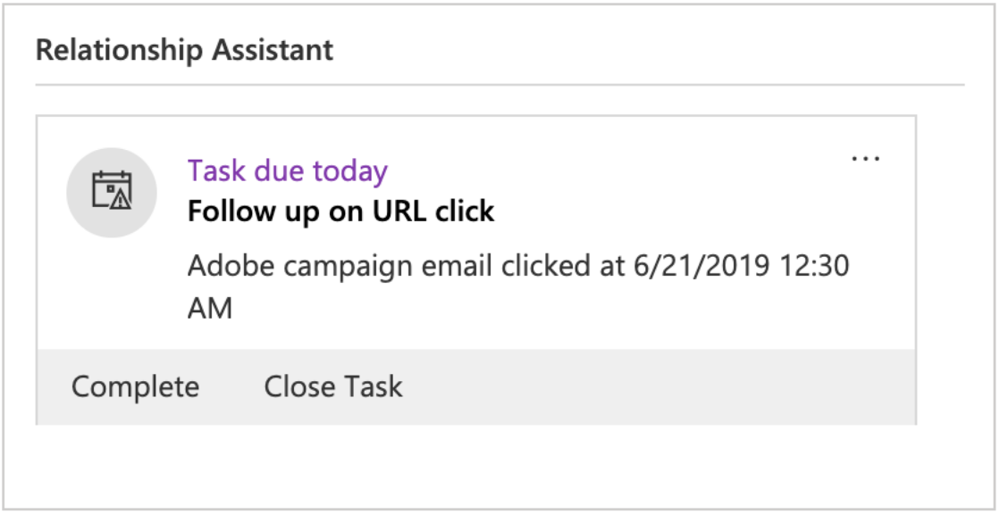

# Utilizzo dell’integrazione Microsoft Dynamics 365

Esistono diversi flussi di dati che l’integrazione di Adobe Campaign Standard con Microsoft Dynamics 365 esegue. Tali flussi sono descritti in [questa pagina](../../integrating/using/d365-acs-self-service-app-workflows.md).

Maggiori dettagli sui flussi di dati sono disponibili in questo documento nella sezione [Flussi di dati](#data-flows)  sezione .

## Esperienza utente Adobe Campaign Standard

Quando un contatto viene creato, modificato o eliminato (se è abilitato l’eliminazione) in Microsoft Dynamics 365, viene inviato ad Campaign Standard. Questi contatti saranno visibili nella schermata Profili di Campaign e possono essere indirizzati nelle campagne di marketing. Vedi la schermata Profili di seguito.

Quando un attributo di rinuncia viene modificato in Campaign, si rifletterà in Dynamics 365 se hai selezionato il **Unidirezionale (da Campaign a Microsoft Dynamics 365)** o **Bidirezionale** configurazione di rinuncia e se tale attributo è stato mappato correttamente.

## Esperienza utente con Microsoft Dynamics 365

In uscita, i seguenti eventi di marketing e-mail vengono inviati da Campaign a Dynamics 365 e visualizzati nella vista Timeline di Microsoft Dynamics 365 come attività personalizzate:

* Invia e-mail Adobe Campaign

* Apri e-mail Adobe Campaign

* Fai clic su URL e-mail Adobe Campaign

* Messaggio e-mail non recapitato di Adobe Campaign

Per visualizzare la Timeline di un contatto, accedi all’elenco dei contatti facendo clic su Sales Hub dal menu a discesa Dynamics 365. Quindi fare clic su Contatti sulla barra del menu a sinistra e selezionare un contatto.

>[!NOTE]
>
>La **Adobe Campaign per Microsoft Dynamics 365** Per visualizzare questi eventi, è necessario installare l’app in AppSource nella tua istanza di Microsoft Dynamics 365. [Ulteriori informazioni](../../integrating/using/d365-acs-configure-d365.md#install-appsource-app).

Di seguito è riportato un&#39;istantanea della schermata Contatti per &quot;Dynamics User&quot;. Nella vista Timeline, noterai che all’utente di Dynamics è stato inviato un messaggio e-mail associato con Nome campagna &quot;2019LoyaltyCamp&quot; e Nome consegna &quot;DM190&quot;. L’utente di Dynamics ha aperto l’e-mail e ha fatto clic su un URL nell’e-mail; entrambe queste azioni hanno creato eventi che mostrano anche di seguito. Se si guarda l’angolo a destra, verrà visualizzata la scheda Report Assistant (RA); al momento, contiene un’attività da seguire sull’URL selezionato.

Di seguito sono riportati alcuni dettagli della visualizzazione Timeline per l’utente di Dynamics.

Di seguito è riportato un primo piano della scheda di Relationship Assistant (RA). L’app AppSource contiene un flusso di lavoro che controlla un evento di clic dell’URL e-mail di Adobe. Quando si verifica questo evento, crea un&#39;attività e imposta una data di scadenza. Questo consente di visualizzare l&#39;attività nella scheda RA, conferendogli una visibilità aggiuntiva. Esiste un flusso di lavoro simile, ad Adobe, per gli eventi di rimbalzo e-mail, con l’aggiunta di un’attività per riconciliare l’indirizzo e-mail non valido. Questi flussi di lavoro possono essere disattivati nella soluzione .

Se fai clic sull’oggetto dell’evento di invio, visualizzerai un modulo simile a quello sottostante. I moduli per gli eventi open e bounce sono simili.

Il modulo per gli eventi di clic dell’url e-mail aggiunge un attributo aggiuntivo per l’URL su cui hai fatto clic:

Segue un elenco degli attributi e una descrizione:

* **Oggetto**: Oggetto dell&#39;evento; composto dall’ID campagna e dall’ID consegna della consegna e-mail

* **Proprietario**: Utente dell&#39;applicazione creato nei passaggi successivi al provisioning

* **Riguardo**: Nome del contatto

* **Nome campagna**: ID campagna in Campaign Standard

* **Nome consegna**: ID consegna in Campaign Standard

* **Data di invio/apertura/clic/rimbalzo**: Data/ora in cui è stato creato l’evento

* **URL di tracciamento**: URL su cui è stato fatto clic

* **URL pagina speculare**: URL della pagina speculare dell’e-mail inviata/aperta/su cui è stato fatto clic/su cui è stato fatto clic/su cui è stato effettuato un rimbalzo. Il periodo di scadenza della pagina speculare e-mail può essere modificato nella schermata di configurazione dell’attività del canale e-mail Campaign corrispondente. [Ulteriori informazioni](../../administration/using/configuring-email-channel.md#validity-period-parameters).

>[!NOTE]
>
>Per la rinuncia, quando un attributo di rinuncia viene modificato in Microsoft Dynamics 365, questo si rifletterà in Campaign se hai selezionato il **Unidirezionale (da Campaign a Microsoft Dynamics 365)** o **Bidirezionale** configurazione di rinuncia e se tale attributo è stato mappato correttamente.

## Flussi di dati {#data-flows}

### Ingresso di entità personalizzate e di contatto

Record nuovi, aggiornati ed eliminati (Nota: devono essere eliminati) sono inviati dalla tabella dei contatti di Microsoft Dynamics 365 alla tabella dei profili di Campaign.

Le mappature delle tabelle possono essere configurate nell’interfaccia utente dell’applicazione di integrazione per mappare gli attributi della tabella di Microsoft Dynamics 365 agli attributi della tabella di Campaign. Le mappature della tabella possono essere modificate per aggiungere/rimuovere attributi, in base alle esigenze.

L&#39;esecuzione iniziale del flusso di dati è progettata per trasferire tutti i record mappati, compresi quelli contrassegnati come &quot;inattivi&quot;; successivamente, l’integrazione elabora solo gli aggiornamenti incrementali. Fa eccezione il caso in cui i dati vengano riprodotti o se un filtro è configurato; è possibile configurare regole di filtro di base basate su attributi per determinare quali record sincronizzare in Campaign.

Le regole di sostituzione di base possono essere configurate nell&#39;interfaccia utente dell&#39;applicazione di integrazione per sostituire un valore di attributo con un valore diverso (ad esempio, &quot;verde&quot; per &quot;#00FF00&quot;, &quot;F&quot; per 1, ecc.).

A seconda del volume di record, potrebbe essere necessario utilizzare l’archiviazione SFTP di Campaign per il trasferimento iniziale dei dati. [Ulteriori informazioni](#initial-data-transfer).

Per il corretto funzionamento dell’ingresso contatto, l’attributo externalId della tabella di profilo di Campaign deve essere compilato con l’attributo contatto contactId di Dynamics 365. Le entità personalizzate di Campaign devono essere compilate anche con un attributo ID univoco di Dynamics 365; tuttavia, questo attributo può essere memorizzato in qualsiasi attributo di entità personalizzata di Campaign (cioè, non deve essere externalId).

>[!NOTE]
>
>Per l’ingresso di entità personalizzate, il tracciamento delle modifiche deve essere abilitato in Dynamics 365 per le entità personalizzate sincronizzate.

#### Entità personalizzate

La [Integrazione Microsoft Dynamics 365-Adobe Campaign Standard](../../integrating/using/d365-acs-get-started.md) supporta le entità personalizzate, consentendo la sincronizzazione delle entità personalizzate in Dynamics 365 con le risorse personalizzate corrispondenti in Campaign.

I nuovi dati nelle risorse personalizzate possono essere utilizzati per diversi scopi, tra cui la segmentazione e la personalizzazione.

L’integrazione supporta sia tabelle collegate che non collegate. Il collegamento è supportato fino a tre livelli (ovvero livello1->livello2->livello3).

>[!IMPORTANT]
>
>Se un record di risorse personalizzate di Campaign contiene informazioni personali, si applicano consigli specifici. Ulteriori informazioni [in questa sezione](../../integrating/using/d365-acs-notices-and-recommendations.md#acs-msdyn-manage-data).

Durante la configurazione dei flussi di dati di entità personalizzati, è importante tenere presente quanto segue:

* La creazione e la modifica di risorse personalizzate di Campaign sono operazioni sensibili che devono essere eseguite solo da utenti esperti.
* Per i flussi di dati di entità personalizzati, il tracciamento delle modifiche deve essere abilitato in Dynamics 365 per le entità personalizzate sincronizzate.
* Se in Dynamics 365 viene creato un record figlio padre e collegato in modo simile, a causa dell’elaborazione parallela dell’integrazione, è possibile scrivere un nuovo record figlio in Campaign prima del record padre.

* Se l’elemento padre e l’elemento figlio sono collegati sul lato Campaign utilizzando **1 cardinalità semplice collegamento** il record figlio rimarrà nascosto e inaccessibile (tramite interfaccia utente o API) fino all’arrivo del record principale in Campaign.

* (Supponendo **1 cardinalità semplice collegamento** in Campaign) Se il record figlio viene aggiornato o eliminato in Dynamics 365 e tale modifica viene scritta in Campaign prima che il record padre venga visualizzato in Campaign (non probabile, ma possibilità remota), tale aggiornamento o eliminazione non verrà elaborato in Campaign e verrà generato un errore. In caso di aggiornamento, il record in questione dovrà essere nuovamente aggiornato in Dynamics 365 per sincronizzare il record aggiornato. In caso di cancellazione, è necessario provvedere separatamente al record in questione sul lato Campaign, in quanto non esiste più un record in Dynamics 365 da eliminare o aggiornare.

* Se ti trovi in una situazione in cui ritieni di avere dei record figlio nascosti e non hai modo di accedervi, puoi cambiare temporaneamente il tipo di collegamento della cardinalità in **0 o 1 collegamento semplice cardinalità** per accedere a tali documenti.

Puoi trovare una panoramica più completa delle risorse personalizzate di Campaign [in questa sezione](../../developing/using/key-steps-to-add-a-resource.md).

### Flusso degli eventi di e-mail marketing{#email-marketing-event-flow}

Gli eventi di marketing e-mail vengono inviati da Campaign a Microsoft Dynamics 365 per essere visualizzati nella vista Timeline.

Tipi di eventi di marketing supportati:
* Invia - e-mail inviata al destinatario
* Apri: e-mail aperta dal destinatario
* Click - URL all’interno dell’e-mail su cui il destinatario fa clic
* Rimbalzo - email al destinatario ha avuto un duro rimbalzo

In Dynamics 365 vengono visualizzati i seguenti attributi di evento:
* Nome della campagna di marketing
* Nome della consegna e-mail
* Timestamp
* URL della pagina speculare e-mail
* URL cliccato (solo eventi clic)

Gli eventi di marketing e-mail possono essere attivati/disabilitati per tipo (invio, apertura, clic, mancato recapito) in modo che solo i tipi di evento selezionati vengano passati a Dynamics 365.

### Flusso di rinuncia {#opt-out-flow}

I valori di rinuncia (ad esempio, elenco Bloccati) sono sincronizzati tra i sistemi; al momento dell’onboarding, puoi scegliere tra le seguenti opzioni:

* **Unidirezionale (da Microsoft Dynamics 365 a Campaign)**: Dynamics 365 è una fonte di verità per le rinunce. Gli attributi di rinuncia verranno sincronizzati in una direzione da Dynamics 365 a Campaign Standard&quot;
* **Unidirezionale (da Campaign a Microsoft Dynamics 365)**: Campaign Standard è la fonte di verità per le rinunce. Gli attributi di rinuncia verranno sincronizzati in una direzione da Campaign Standard a Dynamics 365
* **Bidirezionale**: Dynamics 365 E Campaign Standard sono entrambe fonti di verità. Gli attributi di rinuncia verranno sincronizzati bidirezionalmente tra Campaign Standard e Dynamics 365

In alternativa, se disponi di un processo separato per gestire la sincronizzazione di rinuncia tra i sistemi, il flusso di dati di rinuncia dell’integrazione può essere disabilitato.

>[!NOTE]
>
>Nell’interfaccia utente dell’applicazione di integrazione, le **Unidirezionale (da Microsoft Dynamics 365 a Campaign)** e **Bidirezionale** i casi di utilizzo di rinuncia sono configurati in un flusso di lavoro di rinuncia separato. [Ulteriori informazioni](../../integrating/using/d365-acs-self-service-app-data-sync.md#opt-in-out-wf).
>
>La **Unidirezionale (da Campaign a Microsoft Dynamics 365)** il caso d’uso di rinuncia è un’eccezione; è configurato all’interno del flusso di lavoro Ingresso (contatto con profilo).

La mappatura del flusso di rinuncia deve essere specificata dal cliente, in quanto i requisiti aziendali possono differire tra le diverse aziende. Sul lato Campaign, solo gli attributi di rinuncia OOTB possono essere utilizzati per la mappatura di rinuncia:

* elenco Bloccati
* denyListEmail
* denyListFax
* denyListMobile
* denyListPhone
* denyListPostalMail
* denyListPushnotification
* ccpaOptOut

In Dynamics 365, la maggior parte dei campi di rinuncia ha il prefisso &quot;donot&quot;; tuttavia, puoi anche utilizzare altri attributi a scopo di rinuncia se i tipi di dati sono compatibili.

### Trasferimento dati iniziale {#initial-data-transfer}

Il trasferimento iniziale dei dati potrebbe richiedere un po&#39; di tempo a seconda del numero di record che si stanno acquisendo da Microsoft Dynamics 365. Dopo il trasferimento iniziale dei dati, l&#39;integrazione riprenderà gli aggiornamenti incrementali.
