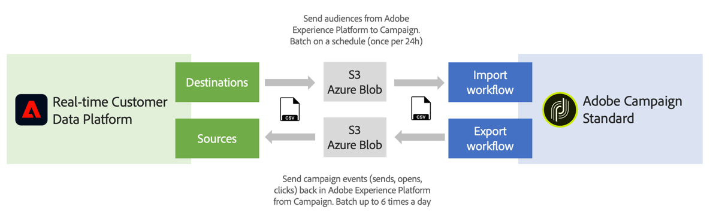

# Guida introduttiva a Origini e Destinazioni {#rtcdp}

## Informazioni su origini e destinazioni

Con Adobe Experience Platform è possibile condividere i dati tra Campaign Standard e Adobe Real-time Customer Data Platform (RTCDP). Questo ti consente di eseguire il targeting dei tipi di pubblico di Adobe Experience Platform nei flussi di lavoro di Campaign, quindi di inviare nuovamente ad Adobe i dati Real-time Customer Data Platform relativi a questi tipi di pubblico come invii, aperture e clic.

* Con **Destinazioni**, assimila i tipi di pubblico da Adobe Experience Platform a Campaign Standard. Questo consente di attivare i dati noti e sconosciuti per le campagne di marketing.
* Con **Origini**, esporta i dati di Campaign Standard (ad esempio, invia, apre, clic) in Adobe Experience Platform. Questo ti consente di centralizzare i dati raccolti da fonti diverse in un unico luogo e di utilizzare le informazioni raccolte per fare di più.

>[!IMPORTANT]
>
>Tieni presente i limiti di archiviazione SFTP, i limiti di archiviazione del database e i limiti dei profili attivi in base al contratto Adobe Campaign durante l’esecuzione di questa integrazione.

Per una panoramica più dettagliata di Adobe Real-time Customer Data Platform, Destinazioni e Origini, consulta queste pagine:

* [Adobe Real-time Customer Data Platform](https://experienceleague.adobe.com/docs/experience-platform/rtcdp/overview.html)
* [Documentazione sulle destinazioni](https://experienceleague.adobe.com/docs/experience-platform/destinations/home.html)
* [Documentazione di Origini](https://experienceleague.adobe.com/docs/experience-platform/sources/home.html)

## Connetti Campaign Standard con Adobe Experience Platform

Per poter condividere i dati tra Adobe Experience Platform e Campaign Standard, è innanzitutto necessario collegare Adobe Campaign come **Destinazione** e collegare il percorso di archiviazione BLOB AWS S3 o Azure come **Origine** in Adobe experience Platform.

Una volta configurati i connettori, puoi impostare un’importazione o un’esportazione di dati in Campaign Standard tramite flussi di lavoro.

Per ulteriori informazioni su come impostare questi processi di importazione ed esportazione, consulta le sezioni seguenti:

* [Inserire il pubblico di Adobe Experience Platform in Campaign](../../integrating/using/ingest-aep-data.md)
* [Esportare dati da Campaign a Adobe Experience Platform](../../integrating/using/export-campaign-data.md)
