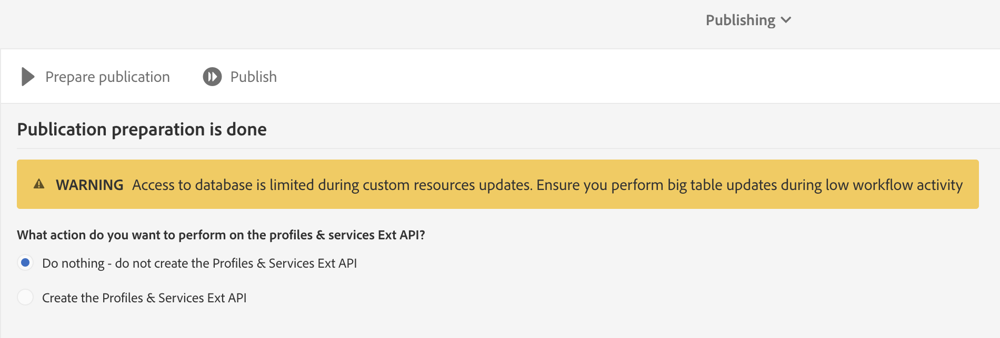

# Mappatura delle risorse personalizzate di Campaign ed entità personalizzate di Dynamics 365

Scopri come mappare risorse personalizzate ed entità personalizzate nel contesto dell&#39;integrazione tra Adobe Campaign Standard e Microsoft Dynamics 365.

## Prerequisiti

La nuova versione dell&#39;integrazione  Microsoft Dynamics 365-Adobe Campaign Standard supporta le entità personalizzate.  Questo consente di replicare le entità personalizzate in Dynamics 365 sulle risorse personalizzate corrispondenti in Campaign.

Una volta replicati, i nuovi dati nelle risorse personalizzate possono essere utilizzati per diversi scopi, tra cui segmentazione e personalizzazione.

>[!CAUTION]
>
>Se un record di risorse personalizzate della campagna contiene informazioni personali applicabili all&#39;uso di Campaign da parte del cliente, tale record deve essere collegato a un record di profilo della campagna corrispondente (direttamente o tramite un&#39;altra risorsa personalizzata), in modo che un&#39;eliminazione correlata alla privacy nel record di profilo possa anche eliminare il record di risorse personalizzate collegato contenente informazioni personali; le opzioni di collegamento ed eliminazione tra le entità devono essere configurate per consentire la rimozione in cascata dei record collegati. Le informazioni personali non devono essere inserite in una risorsa personalizzata non collegata al profilo.

Una panoramica più completa delle risorse personalizzate per Campaign è disponibile [in questo collegamento](../../developing/using/key-steps-to-add-a-resource.md).

Per configurare l&#39;integrazione per le entità personalizzate, contattate [adobe-support@unifisoftware.com](mailto:adobe-support@unifisoftware.com) per richiedere l&#39;esecuzione di questa operazione.  Unifi richiederà i nomi delle tabelle di entità personalizzate in entrambi i sistemi, così come le mappature di attributi desiderate.  Unifi creerà quindi i processi e le pianificazioni corrispondenti.

Di seguito è riportato un esempio di utilizzo del supporto personalizzato per le entità.

>[!CAUTION]
>
>* Le risorse personalizzate pubblicate prima della versione Campaign Standard 19.4 **dovranno essere ripubblicate** per essere utilizzate con l&#39;integrazione.
>* La creazione e la modifica di risorse personalizzate di Campaign Standard sono operazioni sensibili che devono essere eseguite solo da utenti esperti.

## Caso d’uso

### Stato iniziale

Il cliente dispone di un veicolo entità personalizzato predefinito in Dynamics 365 e di un corrispondente veicolo di risorse personalizzato predefinito in Campaign Standard.  Il cliente ha fornito i dettagli di mappatura delle entità personalizzate a Unifi, e Unifi ha impostato i processi e i programmi per la risorsa personalizzata del veicolo, in Unifi.

|   | Microsoft Dynamics 365 | Adobe Campaign Standard | Note |
|---|---|---|---|
| Entità di livello principale | Contatto | Profilo | Entità standard pronte all&#39;uso |
| Entità collegata | Veicolo - nuova entità personalizzata | Veicolo - nuova risorsa personalizzata | Nuove entità personalizzate |
| Tipo di collegamento | Collegamento parentale al contatto con N:1 | Simile a Dynamics 365 - consulta la sezione Campagna di seguito per i dettagli |   |

### Configurazione in Dynamics 365

Le entità personalizzate del cliente in Dynamics 365 possono essere visualizzate nel Pannello vendite facendo clic sul menu a discesa accanto a Dynamics 365.  Le entità personalizzate del cliente sono raggruppate in **[!UICONTROL Extensions]**.

I dati del veicolo possono essere visualizzati facendo clic sull&#39;entità **[!UICONTROL vehicle]** personalizzata.  Cfr. l&#39;elenco dei veicoli riportato di seguito.

La relazione dell&#39; **[!UICONTROL vehicle]** entità con l&#39; **[!UICONTROL Contact]** entità può essere visualizzata di seguito. **[!UICONTROL Parental]** è stato scelto per il **[!UICONTROL Type of Behavior]**.

### Configurazione in Campaign Standard

In Campaign, le risorse personalizzate del cliente possono essere visualizzate facendo clic **[!UICONTROL Adobe Campaign]** nell&#39;angolo in alto a sinistra, quindi selezionando **[!UICONTROL Client data]**.

### Mappatura di risorse personalizzate ed entità personalizzate

La risorsa **[!UICONTROL vehicle]** personalizzata doveva essere precedentemente predefinita dal cliente e doveva essere visualizzata nei dati del cliente; tuttavia, passiamo ai passaggi successivi per la creazione di questa risorsa **[!UICONTROL vehicle]** personalizzata.

Fate clic su **[!UICONTROL Adobe Campaign]** nell&#39;angolo superiore sinistro, quindi fate clic su **[!UICONTROL Administration > Development > Custom Resources]**.

1. Fate clic su **[!UICONTROL Custom Resources]**.
1. Fate clic sul **[!UICONTROL Create]** pulsante.  Viene aperta una finestra a comparsa.
1. Seleziona **[!UICONTROL Create a new resource]** e immetti **[!UICONTROL Vehicle]** come etichetta e ID.
1. Clic **[!UICONTROL Create]**.

Campaign visualizzerà quindi le strutture dei dati e la pagina di collegamento.  Sono stati aggiunti diversi campi.

* ID del veicolo è l’identificatore unico per l’ **[!UICONTROL Vehicle]** entità; il relativo ID deve essere esattamente **[!UICONTROL externalId]**, come mostrato di seguito, affinché l&#39;integrazione funzioni.
* Profilo associato è l’ID del profilo a cui è collegato il record del veicolo; quando è collegato, verrà collegato al **[!UICONTROL externalId]** campo della tabella Profilo.
* VIN e Nome del veicolo sono campi per acquisire informazioni sul veicolo.

>[!CAUTION]
>
>Ciascuna risorsa personalizzata deve avere un campo univoco con un ID di externalId (esattamente).  Questo campo viene associato al campo ID della risorsa personalizzata in Dynamics 365 (vedere di seguito).

### Definire i tasti di identificazione

Il passo successivo consiste nel definire i tasti di identificazione.  Innanzitutto, create i tasti di identificazione, come illustrato di seguito.

Nella schermata Definizione chiave, accertatevi di selezionare il **[!UICONTROL externalId]** campo.

>[!CAUTION]
>
>Ciascuna risorsa personalizzata deve avere una chiave di identificazione con un percorso &quot;externalId&quot; (esattamente).

### Definire il filtro

Il passaggio successivo consiste nel specificare la definizione del filtro.

In **[!UICONTROL Filter Definition]**, fare clic su **[!UICONTROL Add an element]**.\
Assegnare l&#39;etichetta e assegnare l&#39;ID al nome **[!UICONTROL ExternalId]**.
Clic **[!UICONTROL Add]**.

Ora, fai clic su Modifica sul nuovo elemento filtro aggiunto e configura il filtro per l’immagine sottostante.  Se si immette **[!UICONTROL externalId]** nel **[!UICONTROL Parameters]** campo e si fa clic sul segno più, **[!UICONTROL externalId_parameter]** verrà visualizzato.  Selezionate questo come parametro.

### Definire il collegamento

Verrà quindi specificato il collegamento della risorsa personalizzata.  In questo caso, abbiamo scelto di collegare l&#39;entità **[!UICONTROL Vehicles]** personalizzata (origine) all&#39;entità dei profili (destinazione) utilizzando un **[!UICONTROL 1 cardinality simple link]**.

1. Nella **[!UICONTROL Link definitions]** schermata, scegliete l’opzione di eliminazione: **[!UICONTROL Deleting the target record implies deleting records referenced by the link]**. Questa opzione viene scelta in modo che, quando si elimina un profilo, vengano eliminati anche **[!UICONTROL Vehicle]** i record collegati a tale profilo.
1. In **[!UICONTROL Join Definitions]**, selezionate **[!UICONTROL Define specific join conditions]**.
1. Quindi fate clic su **[!UICONTROL Add an element]**.

Per la definizione di join, immettiamo i valori seguenti.

La **[!UICONTROL @externalId]** voce è il campo externalId della tabella del profilo e la **[!UICONTROL ProfileExternalId]** voce è l&#39;ID del campo corrispondente nella risorsa personalizzata veicoli.  Quando il valore externalId di un record di profilo viene immesso nel **[!UICONTROL ProfileExternalId]** campo di un record di veicolo, i due record saranno collegati tra loro.

Confermate le modifiche e salvate l&#39;entità personalizzata.

### Pubblicare e controllare gli aggiornamenti

Il passo finale consiste nel pubblicare la risorsa personalizzata.

1. Fate clic su **[!UICONTROL Adobe Campaign]** nell&#39;angolo superiore sinistro, fate clic su **[!UICONTROL Administration > Development > Publishing]**.
1. Mantenete l’opzione predefinita: **[!UICONTROL Determine modifications since the last publication]**.
1. Fare clic **[!UICONTROL Prepare Publication]** e attendere il completamento.

Fare clic **[!UICONTROL Publish]** e attendere il completamento.

### Programma di ingresso Unifi

Presupponendo che il cliente abbia già popolato l&#39;entità personalizzata del veicolo in Dynamics 365 e che Unifi abbia impostato i propri processi di entità personalizzata del veicolo e i relativi programmi con, il cliente dovrebbe essere in grado di avviare il programma di ingresso per l&#39;entità veicolo.

Dopo il completamento del processo di ingresso, i dati del veicolo ora possono essere visualizzati nella risorsa personalizzata **[!UICONTROL Vehicle]** popolata di recente in Campaign.

**Argomenti correlati**

* [Utilizzo di Adobe Campaign Standard - Microsoft Dynamics 365](../../integrating/using/working-with-campaign-standard-and-microsoft-dynamics-365.md)
* [Passaggi chiave per aggiungere una risorsa personalizzata in Campaign](../../developing/using/key-steps-to-add-a-resource.md)
