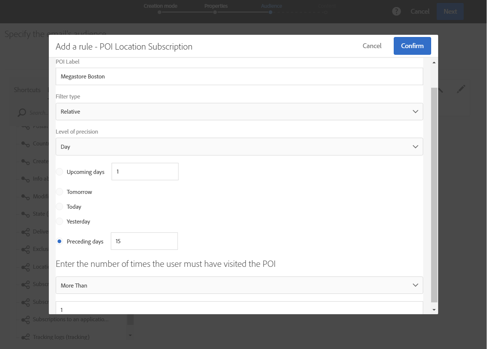

# Personalizzazione dei messaggi della campagna con i dati dei punti di interesse{#personalizing-campaign-messages-with-point-of-interest-data}

In Adobe Campaign, puoi utilizzare i dati dei punti di interesse raccolti dagli abbonati all'applicazione mobile per inviare loro messaggi di marketing personalizzati, ad esempio un'e-mail.

Puoi reagire solo sui dati dei punti di interesse con consegne standard. [I messaggi](../../channels/using/about-transactional-messaging.md) transazionali non possono utilizzare i dati sulla posizione.

La prima reazione è di circa 10 minuti.

In questo caso, si decide di inviare un'e-mail a tutti gli abbonati che hanno visitato il vostro Boston Store nelle ultime due settimane.

1. Creare un'attività di e-mail marketing.
1. Quando definite il pubblico della distribuzione, trascinate l' **[!UICONTROL Subscriptions to an application]** elemento nell'area di lavoro.

   

   La gestione delle audience è dettagliata nella sezione [Definizione delle audience](../../audiences/using/creating-audiences.md) .

1. Nella **[!UICONTROL Add a rule - Profile/Subscriptions to an application]** finestra, trascinate l’ **[!UICONTROL POI Location Subscription]** elemento nell’area di lavoro.

   

1. Nella **[!UICONTROL Add a rule - POI Location Subscription]** finestra, immettere l'etichetta del punto di interesse che si desidera utilizzare.

   

1. Nel **[!UICONTROL Filter type]** campo selezionare **[!UICONTROL Relative]**.
1. Selezionare l' **[!UICONTROL Preceding days]** opzione e immettere **[!UICONTROL 15]** nel campo corrispondente.
1. Definisci quante volte l'utente deve aver visitato il punto di interesse.
1. Fate clic **[!UICONTROL Confirm]** per salvare il pubblico.

   

1. Aggiungete contenuto all’e-mail.

   

1. Confermate la creazione dell'attività per visualizzare il dashboard dell'e-mail.
1. Invia il tuo messaggio.

L'e-mail con l'offerta di sconto del 10% verrà inviata agli abbonati che:

* Ho visitato il tuo Boston Store almeno una volta nelle ultime due settimane.
* L'applicazione mobile è stata messa in primo piano almeno una volta durante la visita.

**Argomenti correlati:**

* [Creazione di un messaggio e-mail](../../channels/using/creating-an-email.md)
* [Definizione del contenuto](../../designing/using/personalization.md#example-email-personalization)
* [Invio di messaggi](../../sending/using/confirming-the-send.md)

