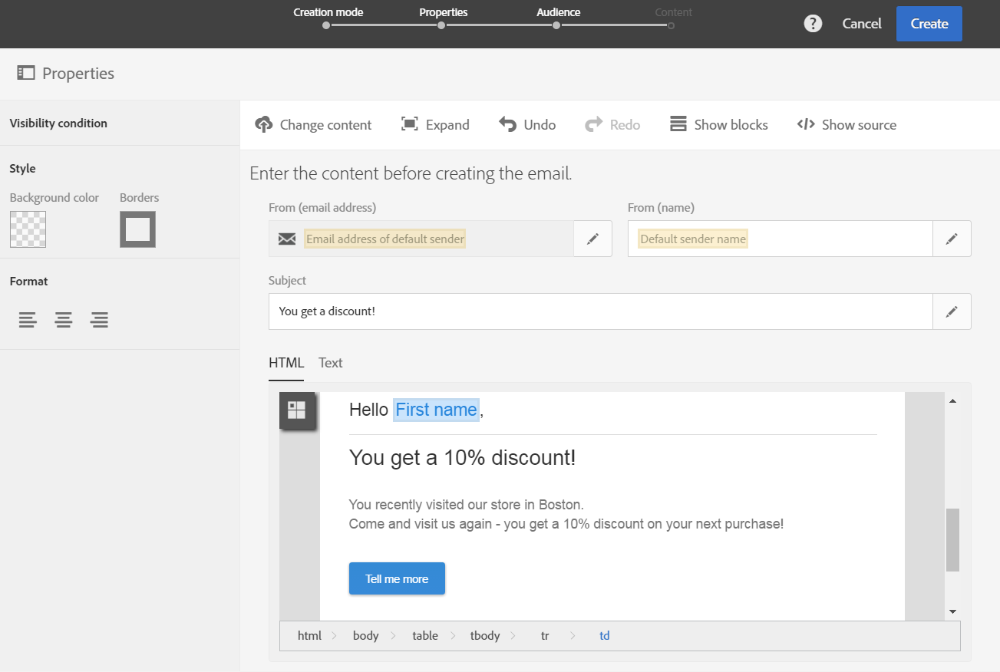

# Personalizing Campaign messages with Point of Interest data{#personalizing-campaign-messages-with-point-of-interest-data}

In Adobe Campaign, puoi utilizzare i dati dei punti di interesse raccolti dagli abbonati dell'applicazione mobile per inviare messaggi di marketing personalizzati, ad esempio un messaggio e-mail.

Puoi reagire solo ai dati dei punti di interesse con le consegne standard. [I messaggi transazionali](../../channels/using/about-transactional-messaging.md) non possono utilizzare i dati sulla posizione.

Il primo problema è circa 10 minuti.

In questo caso, decidi di inviare un messaggio e-mail a tutti gli iscritti che hanno visitato il tuo negozio Boston nelle ultime due settimane.

1. Create un'attività di marketing tramite e-mail.
1. When defining the delivery's audience, drag and drop the **[!UICONTROL Subscriptions to an application]** element into the workspace.

   

   Managing audiences is detailed in the [Defining audiences](../../audiences/using/creating-audiences.md) section.

1. In the **[!UICONTROL Add a rule - Profile/Subscriptions to an application]** window, drag and drop the **[!UICONTROL POI Location Subscription]** element into the workspace.

   

1. In the **[!UICONTROL Add a rule - POI Location Subscription]** window, enter the label of the Point of Interest that you want to use.

   

1. In the **[!UICONTROL Filter type]** field, select **[!UICONTROL Relative]**.
1. Check the **[!UICONTROL Preceding days]** option and enter **[!UICONTROL 15]** in the corresponding field.
1. Definire il numero di volte in cui l'utente deve aver visitato il punto di interesse.
1. Click **[!UICONTROL Confirm]** to save your audience.

   

1. Aggiungete contenuto all'e-mail.

   

1. Confermate la creazione dell'attività per visualizzare il dashboard dell'e-mail.
1. Invia il messaggio.

L'e-mail con l'offerta sconto 10% verrà inviata agli utenti iscritti che:

* Visitato il Boston Store almeno una volta nelle ultime due settimane.
* La tua applicazione mobile è stata in primo piano almeno una volta durante la visita.

**Argomenti correlati:**

* [Creazione di un'e-mail](../../channels/using/creating-an-email.md)
* [Definizione del contenuto](../../designing/using/example--email-personalization.md)
* [Invio di messaggi](../../sending/using/confirming-the-send.md)

