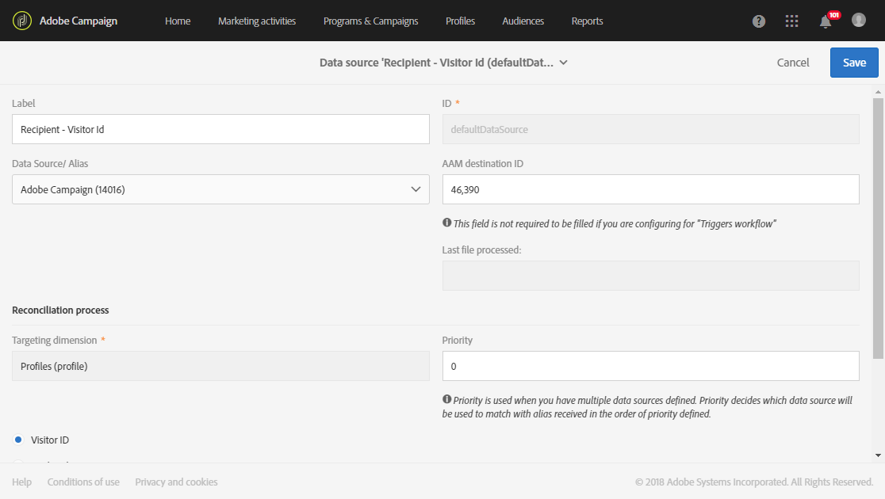

# Provisioning e configurazione dell'integrazione con i servizi di base di Audience Manager o Persone{#provisioning-and-configuring-integration-with-audience-manager-or-people-core-service}

Il provisioning e la configurazione del core Audience Manager e Persone in Adobe Campaign si svolgono in due passaggi: [Inviare una richiesta ad Adobe](#submitting-request-to-adobe) e quindi [configurare l'integrazione in Adobe Campaign](#configuring-the-integration-in-adobe-campaign).

## Invio della richiesta ad Adobe {#submitting-request-to-adobe}

L'integrazione con i servizi di base di Audience Manager (AAM) o Persone consente di importare ed esportare audience o segmenti in Adobe Campaign.

Questa integrazione deve prima essere configurata. Per richiedere il provisioning di questa integrazione, scrivete un messaggio e-mail a [Digital-Request@adobe.com](mailto:Digital-Request@adobe.com) con le seguenti informazioni:

<table> 
 <tbody> 
  <tr> 
   <td> <strong>Tipo di richiesta:</strong>  </td> 
   <td> Configurare l'integrazione dei servizi di base AAM/People-Campaign </td> 
  </tr> 
  <tr> 
   <td> <strong>Nome organizzazione:</strong>  </td> 
   <td> Nome organizzazione </td> 
  </tr> 
  <tr> 
   <td> <strong>ID organizzazione IMS</strong>  </td> 
   <td> L’ID organizzazione IMS.   Puoi trovare il tuo ID organizzazione IMS in Experience Cloud, nel menu Amministrazione. Viene fornito anche quando ti connetti per la prima volta ad Adobe Experience Cloud. </td> 
  </tr> 
  <tr> 
   <td> <strong>Ambiente:</strong>  </td> 
   <td> Esempio: Produzione </td> 
  </tr> 
  <tr> 
   <td> <strong>AAM o Servizio Persone</strong>  </td> 
   <td> Esempio: Adobe Audience Manager </td> 
  </tr> 
  <tr> 
   <td> <strong>ID dichiarato o ID visitatore</strong>  </td> 
   <td> Esempio: ID dichiarato </td> 
  </tr> 
  <tr> 
   <td> <strong>Informazioni aggiuntive</strong>  </td> 
   <td> Eventuali informazioni o commenti utili </td> 
  </tr> 
 </tbody> 
</table>

* **[!UICONTROL Declared ID]** funziona per ogni integrazione di audience condivisa. Se utilizzate il servizio di base Persone, l'utilizzo di **[!UICONTROL Declared ID]** può cambiare a seconda della soluzione:

* Se i tipi di pubblico sono condivisi da Adobe Campaign ad Adobe Target tramite il servizio di base Persone, **[!UICONTROL Declared ID]** è possibile effettuare il provisioning.
* Se i tipi di pubblico sono condivisi da Adobe Campaign ad Ad Cloud tramite il servizio di base Persone, non potrai utilizzare il **[!UICONTROL Declared ID]** provisioning per il backfill storico dei tipi di pubblico. È inoltre prevista una certa latenza durante la creazione di audience.
* Se i tipi di pubblico vengono condivisi da Adobe Analytics ad Adobe Campaign tramite il servizio core Persone, i segmenti non verranno popolati in Adobe Campaign con **[!UICONTROL Declared ID]**.

Se utilizzi Adobe Audience Manager invece del servizio core Persone, **[!UICONTROL Declared ID]** funzionerà in tutti gli scenari.

Potete inoltrare una richiesta di **[!UICONTROL Declared ID]** provisioning al seguente indirizzo: [Digital-Request@adobe.com](mailto:Digital-Request@adobe.com).

## Configurazione dell'integrazione in Adobe Campaign {#configuring-the-integration-in-adobe-campaign}

Dopo aver inviato questa richiesta, Adobe procederà al provisioning dell'integrazione e vi contatterà per fornire i dettagli e le informazioni necessari per completare la configurazione:

* [Passaggio 1: Configurare o controllare gli account esterni in Adobe Campaign](#step-1--configure-or-check-the-external-accounts-in-adobe-campaign)
* [Passaggio 2: Configurare le origini dati](#step-2--configure-the-data-sources)
* [Passaggio 3: Configurare il server di tracciamento campagna](#step-3--configure-campaign-tracking-server)
* [Passaggio 4: Configurare il servizio ID visitatori](#step-4--configure-the-visitor-id-service)

### Passaggio 1: Configurare o controllare gli account esterni in Adobe Campaign {#step-1--configure-or-check-the-external-accounts-in-adobe-campaign}

Dobbiamo prima configurare o controllare gli account esterni in Adobe Campaign. Questi account dovevano essere configurati da Adobe e le informazioni necessarie dovevano essere comunicate all'utente.

A questo scopo:

1. Dal menu avanzato, selezionate **Amministrazione &gt; Impostazioni applicazione &gt; Account** esterni.

   Selezionate uno dei seguenti account esterni disponibili per l'integrazione:

   

1. Immettere **[!UICONTROL Receiver server]** il formato seguente
1. Inserite il **[!UICONTROL AWS Access Key ID]**, **[!UICONTROL Secret Access Key]** e **[!UICONTROL AWS Region]**.

Gli account esterni sono ora configurati per questa integrazione.

### Passaggio 2: Configurare le origini dati {#step-2--configure-the-data-sources}

In Audience Manager vengono create le due seguenti origini dati: Adobe Campaign (MID) e Adobe Campaign (DichiaredId). Allo stesso tempo, queste due origini dati sono disponibili in Adobe Campaign:

* **[!UICONTROL Recipient - Visitor ID (Defaultdatasources)]**: Si tratta di un'origine dati out-of-the-box configurata per impostazione predefinita per l'ID visitatore. I segmenti creati da Campaign faranno parte di questa origine dati.
* **Origine dati ID** dichiarata: Questa origine dati deve essere creata e mappata con la definizione dell'origine **[!UICONTROL DeclaredId]** dati da Audience Manager.

Nel caso di più siti Web con domini diversi, Adobe Campaign non supporta la riconciliazione basata su ECID.

Per configurare l'origine **[!UICONTROL Recipient - Visitor ID (Defaultdatasources)]** dati:

1. In **[!UICONTROL Administration]** &gt; **[!UICONTROL Application settings]** &gt; **[!UICONTROL Shared Data Sources]**, selezionare **[!UICONTROL Recipient - Visitor ID (Defaultdatasources)]**.

   

1. Scegli **[!UICONTROL Adobe Campaign]** nell' **[!UICONTROL Data Source/ Alias]** elenco a discesa.
1. Inserite il valore **[!UICONTROL AAM Destination ID]** fornito da Adobe.

   

1. Nella **[!UICONTROL Reconciliation process]** categoria, consigliamo di non modificare i criteri di riconciliazione e di utilizzare sempre il **[!UICONTROL Visitor ID]**.
1. Click **[!UICONTROL Save]**.

Per creare l'origine **[!UICONTROL Declared ID]** dati:

1. In **[!UICONTROL Administration]** &gt; **[!UICONTROL Application settings]** &gt; **[!UICONTROL Shared Data Sources]**, fate clic sul **[!UICONTROL Create]** pulsante.
1. Modificare l'origine **[!UICONTROL Label]** dati.
1. Dall’ **[!UICONTROL Data Source/ Alias]** elenco a discesa, scegliete l’origine dati corrispondente all’origine **[!UICONTROL DeclaredID]** dati da Audience Manager.
1. Configura l’origine dati immettendo **[!UICONTROL Data Source / Alias]** e **[!UICONTROL AAM Destination ID]** fornendo Adobe.
1. Impostate le opzioni **[!UICONTROL Reconciliation process]** in base alle esigenze.
1. Click **[!UICONTROL Save]**.

>[!NOTE]
>
>Il **[!UICONTROL AAM Destination ID]** campo non è richiesto se stai configurando l'origine dati condivisa per l'integrazione Campaign-Triggers. **[!UICONTROL Priority]** è necessario solo per configurare gli attivatori - Integrazione con Campaign. Priorità decide quale origine dati verrà configurata per prima. La priorità può essere un numero qualsiasi, ad esempio 1 o 100. Maggiore è la priorità, maggiore sarà la preferenza durante la riconciliazione.

### Passaggio 3: Configurare il server di tracciamento campagna {#step-3--configure-campaign-tracking-server}

Per la configurazione dell'integrazione con il servizio di base Persone o Audience Manager, dobbiamo anche configurare il server di tracciamento delle campagne.

In questo caso, devi accertarti che Campaign Tracking Server sia registrato nel dominio (CNAME). Ulteriori informazioni sulla delega dei nomi di dominio sono disponibili in [questo articolo](https://docs.campaign.adobe.com/doc/AC/en/technicalResources/Technotes/AdobeCampaign_Deliverability_Sub_Domain_Delegation.pdf).

### Passaggio 4: Configurare il servizio ID visitatori {#step-4--configure-the-visitor-id-service}

Se il servizio ID visitatore non è mai stato configurato sulle proprietà Web o sui siti Web, consulta il seguente [documento](https://marketing.adobe.com/resources/help/en_US/mcvid/mcvid-setup-aam-analytics.html) per apprendere come configurare il servizio o il [video](https://helpx.adobe.com/marketing-cloud/how-to/email-marketing.html#step-two)seguente.

La configurazione e il provisioning sono completati. L'integrazione ora può essere utilizzata per importare ed esportare audience o segmenti.
