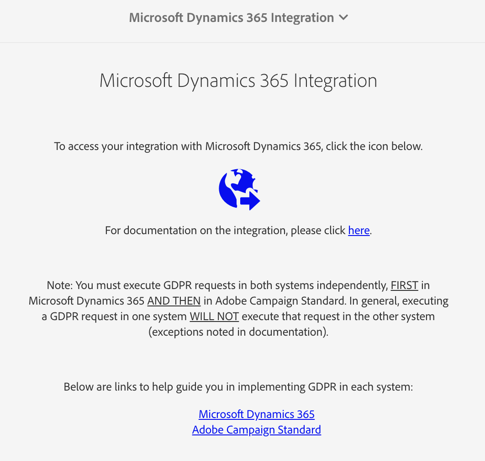

# Utilizzo di Microsoft Dynamics 365 con integrazione di Campaign Standard

Questa integrazione può eseguire diversi processi:

* **Sincronizzazione** contatto: I contatti vengono inviati da Dynamics 365 a Campaign (nota: sincronizzazione unidirezionale).
* **Sincronizzazione** entità personalizzata: I record di entità personalizzati vengono inviati da Dynamics 365 a Campaign (nota sincronizzazione unidirezionale).  Per ulteriori informazioni, consultate la pagina sulle entità personalizzate.
* **Visualizzazione** evento: Alcuni eventi di marketing e-mail vengono inviati da Campaign a Dynamics 365. Vedere Nota di seguito.
* **Eliminazione** dei contatti: Il profilo della campagna viene aggiunto alla coda di eliminazione correlata alla privacy quando il contatto corrispondente viene eliminato in Dynamics 365.
* **Sincronizzazione** rifiuto: I rinunce sono sincronizzati tra Dynamics 365 e Campaign a seconda della configurazione selezionata dal cliente durante l&#39;onboarding (ad esempio, sincronizzazione da Dynamics 365 a Campaign, sincronizzazione da Campaign a Dynamics 365 o sincronizzazione bidirezionale).
* **Single Sign On (SSO)**: I dettagli dell&#39;integrazione in Unifi sono accessibili direttamente da Campaign, utilizzando l&#39;autenticazione Adobe IMS.

>[!NOTE]
>
>Per la visualizzazione **** Evento, un massimo di 10.000 eventi verrà recuperato ogni volta che il processo di uscita viene eseguito in Unifi.

## Adobe Campaign Standard User Experience

Quando un contatto viene creato nuovo o modificato in Dynamics 365, verrà sincronizzato su Campaign dopo l&#39;esecuzione della sincronizzazione dei contatti.  Questi contatti saranno visibili nella schermata Profili di Campaign e possono essere indirizzati alle campagne di marketing.  Vedere la schermata Profili di seguito.

Quando un contatto viene eliminato in Dynamics 365, il profilo corrispondente in Campaign viene aggiunto alla coda di eliminazione del servizio per la privacy nella schermata Richiesta privacy di Campaign.  Per ulteriori dettagli sull&#39;esecuzione delle richieste di eliminazione degli oggetti dati, come richiesto per conformarsi alle leggi sulla privacy applicabili in Campaign, consulta Come eseguire le richieste di eliminazione legalmente autorizzate in Adobe Campaign Standard.

È importante notare che, se il processo in due fasi è attivato nella schermata delle proprietà, è necessario confermare manualmente l&#39;eliminazione di ciascun record nella schermata della privacy prima che venga eliminato definitivamente.  Consulta la schermata del processo in due fasi riportata di seguito:

Quando un attributo di rinuncia/blacklist viene modificato in Campaign, verrà riflesso in Dynamics 365 se hai selezionato la configurazione Campaign-to-Dynamics 365 o di rinuncia bidirezionale e se hai mappato correttamente quel particolare attributo.

Per accedere ai dettagli dell&#39;integrazione tramite single sign-on, accedi al menu Navigazione campagna e fai clic su Amministrazione > Integrazione di Microsoft Dynamics 365.

Questa pagina contiene collegamenti alla documentazione sull&#39;integrazione e linee guida su come utilizzare le funzioni in conformità con i vostri potenziali obblighi legali. Fai clic sull&#39;icona del globo, che ti instraderà automaticamente e ti collegherà alla tua istanza Unifi dove puoi gestire i dettagli di integrazione.

Nel video seguente potete vedere un video di questa funzionalità.

>[!VIDEO](https://video.tv.adobe.com/v/29254)

>[!NOTE]
>
>Dovrai inviare un ticket all&#39;Assistenza clienti Adobe (direttamente o tramite il contatto Adobe) per far sì che nell&#39;istanza Campaign sia attivato il flag della funzione di accesso singolo.

>[!NOTE]
>
>L&#39;icona Integrazione di Microsoft Dynamics 365 non verrà visualizzata nel pannello di amministrazione.  Per abilitare questo flag di funzionalità per l&#39;istanza di Campaign, devi inviare un ticket (o il contatto Adobe).
>
>Inoltre, Unifi dovrà consentire agli utenti l&#39;accesso SSO prima di poter accedere correttamente tramite SSO da Campaign.

## Esperienza utente di Microsoft Dynamics 365

Per la visualizzazione degli eventi, i seguenti eventi di marketing e-mail vengono inviati da Campaign a Dynamics 365 e visualizzati nella visualizzazione Timeline di Dynamics 365 come attività personalizzate:

* Invio e-mail Adobe Campaign

* Apri e-mail Adobe Campaign

* Adobe Campaign Email URL Click

* Rimbalzo e-mail Adobe Campaign

Per visualizzare la timeline di un contatto, accedi all&#39;elenco dei contatti facendo clic su Sales Hub dal menu a discesa Dynamics 365.  Fate clic su Contatti nella barra del menu a sinistra e selezionate un contatto.

>[!NOTE]
>
>Per visualizzare questi eventi, è necessario installare l&#39;app Adobe Campaign for Dynamics 365 in AppSource nell&#39;istanza Dynamics 365.

Di seguito è riportata un&#39;istantanea della schermata Contatti per &quot;Dynamics User&quot;.  Nella visualizzazione Timeline, noterete che all&#39;utente di Dynamics è stato inviato un messaggio e-mail associato con Nome campagna &quot;2019LoyaltyCamp&quot; e Nome consegna &quot;DM190&quot;.  Dynamics User ha aperto l&#39;e-mail e ha fatto clic su un URL nell&#39;e-mail; entrambe queste azioni hanno creato eventi che vengono visualizzati anche di seguito.  Se si guarda all&#39;angolo destro, viene visualizzata la scheda RA (Relationship Assistant); al momento, contiene un&#39;attività da seguire sull&#39;URL su cui è stato fatto clic.

Vedere di seguito per una panoramica della visualizzazione Timeline per l&#39;utente di Dynamics.

Di seguito è riportato un primo piano della scheda Relationship Assistant (RA).  L&#39;app AppSource contiene un flusso di lavoro che controlla un evento Adobe Email URL Click.  Quando si verifica questo evento, crea un&#39;attività e imposta una data di scadenza.  Questo consente all&#39;attività di essere visualizzata nella scheda RA, conferendogli un&#39;ulteriore visibilità.  Esiste un flusso di lavoro simile per gli eventi di rimbalzo e-mail di Adobe, con l&#39;aggiunta di un&#39;attività per la quadratura dell&#39;indirizzo e-mail non valido.  Questi flussi di lavoro possono essere disattivati nella soluzione.

Se si fa clic sull&#39;oggetto dell&#39;evento di invio, verrà visualizzato un modulo simile a quello riportato di seguito.  I moduli per gli eventi open e bounce sono simili.

Il modulo per gli eventi click URL e-mail aggiunge un attributo aggiuntivo per l&#39;URL su cui è stato fatto clic:

Segue un elenco degli attributi e una descrizione:

* Oggetto: Oggetto dell&#39;evento; composto dall&#39;ID campagna e dall&#39;ID di consegna dell&#39;e-mail di consegna

* Proprietario: Utente dell&#39;applicazione creato nei passaggi successivi al provisioning

* Per quanto riguarda: Nome del contatto

* Nome campagna: L&#39;ID campagna in Campaign Standard

* Nome consegna: L&#39;ID di consegna in Campaign Standard

* Data Di Invio/Apertura/Clic/Bloccato: Data/ora in cui è stato creato l’evento

* URL tracciamento: URL su cui è stato fatto clic

* URL pagina mirror: URL della pagina mirror dell’e-mail che è stata inviata/aperta/su cui è stato fatto clic/che è stata rimbalzata

Potete vedere un video dell’URL della pagina mirror utilizzato nel video seguente.

>[!VIDEO](https://video.tv.adobe.com/v/29253)

>[!NOTE]
>
>Per l&#39;opzione di rifiuto, quando un attributo di rinuncia viene modificato in Dynamics 365, questo si rifletterà in Campaign se hai selezionato la configurazione Dynamics 365-to-Campaign o l&#39;opzione di rifiuto bidirezionale e se hai mappato correttamente quel particolare attributo.

**Argomenti correlati**

* Configurare l&#39;integrazione Campaign per Campaign/Dynamics 365
* Configurare l&#39;integrazione Dynamics per Campaign/Dynamics 365
* Configurare Unifi per l&#39;integrazione Campaign/Dynamics 365
* Scoprite come mappare risorse personalizzate ed entità personalizzate