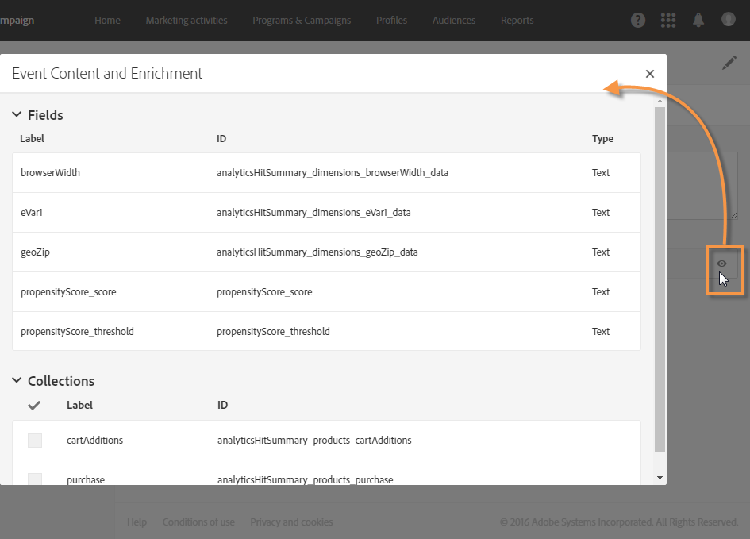
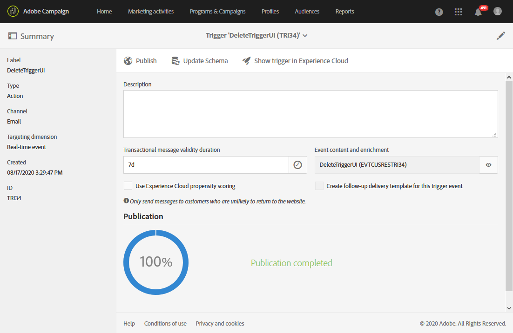
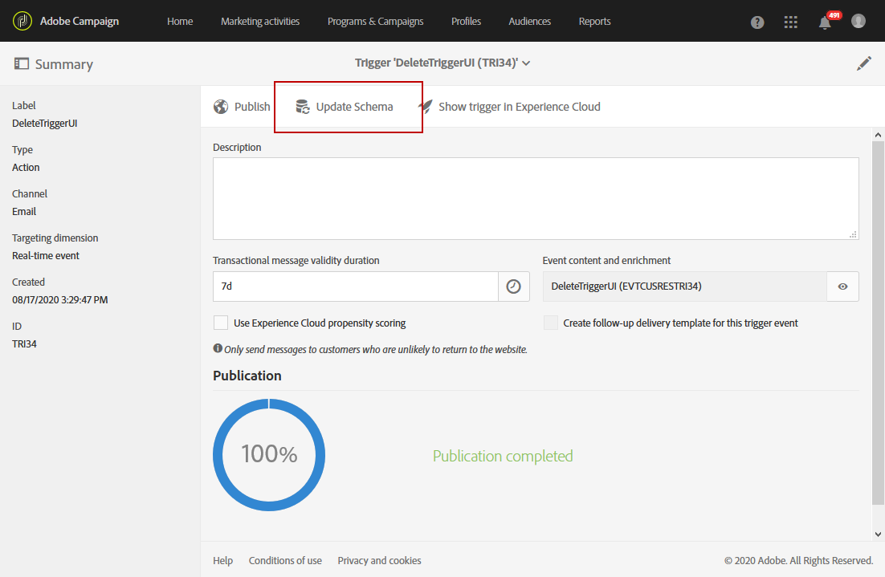

# Utilizzo di triggers in Campaign{#using-triggers-in-campaign}

## Creazione di un trigger mappato in Campaign {#creating-a-mapped-trigger-in-campaign}

Devi accertarti di definire in anticipo i comportamenti da monitorare all’interno di Adobe Experience Cloud (servizio core **[!UICONTROL Triggers]**). Per ulteriori informazioni, consulta la [documentazione di Adobe Experience Cloud](https://docs.adobe.com/content/help/it-IT/core-services/interface/activation/triggers.html). Quando definisci il trigger, devi abilitare gli alias. Per ogni comportamento (navigazione/abbandono moduli, aggiunta/eliminazione di prodotti, sessione scaduta e così via), è necessario aggiungere un nuovo trigger all’interno di Adobe Experience Cloud.

Ora devi creare un evento trigger in Adobe Campaign basato su un trigger esistente di Adobe Experience Cloud.

Guarda questo [video](https://helpx.adobe.com/it/marketing-cloud/how-to/email-marketing.html#step-two) per comprendere come sono configurati i trigger all’interno di Adobe Campaign.

I passaggi per implementare ciò sono i seguenti:

1. Fai clic sul logo **[!UICONTROL Adobe Campaign]** nell’angolo in alto a sinistra, quindi seleziona **[!UICONTROL Marketing plans]** > **[!UICONTROL Transactional messages]** > **[!UICONTROL Experience Cloud Triggers]**.

   

1. Fai clic sul pulsante **[!UICONTROL Create]**. Viene visualizzata la procedura guidata di creazione, che elenca tutti i trigger definiti all’interno di Adobe Experience Cloud. Nella colonna **[!UICONTROL Fired by Analytics]** viene visualizzato il numero di eventi inviati dal trigger di Adobe Experience Cloud a Campaign. Si tratta della mappatura dei trigger creati all’interno dell’interfaccia Experience Cloud.

   

1. Seleziona il trigger di Adobe Experience Cloud che vuoi utilizzare e fai clic su **[!UICONTROL Next]**.
1. Configura le proprietà generali del trigger. In questo passaggio della procedura guidata, specifica anche il canale e la dimensione di targeting da utilizzare per il trigger (consulta [dimensioni di targeting e risorse](../../automating/using/query.md#targeting-dimensions-and-resources)). Quindi, conferma la creazione del trigger.
1. Per visualizzare il contenuto del payload, fai clic sul pulsante a destra del campo **[!UICONTROL Event content and enrichment]**. Questa schermata ti consente inoltre di arricchire i dati dell’evento con i dati del profilo memorizzati nel database di Adobe Campaign. L’arricchimento viene effettuato con la medesima procedura di un messaggio sulle transazioni standard.

   

1. Nel campo **[!UICONTROL Transactional message validity duration]**, definisci la durata della validità del messaggio dopo l’invio dell’evento da parte di Analytics. Se è stata definita una durata di 2 giorni, il messaggio non verrà più inviato, una volta trascorsa tale durata. Se metti in pausa vari messaggi, questi non verranno inviati se li riprendi dopo un certo periodo di tempo.

   

1. Ora puoi pubblicare i trigger. Per ulteriori informazioni, consulta [Pubblicazione di un attivatore in Campaign](../../integrating/using/using-triggers-in-campaign.md#publishing-trigger-in-campaign).

## Pubblicazione di un trigger in Campaign {#publishing-trigger-in-campaign}

Dopo aver creato un evento di attivazione in  Adobe Campaign basato su un trigger Adobe Experience Cloud esistente, è ora necessario pubblicarlo.

1. Dal trigger creato in precedenza, fare clic sul **[!UICONTROL Publish]** pulsante per avviare la pubblicazione dell&#39;evento trigger.

   

1. È possibile controllare l&#39;avanzamento della pubblicazione attivatore in **[!UICONTROL Publication]**.

   

1. Al termine della pubblicazione, sotto verrà visualizzato il messaggio seguente **[!UICONTROL Publication]**.

   

1. Se è necessario apportare una modifica allo schema del trigger anche dopo la pubblicazione dell’evento trigger, fai clic sul pulsante **[!UICONTROL Update schema]** per recuperare le modifiche più recenti.

   Nota: questa azione annullerà la pubblicazione del trigger e del messaggio sulle transazioni. Successivamente, sarà necessario ripubblicarlo.

   

1. Click **[!UICONTROL Show Trigger in Experience Cloud]** button allows you to view the trigger definition in Adobe Experience Cloud.

Una volta pubblicato l’evento, viene automaticamente creato un modello transazionale collegato al nuovo evento. Dovrai quindi modificare e pubblicare il modello appena creato. Per ulteriori informazioni, consulta la sezione [Modifica del modello](../../start/using/marketing-activity-templates.md) .

## Modifica del modello di messaggio sulle transazioni {#editing-the-transactional-message-template}

Dopo aver creato e pubblicato l’evento trigger, viene creato il modello transazionale corrispondente. Per ulteriori informazioni, consulta la sezione [Creazione di un trigger mappato in Campaign](#creating-a-mapped-trigger-in-campaign).

Affinché l’evento attivi l’invio di un messaggio sulle transazioni, è necessario che personalizzi tale modello, per poi testarlo e infine pubblicarlo. Questi passaggi sono i medesimi di un messaggio sulle transazioni standard. Per ulteriori informazioni, consulta la sezione [Modello transazionale](../../channels/using/event-transactional-messages.md#personalizing-a-transactional-message).

>[!NOTE]
>
>Se annulli la pubblicazione del modello, ciò annullerà automaticamente la pubblicazione dell’evento trigger.

Durante la modifica del contenuto, puoi aggiungere un campo di personalizzazione in base alle informazioni inviate dal trigger di Analytics. Se arricchisci i dati dell’evento con i dati del profilo di Adobe Campaign, puoi personalizzare il messaggio in base a tali informazioni. Per personalizzare il messaggio, seleziona **[!UICONTROL Transactional event]** > **[!UICONTROL Event context]** e quindi fai clic su un campo.

## Accesso ai report {#accessing-the-reports}

Per visualizzare il report del trigger dedicato all’interno di Adobe Campaign, apri l’evento trigger creato in precedenza e fai clic su **[!UICONTROL Show trigger report]**.

Il report mostra il numero di eventi elaborati rispetto al numero di eventi inviati da Analytics. Inoltre, visualizza un elenco di tutti i trigger recenti.

