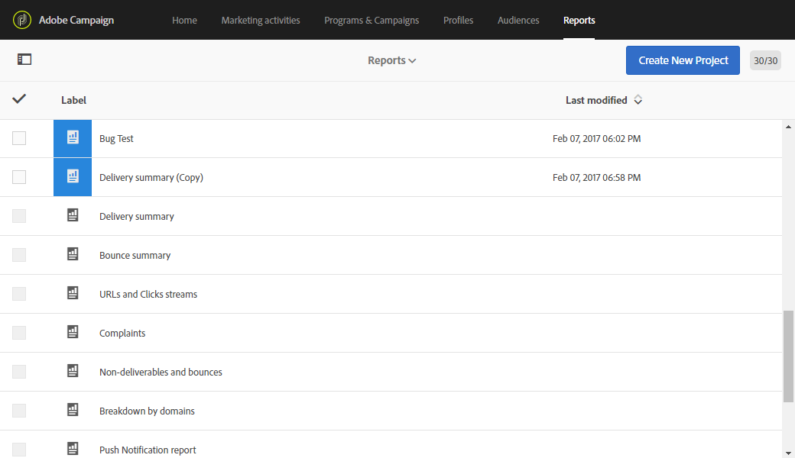

# Introduzione ai rapporti dinamici {#about-dynamic-reports}

Reporting dinamico fornisce rapporti completamente personalizzabili e in tempo reale. Consente di accedere ai dati del profilo, abilitando l’analisi demografica per dimensioni di profilo, come genere, città ed età, oltre ai dati funzionali delle campagne e-mail come aperture e clic. L’interfaccia di trascinamento consente di esaminare i dati, determinare le prestazioni delle campagne e-mail rispetto ai segmenti di clienti più importanti e misurare il loro impatto sui destinatari.

>[!NOTE]
>
>Solo gli utenti con diritti di amministrazione o con unità organizzative impostate su **All** possono creare o salvare un nuovo report. Per ulteriori informazioni, consulta questa [sezione](../../administration/using/users-management.md).

## Accesso ai report dinamici {#accessing-dynamic-reports}

I report sono accessibili:

* Dalla home page selezionando la scheda **[!UICONTROL Reports]** nella barra superiore o la scheda **[!UICONTROL Reports]** per accedere ai rapporti per tutte le consegne.

  

* In ogni programma, campagna e messaggio, dal pulsante **Rapporti** facendo clic su **Rapporti dinamici** per visualizzare solo i rapporti specifici della consegna.

  

Alcuni rapporti non possono essere disponibili immediatamente dopo una consegna, a seconda del tempo necessario per raccogliere ed elaborare le informazioni.

I rapporti dinamici sono suddivisi in due categorie:

* **Modelli**, che possono essere modificati copiandoli con l&#39;opzione **Salva con nome** (**Progetto > Salva con nome..**) nel modello.
* **Report personalizzati** (identificati in blu), che possono essere creati direttamente facendo clic sul pulsante **Crea nuovo progetto** nella home page di **Report**.

>[!NOTE]
>
>I dati vengono filtrati in base alle unità organizzative.

## Accordo di utilizzo del reporting dinamico {#dynamic-reporting-usage-agreement}

Lo scopo del Dynamic Reporting Usage Agreement è quello di funzionare come consenso pop-up per l’elaborazione dei dati. Per impostazione predefinita, l&#39;accordo è visibile solo e può essere accettato o rifiutato solo dagli utenti a cui sono stati assegnati diritti di amministrazione.

Sono disponibili tre opzioni:

* **[!UICONTROL Ask me later]**: facendo clic su **Chiedi più tardi**, la finestra non verrà più visualizzata per 24 ore. Fino a quando non accetti o rifiuti il contratto, le dimensioni del profilo non verranno visualizzate nei rapporti e le informazioni di identificazione personale dei clienti non verranno raccolte o inviate.
* **[!UICONTROL Accept]**: accettando questo contratto, autorizzi Adobe Campaign a raccogliere le informazioni di identificazione personale dei tuoi clienti e a trasferirle al centro dati o reportistica.
* **[!UICONTROL Decline]**: rifiutando il contratto, le dimensioni del profilo non verranno visualizzate nei rapporti e le informazioni di identificazione personale dei clienti non verranno raccolte o inviate. In questo caso externalID verrà comunque raccolto e utilizzato per identificare gli utenti finali.

Nella tabella seguente viene illustrato ciò che accade dopo l&#39;accettazione del contratto, a seconda dell&#39;area geografica.

|  | Reporting dinamico | Connettore Microsoft Dynamics 365 |
|---|---|---|
| Americhe e APAC (Asia Pacifico) | **Funzionalità disponibile**.  Tutte le informazioni predefinite (ad esempio città, paese, stato, genere e segmenti in base all&#39;età) e i profili personalizzati sono stati inviati al centro rapporti negli Stati Uniti. Per ulteriori informazioni sulle dimensioni del profilo, consulta questa [pagina](../../reporting/using/list-of-components.md) | **Funzionalità disponibile**.  Tutti i campi predefiniti e personalizzati dei profili e i campi degli eventi di Adobe Campaign Standard vengono elaborati nel centro dati degli Stati Uniti. |
| EMEA (Europa, Medio Oriente e Africa) | **Funzionalità disponibile**.  Tutte le informazioni predefinite (ovvero città, paese, stato, genere e segmenti in base all&#39;età) e i profili personalizzati inviati al centro rapporti dell&#39;area EMEA. Per ulteriori informazioni sulle dimensioni del profilo, consulta questa [pagina](../../reporting/using/list-of-components.md) | **Funzionalità disponibile.**  Tutti i campi predefiniti e personalizzati dei profili e i campi degli eventi di Adobe Campaign Standard vengono elaborati nel data center dell&#39;area EMEA.  **[!UICONTROL Control data]**&#x200B;che contiene i dati di registrazione di Adobe I/O e gli ID degli eventi dell&#39;utente finale del cliente inviati e memorizzati nel data center statunitense. |

La tabella seguente mostra cosa accade dopo aver rifiutato il contratto, a seconda della regione. Anche se si rifiuta questo contratto, saranno comunque disponibili rapporti sulle consegne e sull’integrazione di Microsoft Dynamics 365.

| Area geografica | Reporting dinamico | Connettore Microsoft Dynamics 365 |
|---|---|---|
| Americhe e APAC (Asia Pacifico) | **Funzionalità disponibile**.   Non sono state inviate informazioni predefinite e personalizzate sui profili al centro rapporti degli Stati Uniti ad eccezione di ExternalID. | **Funzionalità disponibile**.  Nessun campo di profilo predefinito o personalizzato inviato al centro dati degli Stati Uniti ad eccezione dell&#39;ID esterno e dell&#39;ID destinatario.  Tutti i campi evento di Adobe Campaign Standard vengono elaborati nel data center statunitense ad eccezione dell&#39;ID pagina mirror.  Per ulteriori informazioni sull&#39;integrazione di Microsoft Dynamics 365, fare riferimento a questa [pagina](../../integrating/using/d365-acs-get-started.md). |
| EMEA (Europa, Medio Oriente e Africa) | **Funzionalità disponibile**.  Nessuna informazione preconfigurata e personalizzata inviata al centro rapporti EMEA ad eccezione di ExternalID. | **Funzionalità disponibile.**  Nessun campo di profilo predefinito o personalizzato inviato al data center dell&#39;area EMEA, ad eccezione dell&#39;ID esterno e dell&#39;ID destinatario.  Tutti i campi evento di Adobe Campaign Standard elaborati nel data center dell&#39;area EMEA ad eccezione dell&#39;ID pagina mirror.  **[!UICONTROL Control data]**&#x200B;contiene i dati di registrazione di Adobe I/O e gli ID degli eventi degli utenti finali dei clienti inviati e memorizzati nel data center degli Stati Uniti. Per ulteriori informazioni sull&#39;integrazione di Microsoft Dynamics 365, fare riferimento a questa [pagina](../../integrating/using/d365-acs-get-started.md). |

Questa scelta non è definitiva, è sempre possibile modificarla selezionando **[!UICONTROL Enable PII data to be transferred to US region to use reporting on Profile data]** in **[!UICONTROL Administration]** > **[!UICONTROL Application Settings]** > **[!UICONTROL Options]**.

Il valore può essere modificato in qualsiasi momento. Il valore 1 corrisponde a **[!UICONTROL Ask me later]**, 2 **[!UICONTROL Decline]** e 3 **[!UICONTROL Accept]**.

