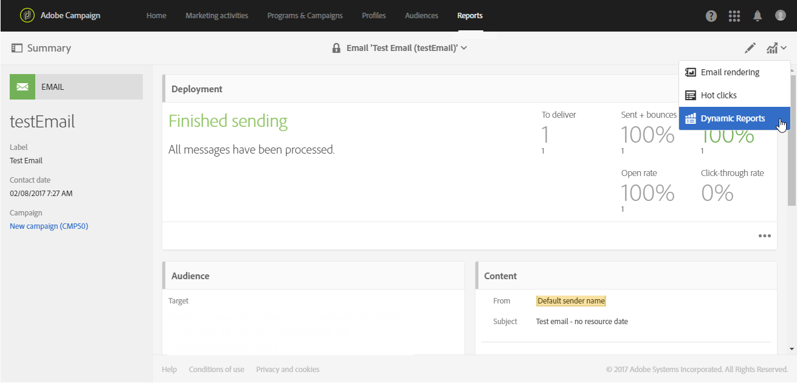

# Informazioni sui report dinamici{#about-dynamic-reports}

>[!NOTE]
>
>Solo gli utenti con diritti di amministrazione o con unità organizzative impostate su **Tutto** possono creare o salvare un nuovo rapporto. For more on this, refer to this [section](../../administration/using/users-management.md).

I rapporti dinamici forniscono rapporti completamente personalizzabili e in tempo reale. Consente l'accesso ai dati del profilo e l'analisi demografica per dimensioni del profilo quali genere, città ed età, oltre ai dati funzionali delle campagne e-mail come aperture e clic. L'interfaccia di trascinamento consente di esaminare i dati, determinare le prestazioni delle campagne e-mail rispetto ai segmenti di clienti più importanti e misurare il loro impatto sui destinatari.

Grazie al menu di trascinamento e alle visualizzazioni personalizzabili, la funzione di report dinamici consente di combinare dimensioni, metriche e intervallo di tempo in qualsiasi combinazione, con suddivisioni e confronti illimitati.

**Argomenti correlati:**

* [Elenco report](../../reporting/using/defining-the-report-period.md)
* [Unità organizzative](../../administration/using/organizational-units.md)
* [Video per report](https://helpx.adobe.com/campaign/kt/acs/using/acs-creating-a-dynamic-report-feature-video-use.html) dinamici

## Accesso ai rapporti dinamici {#accessing-dynamic-reports}

È possibile accedere ai report:

* Dalla home page selezionando **[!UICONTROL Reports]** la scheda nella barra superiore o nella **[!UICONTROL Reports]** scheda per accedere ai rapporti per tutte le consegne.

   

* In ciascun programma, campagna e messaggio, dal pulsante **Rapporti** , facendo clic su Rapporti **** dinamici per visualizzare solo i rapporti specifici per la consegna.

   

Alcuni rapporti non possono essere disponibili subito dopo la consegna, a seconda del tempo necessario per raccogliere ed elaborare le informazioni.

I rapporti dinamici sono suddivisi in due categorie:

* **Modelli**, che possono essere modificati copiandoli con l’opzione **Salva con nome** (**Progetto &gt; Salva con nome).**) nel modello.
* **Report** personalizzati (identificati in blu), che possono essere creati direttamente facendo clic sul pulsante **Crea nuovo progetto** nella home page **Report** .

>[!NOTE]
>
>I dati vengono filtrati in base alle unità aziendali.

## Accordo di utilizzo per rapporti dinamici {#dynamic-reporting-usage-agreement}

>[!NOTE]
>
>Queste modifiche si applicano solo a partire dalla release Campaign Standard 19.4.

Lo scopo dell'accordo di utilizzo di reporting dinamico è di fungere da consenso popup per l'elaborazione dei dati. Per impostazione predefinita, il contratto è visibile e può essere accettato o rifiutato solo dagli utenti ai quali sono stati assegnati diritti di amministrazione.

Sono disponibili tre opzioni:

* **[!UICONTROL Ask me later]**: Facendo clic su Chiedi più tardi, la finestra smetterà di visualizzare per 24 ore.
* **[!UICONTROL Accept]**: Accettando questo contratto, l'Utente autorizza Adobe Campaign a raccogliere i dati di identificazione personale dei clienti e a trasferirli al reporting o al centro dati.
* **[!UICONTROL Decline]**: Rifiutando l'accordo, le dimensioni del profilo non verranno visualizzate nei rapporti e i dati personali dei clienti non verranno raccolti o inviati. In questo caso, externalID verrà comunque raccolto e utilizzato per identificare gli utenti finali.

Nella tabella seguente sono riportati gli eventi che si verificano dopo l'accettazione del contratto in base alla propria area geografica.

|  | Generazione di rapporti dinamici | Connettore Microsoft Dynamics 365 |
|---|---|---|
| Americhe e APAC (Asia Pacifico) | **Funzionalità disponibile**.  Informazioni complete (città, paese, regione, stato, genere e segmenti in base all'età) e profili personalizzati inviati al centro di reporting statunitense. Per ulteriori informazioni sulle dimensioni del profilo, consulta questa [pagina](../../reporting/using/list-of-components-.md) | **Funzionalità disponibile**.  Tutti i campi out-of-the-box e dei profili personalizzati e i campi evento Adobe Campaign Standard vengono elaborati nel centro dati degli Stati Uniti. |
| EMEA (Europa Medio Oriente e Africa) | **Funzionalità disponibile**.  Informazioni complete (città, paese, regione, stato, genere e segmenti in base all'età) e profili personalizzati inviati al centro di reporting EMEA. Per ulteriori informazioni sulle dimensioni del profilo, consulta questa [pagina](../../reporting/using/list-of-components-.md) | **Funzionalità disponibile.** Campi di profili predefiniti e  personalizzati e campi evento Adobe Campaign Standard elaborati nel centro dati EMEA.  **[!UICONTROL Control data]** che contiene i dati di registrazione di I/O Adobe e gli ID degli eventi degli utenti finali del cliente inviati e memorizzati nel centro dati statunitense. |

Nella tabella seguente sono riportati gli eventi che si verificano dopo il rifiuto del contratto a seconda della regione. Anche in caso di rifiuto del contratto, sarà comunque disponibile la generazione di rapporti sulle consegne e l'integrazione con Microsoft Dynamics 365.

| Regione | Generazione di rapporti dinamici | Connettore Microsoft Dynamics 365 |
|---|---|---|
| Americhe e APAC (Asia Pacifico) | **Funzionalità disponibile**.   Nessun'informazione out-of-the-box e informazioni sui profili personalizzati inviate al centro di reporting statunitense, ad eccezione di ExternalID. | **Funzionalità disponibile**.  Nessun campo out-of-the-box o campo di profilo personalizzato inviato al centro dati USA, ad eccezione di ID esterni e ID destinatario.  Tutti i campi evento Adobe Campaign Standard elaborati nel centro dati degli Stati Uniti, ad eccezione del codice del segmento e dell'ID della pagina mirror. |
| EMEA (Europa Medio Oriente e Africa) | **Funzionalità disponibile**.  Nessuna informazione disponibile e nessuna informazione sui profili personalizzati inviati al centro di reporting EMEA, ad eccezione di ExternalID. | **Funzionalità disponibile.**  Nessun campo out-of-the-box o campo di profilo personalizzato inviato al centro dati EMEA, ad eccezione di ID esterno e ID destinatario.  Tutti i campi evento Adobe Campaign Standard elaborati nel centro dati EMEA, ad eccezione del codice del segmento e dell'ID della pagina mirror.   **[!UICONTROL Control data]** che contiene i dati di registrazione di I/O Adobe e gli ID degli eventi degli utenti finali del cliente inviati e memorizzati nel centro dati statunitense. |

Questa scelta non è finale, potete sempre modificarla selezionando **[!UICONTROL Enable PII data to be transferred to US region to use reporting on Profile data]** in **[!UICONTROL Administration]** &gt; **[!UICONTROL Application Settings]** &gt; **[!UICONTROL Options]**.

Il valore può essere modificato in qualsiasi momento. Il valore 1 corrisponde a **[!UICONTROL Ask me later]**, 2 **[!UICONTROL Decline]** e 3 **[!UICONTROL Accept]**.

