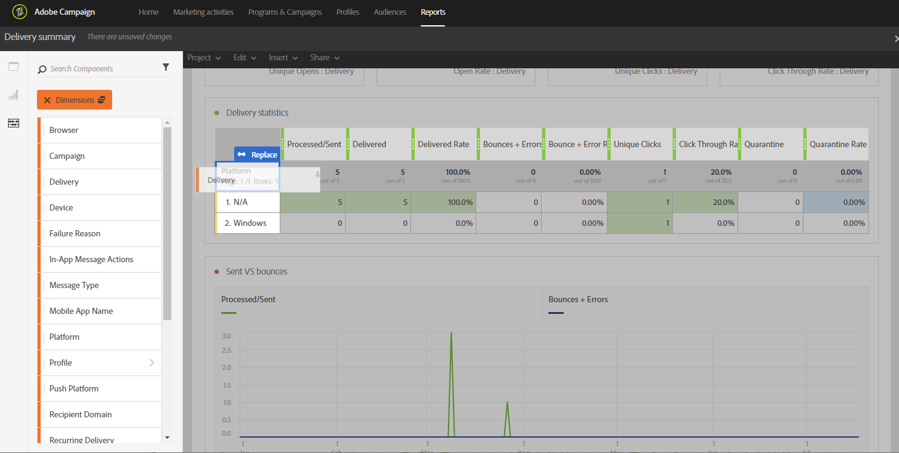
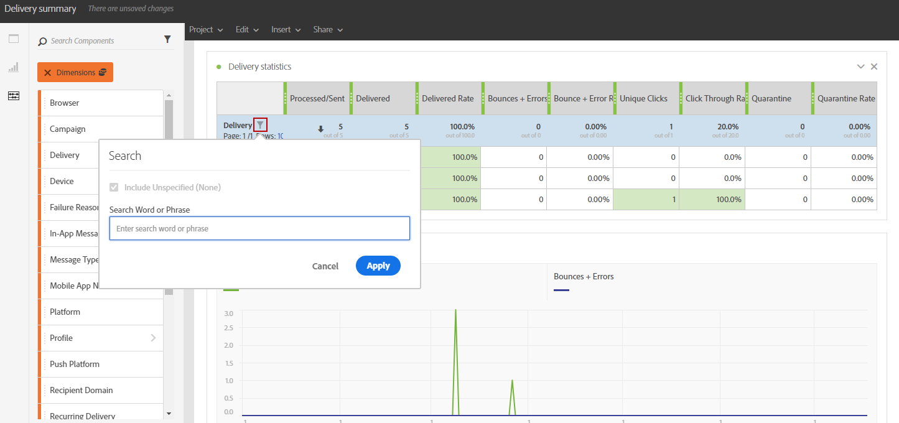

# Aggiunta di componenti{#adding-components}

I componenti consentono di personalizzare i rapporti con dimensioni, metriche e periodi di tempo diversi.

1. Fare clic sulla scheda **[!UICONTROL Components]** per accedere all&#39;elenco dei componenti.

   

1. Ogni categoria visualizzata nella scheda **[!UICONTROL Components]** visualizza i cinque elementi più utilizzati. Fare clic sul nome di una categoria per accedere all&#39;elenco completo dei componenti.

   La tabella dei componenti è suddivisa in quattro categorie:

   * **Dimensioni**: ottieni dettagli dal registro delle consegne, ad esempio il browser o il dominio del destinatario oppure il completamento di una consegna.
   * **Metriche**: ottieni dettagli sullo stato di un messaggio. Ad esempio, se un messaggio è stato recapitato e l’utente lo ha aperto.
   * **[!UICONTROL Segments]**: filtra i dati in base all&#39;intervallo di età del destinatario. È possibile trascinare **[!UICONTROL Segments]** direttamente in una tabella a forma libera o nella barra superiore del pannello.

     Questa categoria è disponibile solo dopo che l’amministratore ha approvato i termini e le condizioni del Dynamic Reporting Usage Agreement che verranno visualizzati sullo schermo. Se l&#39;amministratore rifiuta l&#39;accordo, i segmenti non saranno visibili nella scheda **[!UICONTROL Components]** e i dati non verranno raccolti.

   * **Ora**: imposta un periodo di tempo per la tabella.

1. Trascina e rilascia i componenti in un pannello per iniziare a filtrare i dati.

   

1. Dopo aver trascinato il componente, puoi configurare ulteriormente la tabella con l&#39;opzione **[!UICONTROL Row settings]**.

   

1. Puoi anche filtrare ulteriormente la tabella facendo clic sull&#39;icona **Cerca**. Con questa ricerca, puoi cercare risultati specifici, ad esempio una consegna specifica o un browser.

   

Puoi trascinare tutti i componenti necessari e confrontarli tra loro.

**Argomenti correlati:**

* [Elenco dei componenti](../../reporting/using/list-of-components.md)
* [Elenco dei rapporti](../../reporting/using/defining-the-report-period.md)
