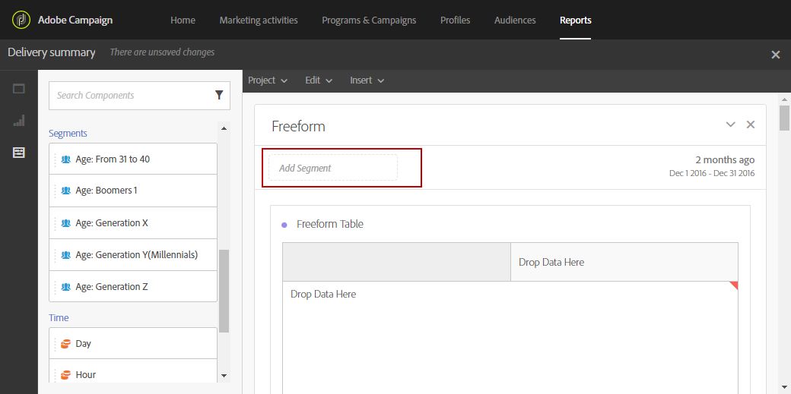

# Aggiunta di pannelli{#adding-panels}

## Aggiunta di un pannello vuoto {#adding-a-blank-panel}

Per avviare il rapporto, puoi aggiungere un set di pannelli a un rapporto out-of-box o personalizzato. Ciascun pannello contiene set di dati diversi ed è composto da tabelle e visualizzazioni a forma libera.

Questo pannello consente di creare i rapporti in base alle esigenze. Puoi aggiungere tutti i pannelli che desideri nei tuoi rapporti per filtrare i dati con periodi di tempo diversi.

1. Fate clic sull’icona **Pannelli** . Potete anche aggiungere un pannello facendo clic sulla scheda **** Inserisci e selezionando **Nuovo pannello** vuoto.

   

1. Trascinate e rilasciate il pannello **** vuoto nel dashboard.

   

Ora potete aggiungere una tabella a forma libera al pannello per avviare il targeting dei dati.

## Aggiunta di una tabella a forma libera {#adding-a-freeform-table}

Le tabelle a forma libera consentono di creare una tabella per analizzare i dati utilizzando le diverse metriche e dimensioni disponibili nella tabella **Componenti** .

Ogni tabella e visualizzazione può essere ridimensionata e spostata per personalizzare meglio il rapporto.

1. Fate clic sull’icona **Pannelli** .

   

1. Trascinare l’elemento **Freeform** nel dashboard.

   È inoltre possibile aggiungere una tabella facendo clic sulla scheda **Inserisci** e selezionando **Nuova forma libera** oppure facendo clic su **Aggiungi una tabella** a forma libera in un pannello vuoto.

   

1. A partire dalla versione Campaign 19.4, l'opzione **[!UICONTROL Exclude proof]** sarà già selezionata per impostazione predefinita. Se necessario, potete modificarlo trascinando una delle due opzioni **[!UICONTROL Segments]** dalla **[!UICONTROL Components]** scheda alla barra superiore.

   

1. Trascinare gli elementi dalla scheda **Componenti** nelle colonne e nelle righe per creare la tabella.

   

1. Fate clic sull'icona **Impostazioni** per cambiare la modalità di visualizzazione dei dati nelle colonne.

   

   Il **[!UICONTROL Column settings]** gruppo è composto da:

   * **[!UICONTROL Number]**: consente di mostrare o nascondere i numeri di riepilogo nella colonna.
   * **[!UICONTROL Percent]**: consente di visualizzare o nascondere la percentuale nella colonna.
   * **[!UICONTROL Interpret zero as no value]**: consente di visualizzare o nascondere quando un valore è uguale a zero.
   * **[!UICONTROL Background]**: consente di mostrare o nascondere la barra di avanzamento orizzontale nelle celle.
   * **[!UICONTROL Include retries]**: consente di includere i tentativi nel risultato. Questo è disponibile solo per **[!UICONTROL Sent]** e **[!UICONTROL Bounces + Errors]**.

1. Selezionate una o più righe e fate clic sull'icona **Visualizza** . Viene aggiunta una visualizzazione per riflettere le righe selezionate.

   

Ora puoi aggiungere tutti i componenti necessari e anche aggiungere visualizzazioni per fornire rappresentazioni grafiche dei tuoi dati.
