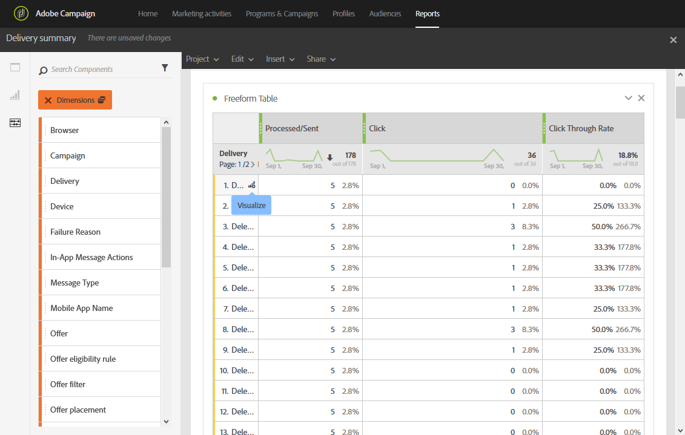

# Aggiunta di pannelli{#adding-panels}

## Aggiunta di un pannello vuoto {#adding-a-blank-panel}

Per avviare il rapporto, puoi aggiungere un set di pannelli a un rapporto predefinito o personalizzato. Ogni pannello contiene set di dati diversi ed è composto da tabelle e visualizzazioni a forma libera.

Questo pannello consente di creare i rapporti in base alle esigenze. Puoi aggiungere nei rapporti tutti i pannelli desiderati per filtrare i dati in base a diversi periodi di tempo.

1. Fai clic sull&#39;icona **Panels**. È inoltre possibile aggiungere un pannello facendo clic sulla **scheda Inserisci** e selezionando **Nuovo pannello vuoto**.

   

1. Trascina e rilascia il **pannello vuoto** nel dashboard.

   

Ora puoi aggiungere una tabella a forma libera al pannello per iniziare a eseguire il targeting dei dati.

## Aggiunta di una tabella a forma libera {#adding-a-freeform-table}

Le tabelle a forma libera consentono di creare una tabella per analizzare i dati utilizzando le diverse metriche e dimensioni disponibili nella tabella **Componente**.

Ogni tabella e visualizzazione è ridimensionabile e può essere spostata per personalizzare meglio il rapporto.

1. Fare clic sull&#39;icona **[!UICONTROL Panels]**.

   

1. Trascina e rilascia l&#39;elemento **[!UICONTROL Freeform]** nel dashboard.

   È inoltre possibile aggiungere una tabella facendo clic sulla scheda **[!UICONTROL Insert]** e selezionando **[!UICONTROL New Freeform]** oppure facendo clic su **[!UICONTROL Add a freeform table]** in un pannello vuoto.

   

1. Nel campo **[!UICONTROL Drop a segment here]**, aggiungi **[!UICONTROL Segment]** dalla scheda **[!UICONTROL Components]** nella barra superiore.

   

1. Trascinare gli elementi dalla scheda **[!UICONTROL Components]** nelle colonne e nelle righe per creare la tabella.

   

1. Fare clic sull&#39;icona **[!UICONTROL Settings]** per modificare la modalità di visualizzazione dei dati nelle colonne.

   

   **[!UICONTROL Column settings]** è composto da:

   * **[!UICONTROL Number]**: consente di mostrare o nascondere i numeri di riepilogo nella colonna.
   * **[!UICONTROL Percent]**: consente di mostrare o nascondere la percentuale nella colonna.
   * **[!UICONTROL Interpret zero as no value]**: consente di mostrare o nascondere quando il valore è uguale a zero.
   * **[!UICONTROL Background]**: consente di mostrare o nascondere la barra di avanzamento orizzontale nelle celle.
   * **[!UICONTROL Include retries]**: consente di includere nuovi tentativi nel risultato. Disponibile solo per **[!UICONTROL Sent]** e **[!UICONTROL Bounces + Errors]**.

1. Selezionare una o più righe e fare clic sull&#39;icona **[!UICONTROL Visualize]**. Viene aggiunta una visualizzazione per riflettere le righe selezionate.

   

Ora puoi aggiungere tutti i componenti necessari e anche visualizzazioni per fornire rappresentazioni grafiche dei dati.
