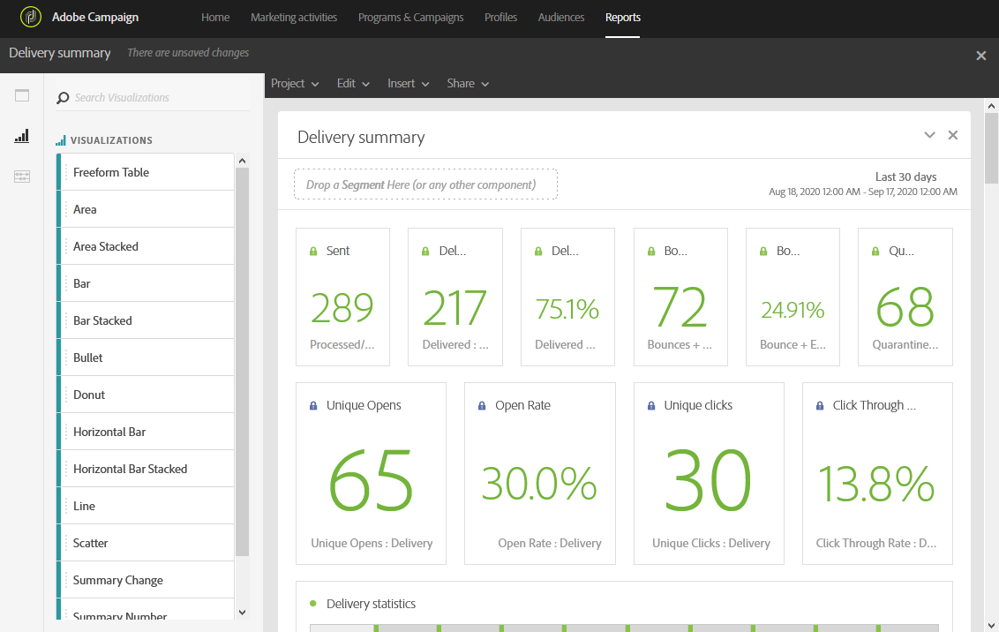

# Aggiunta di visualizzazioni{#adding-visualizations}

La scheda **Visualizzazioni** consente di trascinare e rilasciare elementi di visualizzazione, ad esempio area, ciambella e grafico. Le visualizzazioni forniscono rappresentazioni grafiche dei dati.

1. Nella **[!UICONTROL Visualizations]** scheda, trascina e rilascia un elemento di visualizzazione in un pannello.

   

1. Dopo aver aggiunto una visualizzazione al pannello, i report dinamici rilevano automaticamente i dati nella tabella a forma libera. Seleziona le impostazioni per la visualizzazione.
1. Se disponi di più tabelle a forma libera, scegli l’origine dati disponibile da aggiungere nel grafico nella finestra Impostazioni **origine** dati. Questa finestra è disponibile anche facendo clic sul punto colorato accanto al titolo della visualizzazione.

   

1. Fate clic sul pulsante **[!UICONTROL Visualization]** Impostazioni per modificare direttamente il tipo di grafico o il contenuto visualizzato, ad esempio:

   * **Percentuali**: Visualizza i valori in percentuale.
   * **Ancoraggio asse Y su zero**: Forza l&#39;asse y a zero anche se i valori sono superiori a zero.
   * **Legenda visibile**: Ti permette di nascondere la leggenda.
   * **Normalizzazione**: Forza la corrispondenza dei valori.
   * **Visualizza asse** doppio: Aggiunge un altro asse al grafico.
   * **Limite massimo elementi**: Limita il numero di grafici visualizzati.
   * **Soglia**: Consente di impostare una soglia per il grafico. Viene visualizzata come una linea punteggiata nera.

   

Questa visualizzazione consente di avere una visualizzazione più chiara dei dati nei rapporti.
