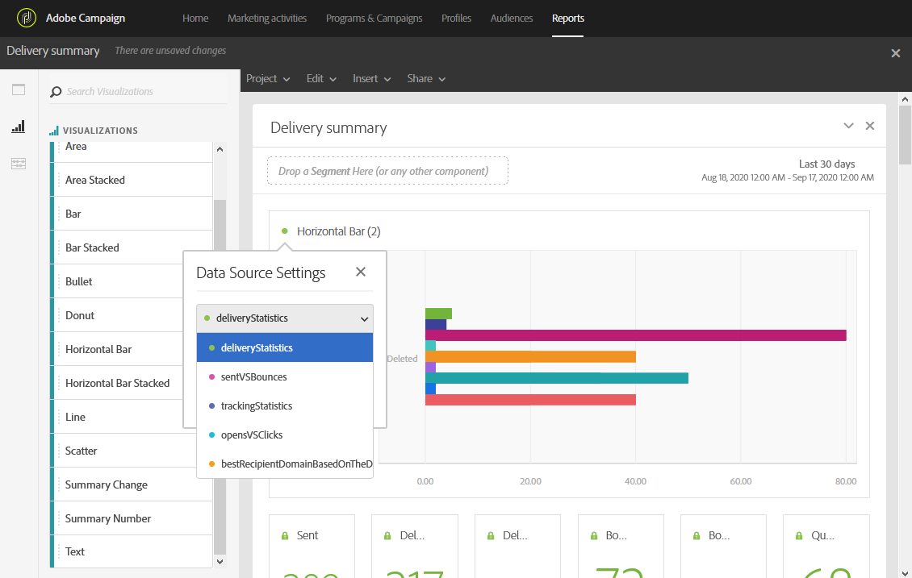

# Aggiunta di visualizzazioni{#adding-visualizations}

La scheda **Visualizzazioni** consente di trascinare gli elementi di visualizzazione, ad esempio area, anello e grafico. Le visualizzazioni forniscono rappresentazioni grafiche dei dati.

1. Nella scheda **[!UICONTROL Visualizations]**, trascina e rilascia un elemento di visualizzazione in un pannello.

   

1. Dopo aver aggiunto una visualizzazione al pannello, i rapporti dinamici rilevano automaticamente i dati nella tabella a forma libera. Seleziona le impostazioni per la visualizzazione.
1. Se disponi di più tabelle a forma libera, scegli l&#39;origine dati disponibile da aggiungere al grafico nella finestra **Impostazioni Source dati**. Questa finestra è disponibile anche facendo clic sul punto colorato accanto al titolo della visualizzazione.

   

1. Fare clic sul pulsante Impostazioni **[!UICONTROL Visualization]** per modificare direttamente il tipo di grafico o il contenuto visualizzato, ad esempio:

   * **Percentuali**: visualizza i valori in percentuale.
   * **Ancoraggio asse Y su zero**: forza l&#39;azzeramento dell&#39;asse Y anche se i valori sono superiori a zero.
   * **Legenda visibile**: consente di nascondere la legenda.
   * **Normalizzazione**: forza la corrispondenza dei valori.
   * **Visualizza asse doppio**: aggiunge un altro asse al grafico.
   * **Limita max. elementi**: limita il numero di grafici visualizzati.
   * **Soglia**: consenti di impostare una soglia nel grafico. Viene visualizzata come una linea punteggiata nera.

   

Questa visualizzazione ti consente di avere una visione più chiara dei dati nei rapporti.
