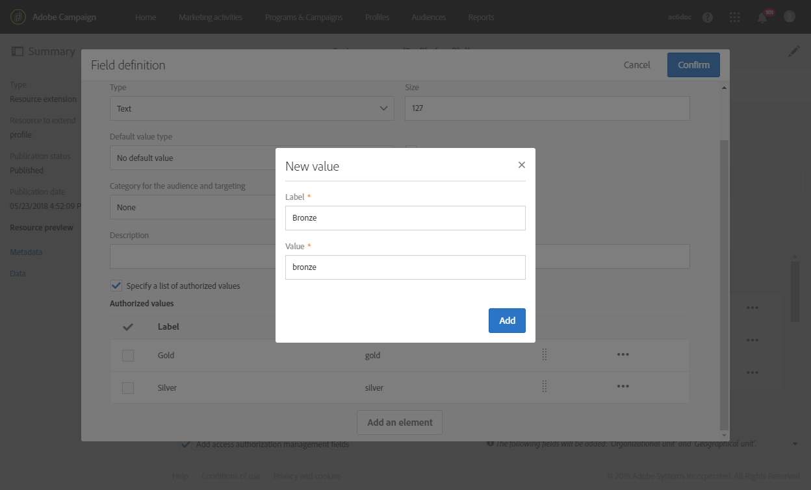
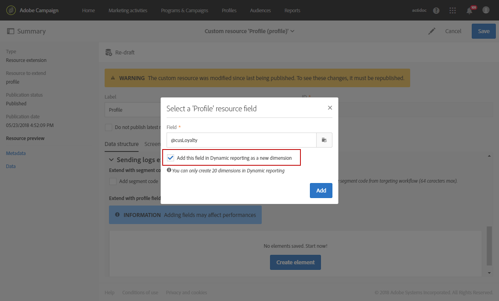

# Creazione di una dimensione di profilo personalizzata{#creating-a-custom-profile-dimension}

I rapporti possono essere creati e gestiti in base ai dati di profilo personalizzati creati durante l'estensione di risorse personalizzata del profilo.

In questo esempio, vogliamo creare i programmi fedeltà campi **personalizzati** che verranno suddivisi in tre livelli: oro, argento e bronze. Questo profilo personalizzato verrà quindi esteso per essere utilizzato come dimensione di profilo personalizzata nei rapporti dinamici.

* [Passaggio 1: Creare un nuovo campo profilo](../../reporting/using/creating-a-custom-profile-dimension.md#step-1--create-a-new-profile-field)
* [Passaggio 2: Estensione dei registri di invio con il campo profilo](../../reporting/using/creating-a-custom-profile-dimension.md#step-2--extend-the-sending-logs-with-the-profile-field)
* [Passaggio 3: Creazione di un destinatario di targeting di distribuzione iscritto al programma fedeltà](../../reporting/using/creating-a-custom-profile-dimension.md#step-3--create-a-delivery-targeting-recipients-enrolled-in-the-loyalty-program)
* [Passaggio 4: Creare un rapporto dinamico per filtrare i destinatari con la dimensione del profilo personalizzata](../../reporting/using/creating-a-custom-profile-dimension.md#step-4--create-a-dynamic-report-to-filter-recipients-with-the-custom-profile-dimension)

## Passaggio 1: Creare un nuovo campo profilo {#step-1--create-a-new-profile-field}

Dobbiamo innanzitutto creare il nuovo programma **fedeltà del campo di profilo** che assegnerà il livello di fedeltà ai destinatari: oro, argento o bronze.

>[!NOTE]
>
>Le risorse personalizzate possono essere gestite solo da un amministratore.

A tal fine:

1. Dal menu avanzato, selezionate **[!UICONTROL Administration]** &gt; **[!UICONTROL Development]** &gt; **[!UICONTROL Custom resources]** quindi la risorsa **[!UICONTROL Profile (profile)]** personalizzata.

   

1. Nella **[!UICONTROL Data structure]** scheda, nella **[!UICONTROL Fields]** categoria, fate clic sul **[!UICONTROL Add field]** pulsante.

   

1. Immettete l' **[!UICONTROL Label]** e **[!UICONTROL ID]** selezionate la risorsa **[!UICONTROL Type]** personalizzata. Qui abbiamo selezionato **[!UICONTROL Text]** in quanto i destinatari avranno la scelta tra oro, argento e bronze.

   

1. Fate clic sull  'icona per definire il campo.

   

1. Qui, è necessario specificare i valori autorizzati selezionando **[!UICONTROL Specify a list of authorized valued]** e creando ciascun valore facendo clic **[!UICONTROL Create element]** su.

   

1. Immettete il **[!UICONTROL Label]** testo e **[!UICONTROL Value]** fate clic **[!UICONTROL Add]** su. Per questo esempio, dobbiamo creare il valore gold, silver e bronze. Fate clic **[!UICONTROL Confirm]** su di essa.

   

1. Selezionare la **[!UICONTROL Screen definition]** scheda. Nel **[!UICONTROL Detail screen configuration]** menu a discesa, **[!UICONTROL Add personalized fields]** consulta la sezione per creare una nuova sezione nel profilo.

   

1. Fate clic sul **[!UICONTROL Add an element]** pulsante per creare la nuova sezione. Selezionate i **[!UICONTROL Type]** seguenti elementi: **[!UICONTROL Input field]**, **[!UICONTROL Value]** o **[!UICONTROL List]**, quindi, il campo da aggiungere in questa nuova sezione.

   

1. Potete anche aggiungere un titolo alla sezione del campo **[!UICONTROL Customize the title of the section where the fields will be displayed]**.

   Fate clic **[!UICONTROL Save]** al termine della configurazione.

   

1. Dal menu avanzato, selezionate **[!UICONTROL Administration]** &gt; **[!UICONTROL Development]** &gt; **[!UICONTROL Publication]** per iniziare a pubblicare la risorsa personalizzata.
1. Fate clic **[!UICONTROL Prepare publication]** su, quindi fate clic sul **[!UICONTROL Publish]** pulsante.

   

Il nuovo campo profilo è pronto per essere usato e selezionato dai destinatari.

## Passaggio 2: Estensione dei registri di invio con il campo profilo {#step-2--extend-the-sending-logs-with-the-profile-field}

Ora che il campo del profilo è stato creato, è necessario estendere i registri di invio con il nostro campo profilo per creare la dimensione di profilo personalizzata associata nei rapporti dinamici.

Prima di estendere il registro con il nostro campo profilo, accertatevi che la finestra PII sia stata accettata per accedere alla **[!UICONTROL Sending logs extension]** scheda. Per ulteriori informazioni, consultate questa [pagina](../../reporting/using/about-dynamic-reports.md#dynamic-reporting-usage-agreement).

>[!NOTE]
>
>I registri possono essere estesi solo con i campi del profilo per amministratore.

1. Dal menu avanzato, selezionate **[!UICONTROL Administration]** &gt; **[!UICONTROL Development]** &gt; **[!UICONTROL Custom resources]** quindi la risorsa **[!UICONTROL Profile (profile)]** personalizzata.
1. Aprite il **[!UICONTROL Sending logs extension]** menu a discesa.
1. Fate clic sul **[!UICONTROL Create element]** pulsante.

   

1. Selezionate il campo creato in precedenza e fate clic **[!UICONTROL Confirm]** su.
1. Seleziona questa opzione **[!UICONTROL Add this field in Dynamic reporting as a new dimension]** per creare la dimensione personalizzata del profilo.

   

   Questa opzione è disponibile solo se la finestra PII è stata accettata. Per ulteriori informazioni, consultate questa [pagina](../../reporting/using/about-dynamic-reports.md#dynamic-reporting-usage-agreement).

1. Fai clic su **[!UICONTROL Add]** Salva la risorsa personalizzata.
1. Poiché la risorsa personalizzata è stata modificata, è necessario pubblicarla per implementare le nuove modifiche.

   Dal menu avanzato, selezionate **[!UICONTROL Administration]** &gt; **[!UICONTROL Development]** &gt; **[!UICONTROL Publication]** per iniziare a pubblicare la risorsa personalizzata.

1. Fate clic **[!UICONTROL Prepare publication]** su, quindi fate clic sul **[!UICONTROL Publish]** pulsante.

   

Il tuo profilo personalizzato è ora disponibile come dimensione di profilo personalizzata nei tuoi rapporti.

Ora che il campo è stato creato e che l'invio di registri è stato esteso con questo campo di profilo, potete avviare il targeting dei destinatari nelle consegne.

## Passaggio 3: Creazione di un destinatario di targeting di distribuzione iscritto al programma fedeltà {#step-3--create-a-delivery-targeting-recipients-enrolled-in-the-loyalty-program}

Una volta pubblicato il campo del profilo, puoi avviare la distribuzione. In questo esempio, desideriamo indirizzare ogni destinatario registrato nel programma fedeltà.

1. Dalla **[!UICONTROL Marketing activities]** scheda, fate clic **[!UICONTROL Create]** su **[!UICONTROL Email]** di essa.
1. Scegliete quindi le **[!UICONTROL Email type]** proprietà dell'e-mail.
1. Al destinatario di destinazione nel programma fedeltà, trascina e rilascia l' **[!UICONTROL Profiles (attributes)]** attività.
1. Selezionate il campo creato in precedenza dal **[!UICONTROL Field]** menu a discesa.

   

1. Selezionate la **[!UICONTROL Filter conditions]** vostra. Qui, vogliamo indirizzare i destinatari che fanno parte di uno dei tre livelli del programma fedeltà.

   

1. Fate clic **[!UICONTROL Confirm]** su un filtro, quindi fate clic **[!UICONTROL Next]** su.
1. Definire e personalizzare il contenuto del messaggio, il nome mittente e l'oggetto. Per ulteriori informazioni sulla creazione delle e-mail, consultate questa [pagina](../../designing/using/about-email-content-design.md#about-the-email-designer).

   Quindi fate clic **[!UICONTROL Create]** su.

1. Quando è pronto, puoi visualizzare l'anteprima e inviare il messaggio. Per ulteriori informazioni su come preparare e inviare il messaggio, consulta questa [pagina](../../sending/using/preparing-the-send.md).

Una volta inviato correttamente il messaggio e-mail ai destinatari selezionati, puoi iniziare a filtrare i dati e monitorare il successo della distribuzione con i rapporti.

## Passaggio 4: Creare un rapporto dinamico per filtrare i destinatari con la dimensione del profilo personalizzata {#step-4--create-a-dynamic-report-to-filter-recipients-with-the-custom-profile-dimension}

Dopo aver inviato la distribuzione, puoi suddividere i rapporti utilizzando la dimensione di profilo personalizzata dalla **[!UICONTROL Profile]** tabella.

1. Nella **[!UICONTROL Reports]** scheda, selezionate un rapporto out-of-the-box o fate clic sul **[!UICONTROL Create]** pulsante per avviarne uno da zero.

   

1. Nella **[!UICONTROL Dimensions]** categoria, fai clic **[!UICONTROL Profile]** su e trascina la dimensione del profilo **di Program Program** personalizzata nella tabella a forma libera.

   

1. Trascina e rilascia le **[!UICONTROL Processed/Sent]****[!UICONTROL Open]** metriche per avviare il filtraggio dei dati.

   

1. Se necessario, trascina e rilascia una visualizzazione nell'area di lavoro.

   

**Argomento correlato:**

* [Utilizzo di dati di profilo personalizzati per creare rapporti approfonditi](https://helpx.adobe.com/campaign/kb/simplify-campaign-management.html#Reportandshareinsightswithallstakeholders)
