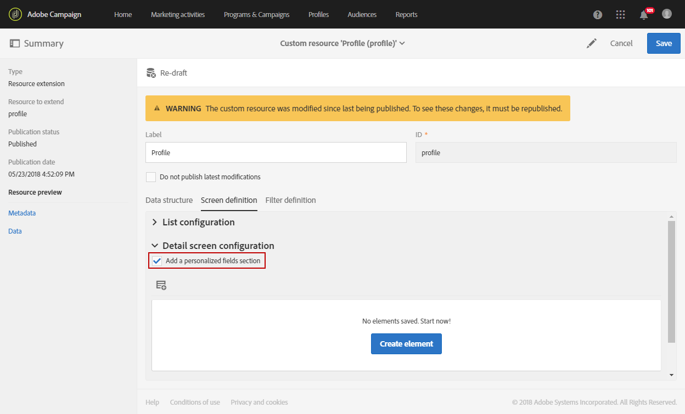

# Creazione di una dimensione di profilo personalizzata{#creating-a-custom-profile-dimension}

È inoltre possibile creare e gestire i rapporti in base ai dati di profilo personalizzati creati durante l'estensione della risorsa personalizzata del profilo.

In questo esempio, desideriamo creare i programmi **** fedeltà per i campi di profilo personalizzati che verranno suddivisi in tre livelli: oro, argento e bronzo. Questo profilo personalizzato verrà quindi esteso in modo da poterlo utilizzare come dimensione di profilo personalizzata nei report dinamici.

* [Passaggio 1: Creare un nuovo campo profilo](#step-1--create-a-new-profile-field)
* [Passaggio 2: Estendi i registri di invio con il campo del profilo](#step-2--extend-the-sending-logs-with-the-profile-field)
* [Passaggio 3: Creazione di un targeting per la consegna dei destinatari iscritti al programma fedeltà](#step-3--create-a-delivery-targeting-recipients-enrolled-in-the-loyalty-program)
* [Passaggio 4: Creare un rapporto dinamico per filtrare i destinatari con la dimensione del profilo personalizzato](#step-4--create-a-dynamic-report-to-filter-recipients-with-the-custom-profile-dimension)

## Passaggio 1: Creare un nuovo campo profilo {#step-1--create-a-new-profile-field}

Prima di tutto è necessario creare il nuovo programma **** Fedeltà campo profilo che assegnerà il livello di fedeltà ai destinatari: oro, argento o bronzo.

>[!NOTE]
>
>Le risorse personalizzate possono essere gestite solo da un amministratore.

A questo scopo:

1. Dal menu avanzato, selezionate **[!UICONTROL Administration]** &gt; **[!UICONTROL Development]** &gt; **[!UICONTROL Custom resources]** quindi la risorsa **[!UICONTROL Profile (profile)]** personalizzata.

   

1. Dalla **[!UICONTROL Data structure]** scheda, nella **[!UICONTROL Fields]** categoria fare clic sul **[!UICONTROL Add field]** pulsante.

   

1. Inserite la risorsa **[!UICONTROL Label]** e **[!UICONTROL ID]** selezionate la risorsa personalizzata **[!UICONTROL Type]**. Qui, abbiamo selezionato **[!UICONTROL Text]** dal momento che i destinatari avranno la scelta tra oro, argento e bronzo.

   

1. Fare clic sull'  icona per definire il campo.

   

1. Qui è necessario specificare i valori autorizzati selezionando **[!UICONTROL Specify a list of authorized valued]** e creando ciascun valore facendo clic su **[!UICONTROL Create element]**.

   

1. Inserite il testo **[!UICONTROL Label]** e **[!UICONTROL Value]** fate clic su **[!UICONTROL Add]**. Per questo esempio, dobbiamo creare il valore oro, argento e bronzo. Al **[!UICONTROL Confirm]** termine, fate clic.

   

1. Selezionate la **[!UICONTROL Screen definition]** scheda. Nell' **[!UICONTROL Detail screen configuration]** elenco a discesa, controlla **[!UICONTROL Add personalized fields]** sezione per creare una nuova sezione nel nostro profilo.

   

1. Fate clic sul **[!UICONTROL Add an element]** pulsante per creare la nuova sezione. Selezionate **[!UICONTROL Type]**: **[!UICONTROL Input field]**, **[!UICONTROL Value]** o **[!UICONTROL List]**, il campo da aggiungere in questa nuova sezione.

   

1. È inoltre possibile aggiungere un titolo alla sezione del campo **[!UICONTROL Customize the title of the section where the fields will be displayed]**.

   Fate clic **[!UICONTROL Save]** al termine della configurazione.

   

1. Dal menu avanzato, selezionate **[!UICONTROL Administration]** &gt; **[!UICONTROL Development]** &gt; **[!UICONTROL Publication]** per avviare la pubblicazione della risorsa personalizzata.
1. Al **[!UICONTROL Prepare publication]** termine della preparazione, fare clic sul **[!UICONTROL Publish]** pulsante.

   

Il nuovo campo del profilo è ora pronto per essere utilizzato e selezionato dai destinatari.

## Passaggio 2: Estendi i registri di invio con il campo del profilo {#step-2--extend-the-sending-logs-with-the-profile-field}

Dopo aver creato il campo del profilo, è necessario estendere i log di invio con il campo del profilo per creare la dimensione del profilo personalizzato associata nei report dinamici.

Prima di estendere il registro con il campo del profilo, assicurarsi che la finestra PII sia stata accettata per avere accesso alla **[!UICONTROL Sending logs extension]** scheda. Per ulteriori informazioni, consultare questa [pagina](../../reporting/using/about-dynamic-reports.md#dynamic-reporting-usage-agreement).

>[!NOTE]
>
>I registri possono essere estesi solo con i campi del profilo dall’amministratore.

1. Dal menu avanzato, selezionate **[!UICONTROL Administration]** &gt; **[!UICONTROL Development]** &gt; **[!UICONTROL Custom resources]** quindi la risorsa **[!UICONTROL Profile (profile)]** personalizzata.
1. Aprite il **[!UICONTROL Sending logs extension]** menu a discesa.
1. Fate clic sul **[!UICONTROL Create element]** pulsante.

   

1. Selezionate il campo creato in precedenza e fate clic su **[!UICONTROL Confirm]**.
1. Selezionate questa opzione **[!UICONTROL Add this field in Dynamic reporting as a new dimension]** per creare una dimensione di profilo personalizzata.

   

   Questa opzione è disponibile solo se è stata accettata la finestra PII. Per ulteriori informazioni, consultare questa [pagina](../../reporting/using/about-dynamic-reports.md#dynamic-reporting-usage-agreement).

1. Fate clic su **[!UICONTROL Add]** e salvate la risorsa personalizzata.
1. Poiché la risorsa personalizzata è stata modificata, è necessario pubblicarla per implementare le nuove modifiche.

   Dal menu avanzato, selezionate **[!UICONTROL Administration]** &gt; **[!UICONTROL Development]** &gt; **[!UICONTROL Publication]** per avviare la pubblicazione della risorsa personalizzata.

1. Al **[!UICONTROL Prepare publication]** termine della preparazione, fare clic sul **[!UICONTROL Publish]** pulsante.

   

Il profilo personalizzato è ora disponibile come dimensione di profilo personalizzata nei rapporti.

Ora che il campo è stato creato e che i registri di invio sono stati estesi con questo campo del profilo, puoi avviare il targeting dei destinatari nelle consegne.

## Passaggio 3: Creazione di un targeting per la consegna dei destinatari iscritti al programma fedeltà {#step-3--create-a-delivery-targeting-recipients-enrolled-in-the-loyalty-program}

Dopo aver pubblicato il campo del profilo, puoi iniziare la consegna. In questo esempio, vogliamo indirizzare tutti i destinatari iscritti al programma fedeltà.

1. Dalla **[!UICONTROL Marketing activities]** scheda, fare clic **[!UICONTROL Create]** quindi selezionare **[!UICONTROL Email]**.
1. Scegliete un indirizzo **[!UICONTROL Email type]** e-mail, quindi immettete le proprietà del messaggio.
1. Per eseguire il targeting del destinatario iscritto al programma fedeltà, trascinate e rilasciate l' **[!UICONTROL Profiles (attributes)]** attività.
1. Seleziona il campo creato in precedenza dall’ **[!UICONTROL Field]** elenco a discesa.

   

1. Selezionate la vostra **[!UICONTROL Filter conditions]**. In questo caso, vogliamo indirizzare i destinatari che fanno parte di uno dei tre livelli del programma fedeltà.

   

1. Al termine del filtraggio, fate clic **[!UICONTROL Confirm]** quindi su **[!UICONTROL Next]**.
1. Definisci e personalizza il contenuto del messaggio, il nome del mittente e l'oggetto. Per ulteriori informazioni sulla creazione di e-mail, consultate questa [pagina](../../designing/using/overview.md).

   Quindi fate clic su **[!UICONTROL Create]**.

1. Una volta pronti, potete visualizzare l'anteprima e inviare il messaggio. Per ulteriori informazioni su come preparare e inviare il messaggio, consulta questa [pagina](../../sending/using/preparing-the-send.md).

Una volta che l’e-mail è stata inviata correttamente ai destinatari selezionati, potete iniziare a filtrare i dati e a monitorare il successo della distribuzione con i rapporti.

## Passaggio 4: Creare un rapporto dinamico per filtrare i destinatari con la dimensione del profilo personalizzato {#step-4--create-a-dynamic-report-to-filter-recipients-with-the-custom-profile-dimension}

Dopo aver inviato la consegna, puoi suddividere i rapporti utilizzando la dimensione del profilo personalizzata dalla **[!UICONTROL Profile]** tabella.

1. Dalla **[!UICONTROL Reports]** scheda, selezionate un rapporto out-of-the-box oppure fate clic sul **[!UICONTROL Create]** pulsante per iniziare da zero.

   

1. Nella **[!UICONTROL Dimensions]** categoria, fai clic **[!UICONTROL Profile]** quindi trascina e rilascia la dimensione del profilo del programma **** Fedeltà personalizzata nella tabella a forma libera.

   

1. Trascina e rilascia le **[!UICONTROL Processed/Sent]** metriche e **[!UICONTROL Open]** inizia a filtrare i dati.

   

1. Se necessario, trascina e rilascia una visualizzazione nell’area di lavoro.

   

**Argomento correlato:**

* [Utilizzo di dati di profilo personalizzati per creare rapporti approfonditi](https://helpx.adobe.com/campaign/kb/simplify-campaign-management.html#Reportandshareinsightswithallstakeholders)
