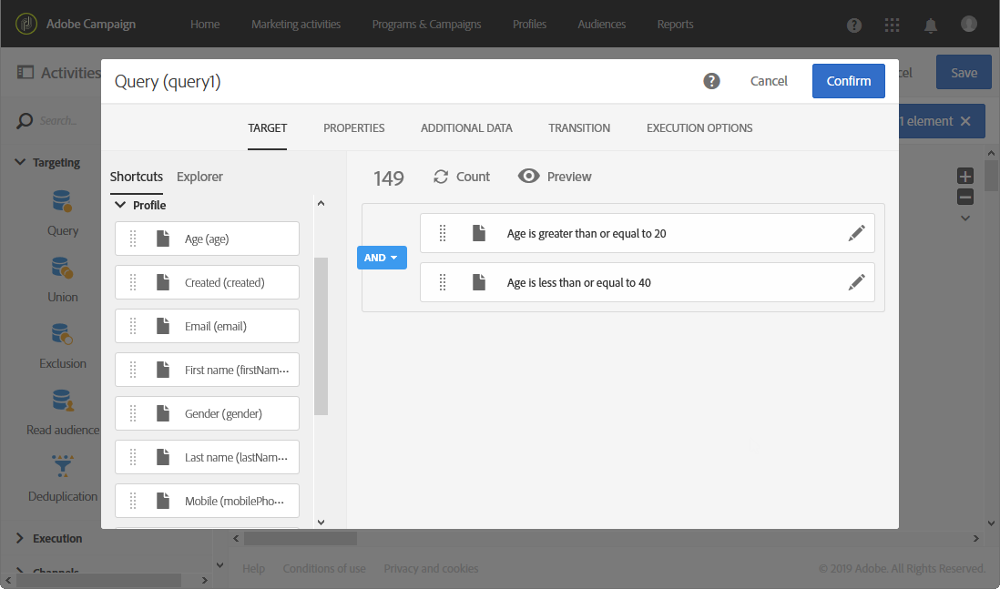
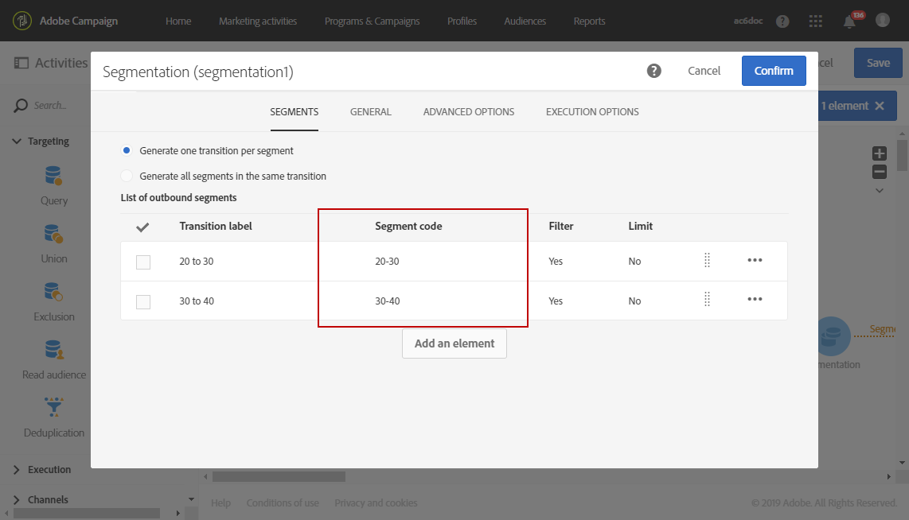

# Creazione di un rapporto basato sui segmenti del flusso di lavoro{#creating-a-report-workflow-segment}

Dopo aver creato un flusso di lavoro e aver filtrato la popolazione in un pubblico di destinazione diverso, potete misurare l&#39;efficienza delle campagne di marketing in base ai segmenti definiti in questo flusso di lavoro di targeting.
Per eseguire il targeting di questi segmenti nei report:

* [Passaggio 1: Aggiorna risorsa personalizzata profili con segmenti](#step-1--update-profiles-custom-resource-segments)
* [Passaggio 2: Creazione di un flusso di lavoro con i segmenti](#step-2--create-a-workflow-segments)
* [Passaggio 3: Creare un rapporto dinamico per filtrare i segmenti](#step-3--create-a-dynamic-report-filter-segments)

>[!CAUTION]
>Per iniziare a raccogliere questi dati, è necessario accettare il contratto di utilizzo per i rapporti dinamici.
>Per ulteriori informazioni su questo contratto, fare riferimento a questa [pagina](../../reporting/using/about-dynamic-reports.md#dynamic-reporting-usage-agreement).

## Passaggio 1: Aggiorna risorsa personalizzata profili con segmenti{#step-1--update-profiles-custom-resource-segments}

Prima di generare rapporti sul codice del segmento, è necessario aggiornare la risorsa **[!UICONTROL Profiles]** personalizzata per memorizzare i codici del segmento.

1. Dal menu avanzato, tramite il logo Adobe Campaign , selezionare **[!UICONTROL Administration]** > **[!UICONTROL Development]** > **[!UICONTROL Custom resources]**, quindi selezionare la risorsa **[!UICONTROL Profile (profile)]**.
1. Nel menu **[!UICONTROL Sending logs extension]** dalla scheda **[!UICONTROL Data structure]**, selezionare **[!UICONTROL Add segment code]** per consentire la memorizzazione dei codici dei segmenti dai flussi di lavoro di targeting e inviarli ai report dinamici.

   La **[!UICONTROL Segment code]** sarà quindi disponibile nella sezione **[!UICONTROL Profile]** della dimensione del report.

   

1. Salvate la risorsa personalizzata.

1. È ora necessario pubblicare la risorsa personalizzata.
Dal menu avanzato, selezionare **[!UICONTROL Administration]** > **[!UICONTROL Development]** > **[!UICONTROL Publishing]**.

   

1. Fare clic su **[!UICONTROL Prepare publication]**, quindi, al termine della preparazione, fare clic sul pulsante **[!UICONTROL Publish]**. Per ulteriori informazioni sulla risorsa personalizzata, fare riferimento a questa [pagina](../../developing/using/updating-the-database-structure.md).

Ora puoi iniziare a creare il flusso di lavoro con i codici dei segmenti.

I codici dei segmenti verranno raccolti non appena si abilita il codice dei segmenti in **[!UICONTROL Sending logs extension]**.

## Passaggio 2: Creare un flusso di lavoro con segmenti {#step-2--create-a-workflow-segments}

>[!NOTE]
>Se la transizione di input per la consegna dell’e-mail è vuota, per impostazione predefinita verrà aggiunto il codice Segmento dalla transizione precedente.

È innanzitutto necessario creare un flusso di lavoro con popolazione di destinazione diversa. Qui, desideriamo inviare un&#39;e-mail che sarà personalizzata a seconda dell&#39;età del nostro pubblico: una consegna per i profili da 20 a 30 anni e un&#39;altra per quelli da 30 a 40 anni.

1. Crea il flusso di lavoro. Per ulteriori dettagli su come creare il flusso di lavoro, fare riferimento a questa [pagina](../../automating/using/building-a-workflow.md).

1. Aggiungete un&#39;attività **[!UICONTROL Query]** trascinandola dalla palette e rilasciandola nell&#39;area di lavoro.

1. Esegue il targeting dei profili da 20 a 40 anni per suddividerli successivamente in popolazioni più mirate.

   

1. Aggiungete un&#39;attività **[!UICONTROL Segmentation]** per suddividere i risultati della query in due popolazioni mirate. Per ulteriori informazioni sulla segmentazione, fare riferimento a questa [pagina](../../automating/using/segmentation.md).

1. Fare doppio clic sull&#39;attività **[!UICONTROL Segmentation]** per configurarla. Modificate il primo segmento facendo clic su **[!UICONTROL Edit properties]**.

   

1. Effettuate le query sui profili tra i 20 e i 30 anni e fate clic su **[!UICONTROL Confirm]** al termine.

   

1. Fai clic su **[!UICONTROL Add an element]** per creare il secondo segmento e configurarlo come descritto nei passaggi descritti sopra per eseguire il targeting dei profili tra i 30 e i 40 anni.

1. Modificare la **[!UICONTROL Segment code]** per ogni popolazione da trasmettere attraverso il reporting dinamico.

   >[!NOTE]
   >Questo passaggio è obbligatorio, altrimenti non sarai in grado di capire su quali segmenti generare i rapporti.

   

1. Trascinare un&#39;attività **[!UICONTROL Email delivery]** dopo i segmenti.

   

1. Personalizza le tue consegne in base alle diverse popolazioni mirate. Per ulteriori informazioni sulla creazione di e-mail, fare riferimento a questa [pagina](../../designing/using/designing-content-in-adobe-campaign.md).

1. Salva il flusso di lavoro.

1. Fare clic su **[!UICONTROL Start]** quando il flusso di lavoro è pronto.

Ora puoi accedere ai rapporti per tenere traccia dei codici dei segmenti.

## Passaggio 3: Creare un rapporto dinamico per filtrare i segmenti {#step-3--create-a-dynamic-report-filter-segments}

Dopo aver inviato le consegne con il flusso di lavoro, puoi suddividere i rapporti utilizzando i codici dei segmenti dal flusso di lavoro.

1. Dalla scheda **[!UICONTROL Reports]**, selezionare un report out-of-the-box o fare clic sul pulsante **[!UICONTROL Create new project]** per iniziare da zero.

   
1. Trascinare la dimensione **[!UICONTROL Delivery]** nella tabella a forma libera.

   

1. Trascina diverse metriche nella tabella, ad esempio le metriche **[!UICONTROL Open]** e **[!UICONTROL Click]** per iniziare a filtrare i dati.
1. Nella categoria **[!UICONTROL Dimensions]**, fai clic sulla dimensione **[!UICONTROL Profile]**, quindi trascina e rilascia la dimensione **[!UICONTROL Segment code]** nella distribuzione del flusso di lavoro per misurare il successo della distribuzione delle e-mail in base alle popolazioni mirate.

   

1. Se necessario, trascina e rilascia una visualizzazione nell’area di lavoro.

   
