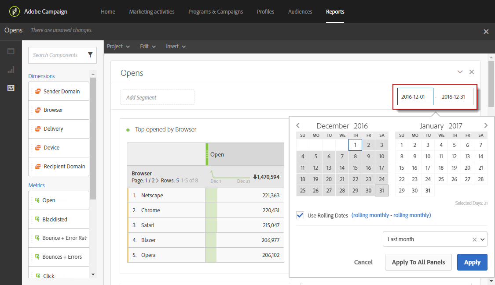

# Defining the report period{#defining-the-report-period}

Prima di avviare o accedere a un report, è necessario applicare un periodo di tempo. Il periodo specificato è accessibile in alto a destra nel report.

Per impostazione predefinita, per una campagna o un programma, il periodo di filtro è impostato sulla data iniziale e finale del programma o della campagna. Per una consegna, la data iniziale corrisponde alla data inviata e alla data di fine alla data inviata più 7 giorni.

Per modificare il filtro, seleziona una data di inizio e un periodo oppure usa il periodo di tempo preimpostato, ad esempio la settimana scorsa, due mesi fa, ecc.

Il rapporto viene aggiornato automaticamente quando un filtro viene applicato o modificato. Il periodo di report selezionato regolerà gli eventi verificatisi nel periodo, non l'intero insieme di dati delle consegne che sono stati creati nell'intervallo, ad es. se una consegna è passata da 1 a 5 ° gennaio e il 1 ° til 2 ° gennaio, l'utente può visualizzare dati parziali. Questo può influire sui conteggi di apertura/clic dal momento che l'apertura o il clic possono avvenire anche un mese dopo l'invio della distribuzione.

