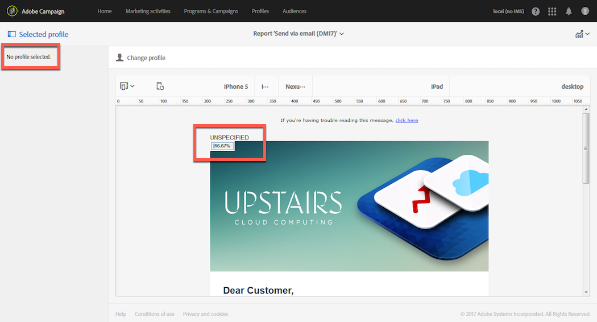

# Hot click{#hot-clicks}

>[!IMPORTANT]
>
>Il rapporto Hot click presenta esclusivamente la versione HTML dell’e-mail e non supporta la versione Testo.

È possibile accedere a questo report da **[!UICONTROL Reports]** in ogni consegna o messaggio transazionale.

Presenta il contenuto del messaggio con la percentuale di clic su ciascun collegamento.

Se hai creato contenuto dinamico per la consegna, puoi visualizzare le percentuali per ogni condizione definita. Per ulteriori informazioni sull’inserimento di contenuto condizionale in una consegna, consulta [Definizione del contenuto dinamico](../../designing/using/personalization.md#defining-dynamic-content-in-an-email).

Ad esempio, immagina di aver creato una consegna con le seguenti condizioni:

* Il collegamento sull&#39;immagine principale è diverso se il destinatario è un uomo o una donna.
* Hai anche aggiunto un collegamento a un’offerta speciale visibile solo ai destinatari che hanno più di 25 anni.

Una volta inviato il messaggio, seleziona **[!UICONTROL Reports]** > **[!UICONTROL Hot clicks]** dal dashboard di consegna.

Per impostazione predefinita, non è selezionato alcun profilo. Vengono visualizzati solo i clic per i destinatari il cui genere è sconosciuto e per i destinatari di età inferiore a 25 anni o sconosciuta.

Per visualizzare i clic per le donne, fare clic sul pulsante **[!UICONTROL Change profile]** e selezionare un profilo di test femminile. Per visualizzare i clic per gli uomini, procedi in modo simile e seleziona un profilo di test maschile.

Per visualizzare i clic per i destinatari con più di 25 anni, fai clic sul pulsante **[!UICONTROL Change profile]** e seleziona un profilo di test la cui data di nascita corrisponde a questa condizione.

Per ulteriori informazioni sui profili di test, consulta [Informazioni sui profili di test](../../audiences/using/managing-test-profiles.md).

>[!NOTE]
>
>Il numero di clic su un collegamento specifico è una percentuale del totale di clic per tutti i contenuti condizionali di una consegna. Pertanto, se hai definito il contenuto dinamico, il totale delle percentuali visualizzate per un profilo di test specifico potrebbe non essere uguale a 100.

Allo stesso modo, per le consegne ricorrenti e i messaggi transazionali, puoi selezionare il profilo di test corrispondente al contenuto dinamico che desideri visualizzare, ma puoi anche visualizzare le percentuali di clic in base alla consegna di esecuzione selezionata.

Una consegna di esecuzione è un messaggio tecnico non actionable e non funzionale creato nei casi seguenti:

* Ogni volta che viene eseguita o aggiornata una consegna ricorrente.

  Ad esempio, se il flusso di lavoro che gestisce questa consegna viene eseguito una volta al mese, ci sarà una consegna di esecuzione al mese. Inoltre, ogni volta che il contenuto della consegna viene aggiornato, viene creata un’ulteriore consegna di esecuzione.

  Per ulteriori informazioni sulle consegne ricorrenti di e-mail, consulta [Consegna e-mail](../../automating/using/email-delivery.md).

* Per impostazione predefinita, una volta al mese per i messaggi transazionali e ogni volta che un messaggio transazionale viene modificato e pubblicato di nuovo.

  Per ulteriori informazioni sui messaggi transazionali, consulta [Guida introduttiva alla messaggistica transazionale](../../channels/using/getting-started-with-transactional-msg.md).

>[!NOTE]
>
>Poiché gli ID degli URL tracciati sono diversi per ogni esecuzione, i dati degli hot click non possono essere aggregati per tutte le consegne di esecuzione di un determinato messaggio. Può essere visualizzato per una sola consegna di esecuzione alla volta.

Una volta inviato il messaggio, seleziona **[!UICONTROL Reports]** > **[!UICONTROL Hot clicks]** dal dashboard di consegna.

Per impostazione predefinita, è selezionata l’ultima consegna di esecuzione. Fai clic su **[!UICONTROL Change execution delivery]** per selezionarne un altro.

Vengono visualizzate solo le percentuali di clic per l’esecuzione della consegna selezionata.
