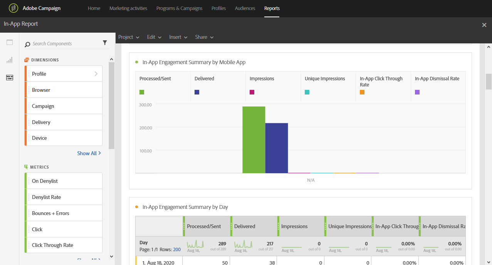
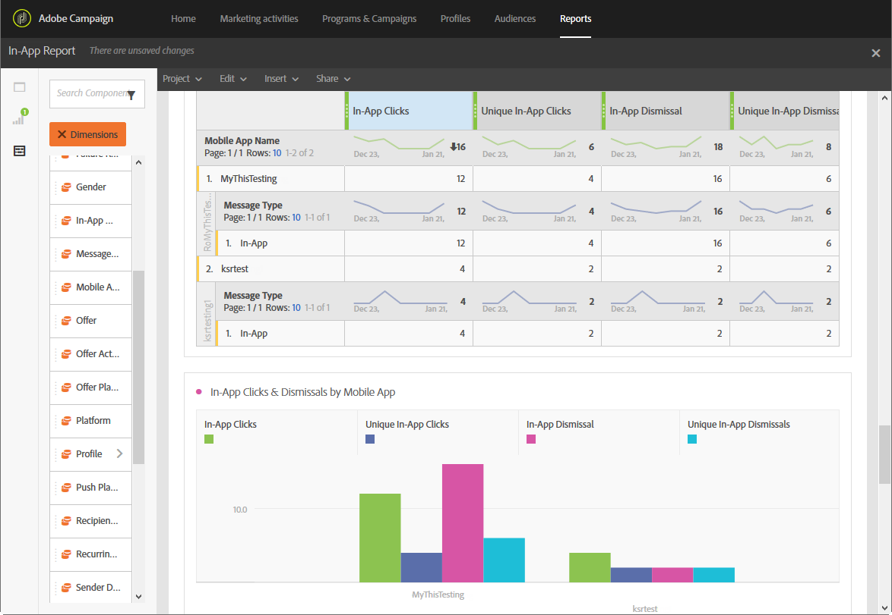

# Rapporto in-app{#in-app-report}

>[!CAUTION]
>
>Tieni presente che devi trascinare e rilasciare le metriche **[!UICONTROL Message type]** nelle tabelle per suddividere i dati in base ai tipi di consegna, in questo caso consegne in-app.

Il report **In-App** fornisce dettagli relativi alle consegne in-app.

Ogni tabella è rappresentata da numeri e grafici di riepilogo. Puoi modificare la modalità di visualizzazione dei dettagli nelle rispettive impostazioni di visualizzazione.

La prima tabella **Riepilogo del coinvolgimento in-app** è suddivisa in tre categorie: per giorno, per app mobile e per consegna. Contiene i dati disponibili per la reattività del destinatario alla consegna:

* **[!UICONTROL Processed/sent]**: numero totale di invii per la consegna in-app.
* **[!UICONTROL Delivered]**: numero di messaggi in-app inviati correttamente, in relazione al numero totale di messaggi inviati.
* **[!UICONTROL Impressions]**: totale dei messaggi in-app visualizzati dai destinatari a seconda che il criterio di attivazione sia stato soddisfatto.
* **[!UICONTROL Unique impressions]**: numero di impression per destinatario.
* **[!UICONTROL In-App click through rate]**: percentuale di utenti che hanno fatto clic sul pulsante 1 o sul pulsante 2 rispetto agli utenti che hanno visualizzato il messaggio.
* **[!UICONTROL In-App dismissal rate]**: percentuale di messaggi in-app ignorati dai destinatari.

La seconda tabella **Clic e chiusure in-app** è suddivisa in tre categorie: per giorno, per app mobile e per consegna. Contiene i dati disponibili per il comportamento del destinatario per consegna:

* **[!UICONTROL In-App clicks]**: numero totale di destinatari che hanno fatto clic sul pulsante 1 o sul pulsante 2.
* **[!UICONTROL Unique In-App clicks]**: numero di volte in cui i destinatari hanno fatto clic sul pulsante 1 o sul pulsante 2.
* **[!UICONTROL In-App dismissal]**: numero totale di messaggi che i destinatari hanno ignorato facendo clic sul pulsante Chiudi o Chiudi automaticamente.
* **[!UICONTROL Unique In-App dismissal]**: numero di volte in cui i destinatari hanno ignorato un messaggio in-app.
