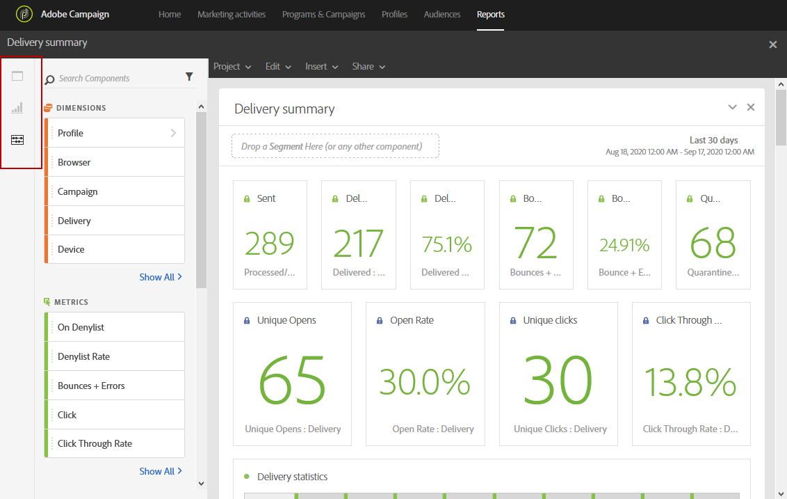
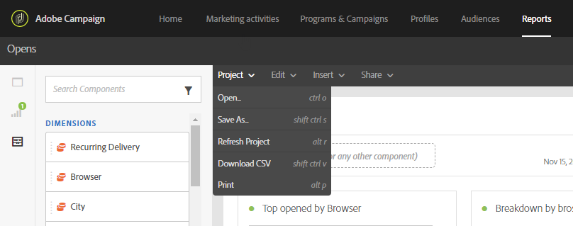

# Interfaccia di reporting{#reporting-interface}

La barra degli strumenti superiore consente, ad esempio, di modificare, salvare o stampare il rapporto.

Utilizza la scheda **Progetto** per:

* **Apri...**: Apre un report o un modello creato in precedenza.
* **Salva con nome...**: Duplica i modelli per poterli modificare.
* **Aggiorna progetto**: Aggiorna il rapporto in base a nuovi dati e a modifiche ai filtri.
* **Scarica CSV**: Esporta i rapporti in un file CSV.

La scheda **Modifica** consente di:

* **Annulla**: Annulla l’ultima azione sul dashboard.
* **Cancella tutto**: Elimina ogni pannello del dashboard.

La tabella **Inserisci** consente di personalizzare i rapporti aggiungendo grafici e tabelle al dashboard:

* **Nuovo pannello** vuoto: Aggiunge un nuovo pannello vuoto al dashboard.
* **Nuova forma libera**: Aggiunge una nuova tabella a forma libera al dashboard.
* **Nuova riga**: Aggiunge un nuovo grafico a linee al dashboard.
* **Nuova barra**: Aggiunge un nuovo grafico a barre al dashboard.

**Argomenti correlati:**

* [Aggiunta di pannelli](../../reporting/using/adding-panels.md)
* [Aggiunta di visualizzazioni](../../reporting/using/adding-visualizations.md)
* [Aggiunta di componenti](../../reporting/using/adding-components.md)
* [Condivisione automatica dei rapporti con le parti interessate tramite e-mail](https://helpx.adobe.com/campaign/kb/simplify-campaign-management.html#Reportandshareinsightswithallstakeholders)

## Schede {#tabs}

Le schede a sinistra ti consentono di generare il rapporto e filtrare i dati in base alle esigenze.

Queste schede consentono di accedere ai seguenti elementi:

* **[!UICONTROL Panels]**: aggiungi un pannello vuoto o una forma libera al rapporto per iniziare a filtrare i dati. Per ulteriori informazioni, consulta la sezione Aggiunta di pannelli .
* **[!UICONTROL Visualizations]**: trascina e rilascia una selezione di elementi di visualizzazione per assegnare al rapporto una dimensione grafica. Per ulteriori informazioni, consulta la sezione Aggiunta di visualizzazioni .
* **[!UICONTROL Components]**: personalizzare i rapporti con dimensioni, metriche, segmenti e periodi di tempo diversi.

## Barra degli strumenti {#toolbar}

La barra degli strumenti si trova sopra l’area di lavoro. Composto da diverse schede, consente, ad esempio, di modificare, salvare, condividere o stampare il rapporto.

**Argomenti correlati:**

* [Aggiunta di pannelli](../../reporting/using/adding-panels.md)
* [Aggiunta di visualizzazioni](../../reporting/using/adding-visualizations.md)
* [Aggiunta di componenti](../../reporting/using/adding-components.md)

### Scheda Progetto {#project-tab}

Utilizza la scheda **Progetto** per:

* **Apri...**: Apre un report o un modello creato in precedenza.
* **Salva con nome...**: Duplica i modelli per poterli modificare.
* **Aggiorna progetto**: Aggiorna il rapporto in base a nuovi dati e a modifiche ai filtri.
* **Scarica CSV**: Esporta i rapporti in un file CSV.
* **[!UICONTROL Print]**: Stampa il rapporto.

### Scheda Modifica {#edit-tab}

La scheda **Modifica** consente di:

* **Annulla**: Annulla l’ultima azione sul dashboard.
* **Cancella tutto**: Elimina ogni pannello del dashboard.

### Inserisci scheda {#insert-tab}

La scheda **Inserisci** ti consente di personalizzare i rapporti aggiungendo grafici e tabelle al dashboard:

* **Nuovo pannello** vuoto: Aggiunge un nuovo pannello vuoto al dashboard.
* **Nuova forma libera**: Aggiunge una nuova tabella a forma libera al dashboard.
* **Nuova riga**: Aggiunge un nuovo grafico a linee al dashboard.
* **Nuova barra**: Aggiunge un nuovo grafico a barre al dashboard.

### Scheda Condividi {#share-tab}

La scheda **[!UICONTROL Share]** ti consente di inviare i rapporti con gli utenti di Adobe Campaign tramite e-mail una tantum o ricorrenti. Gli utenti di destinazione riceveranno quindi un’e-mail con il rapporto allegato.

* **[!UICONTROL Send report now]**: Invia il rapporto a un elenco di destinatari selezionati tramite e-mail una tantum.

   1. Se necessario, aggiungi una descrizione nella finestra **[!UICONTROL Send report]**.

      

   1. Seleziona i destinatari dell’e-mail facendo clic sul campo e selezionandoli nell’elenco a discesa o digitandone gli indirizzi e-mail.
   1. Se desideri inviare e-mail ricorrenti, seleziona **[!UICONTROL Show scheduling options]** . Per eseguire questa operazione, seleziona anche **[!UICONTROL Send Report on schedule]** nella scheda **[!UICONTROL Share]** .
   1. Fai clic su **[!UICONTROL Send now]**. I destinatari riceveranno quindi un’e-mail con il rapporto allegato.

* **[!UICONTROL Send report on schedule]**: Pianifica il rapporto e invia e-mail ricorrenti ai destinatari.

   1. Se necessario, aggiungi una descrizione nella finestra **[!UICONTROL Send report]**.
   1. Seleziona i destinatari dell’e-mail facendo clic sul campo e selezionandoli nell’elenco a discesa o digitandone gli indirizzi e-mail.

      

   1. Seleziona la data di inizio e la data di fine per configurare la validità delle e-mail nei campi **[!UICONTROL Starting on]** e **[!UICONTROL Ending on]** .
   1. Scegli la frequenza con cui l’e-mail verrà inviata.

      

   1. Fai clic su **[!UICONTROL Send on schedule]** per ricevere l’e-mail ricorrente a seconda della frequenza scelta.

* **[!UICONTROL Scheduled reports]**: Trova e configura tutti i rapporti pianificati.

   1. Nella finestra **[!UICONTROL Scheduled reports]**, trova tutti i tuoi report ricorrenti inviati.

      

   1. Per eliminare uno dei rapporti pianificati, selezionalo e fai clic su **[!UICONTROL Delete the section]**.
   1. Per configurare o controllare i rapporti pianificati, fai clic direttamente sul rapporto da modificare.
   1. Viene visualizzata la finestra **[!UICONTROL Edit scheduled report]** , che consente di modificare i destinatari o la frequenza dell’e-mail, se necessario.

Gli utenti di destinazione riceveranno quindi un’e-mail con il rapporto allegato direttamente nelle loro caselle in entrata. Gli utenti possono sempre decidere di interrompere la ricezione di e-mail ricorrenti utilizzando un collegamento di annullamento dell’abbonamento disponibile in ogni e-mail ricorrente.

**Argomento correlato:**

* [Condivisione automatica dei rapporti con le parti interessate tramite e-mail](https://helpx.adobe.com/campaign/kb/simplify-campaign-management.html#Reportandshareinsightswithallstakeholders)
