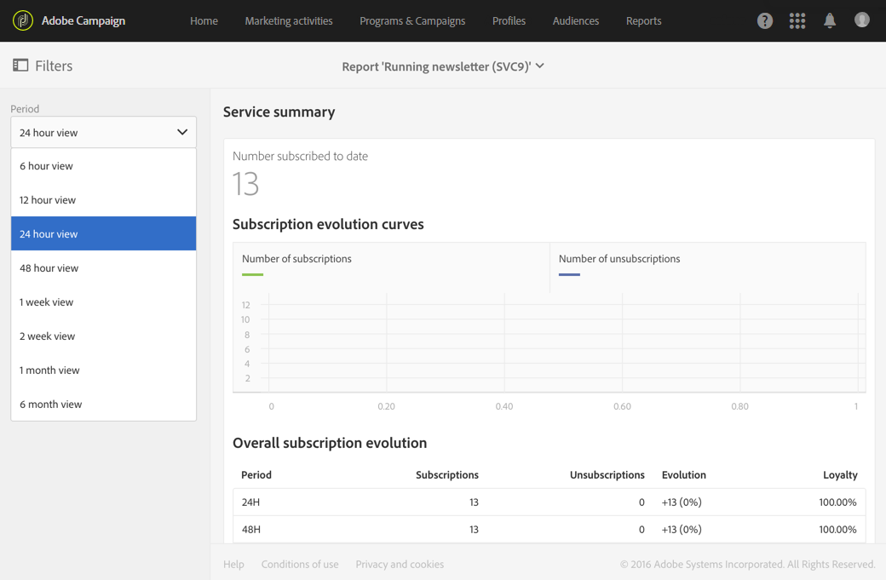

# Riepilogo del servizio{#service-summary}

I **[!UICONTROL Service summary]**dettagli sull&#39;evoluzione delle iscrizioni e delle cancellazioni delle iscrizioni del servizio.
Questo rapporto è accessibile solo dalla pagina Servizio tramite il menu avanzato**[!UICONTROL Profiles & Audiences]** > **[!UICONTROL Services]**. Per ulteriori informazioni, consultare questa[pagina](../../audiences/using/monitoring-subscriptions.md#service-reports).

La **[!UICONTROL Subscription evolution curves]**visualizzazione specifica il numero di sottoscrizioni e di sottoscrizioni a seconda del numero**[!UICONTROL Period]** scelto nella barra a discesa.

Questo **[!UICONTROL Overall subscription evolution]**consente di visualizzare l&#39;evoluzione degli abbonati in diversi periodi di tempo.
