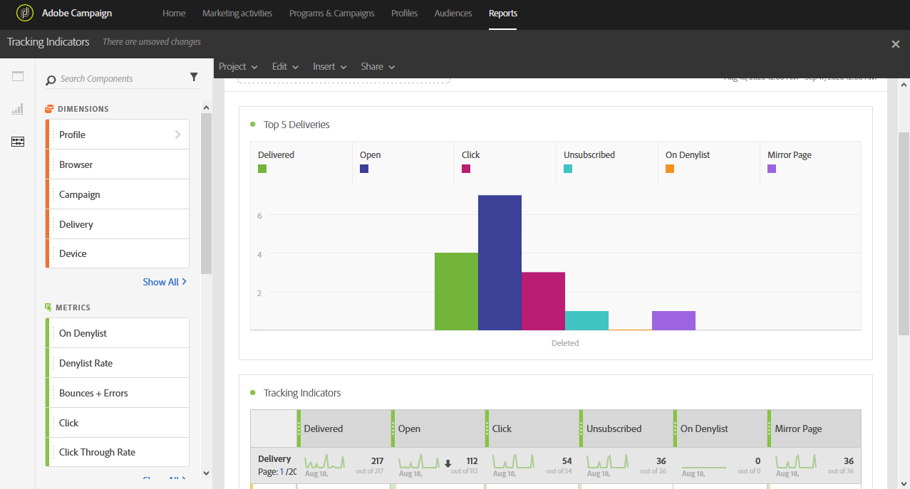

# Indicatori di tracciamento{#tracking-indicators}

Il report **[!UICONTROL Tracking indicators]** contiene gli indicatori chiave per il comportamento di tracciamento dopo la ricezione dei messaggi e-mail.

>[!NOTE]
>
>Per accedere a questi dati, il tracciamento deve essere abilitato durante la preparazione di una consegna.

La tabella **[!UICONTROL Tracking indicators]** e il grafico **Prime 5 consegne** contengono i dati disponibili per il tracciamento delle e-mail, ad esempio:

* **[!UICONTROL Delivered]**: numero di messaggi inviati correttamente. Gli errori generati (mancati recapiti) vengono presi in considerazione. tuttavia, i reclami (dichiarazioni spam) e i messaggi di allontanamento come &quot;fuori sede&quot; non vengono presi in considerazione.
* **Apri**: il numero di volte in cui un messaggio è stato aperto in una consegna.
* **Clic**: il numero di volte in cui è stato fatto clic sul contenuto in una consegna.
* **Annullamento dell&#39;abbonamento**: numero di clic sul collegamento dell&#39;abbonamento.
* **Spam:** il numero di destinatari che hanno dichiarato un&#39;e-mail come spam.
* **Pagina mirror**: numero di clic sul collegamento della pagina mirror.
