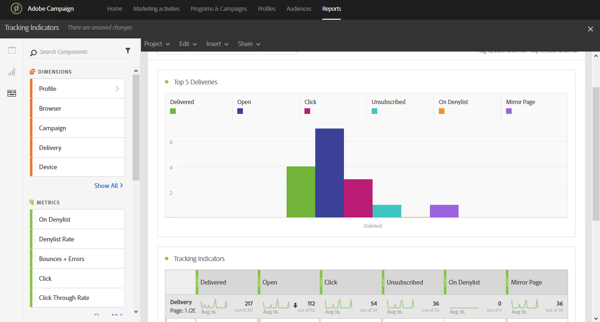

# Indicatori di tracciamento{#tracking-indicators}

Il **[!UICONTROL Tracking indicators]** rapporto contiene gli indicatori chiave per il tracciamento del comportamento dopo la ricezione dei messaggi e-mail.

>[!NOTE]
>
>Per accedere a questi dati, è necessario abilitare il tracciamento durante la preparazione della consegna.

La **[!UICONTROL Tracking indicators]** tabella e il grafico delle **prime 5 consegne** contiene i dati disponibili per il tracciamento delle e-mail, ad esempio:

* **[!UICONTROL Delivered]**: Numero di messaggi inviati correttamente. Vengono presi in considerazione gli errori generati (rimbalzi). tuttavia, non si tiene conto dei reclami (dichiarazioni di spam) e dei messaggi inviati via via, come &quot;fuori sede&quot;.
* **Apri**: Il numero di volte in cui un messaggio è stato aperto in una consegna.
* **Fate clic**: Numero di volte in cui è stato fatto clic sul contenuto in una consegna.
* **Annulla sottoscrizione**: Il numero di clic sul collegamento di iscrizione.
* **Spam:** Numero di destinatari che hanno dichiarato spam un&#39;e-mail.
* **Pagina** speculare: Numero di clic sul collegamento della pagina mirror.

