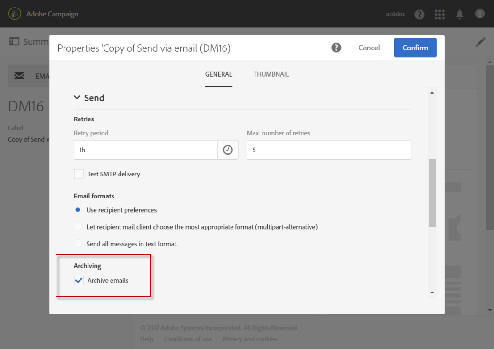

# Archiviazione di e-mail con indirizzi in Ccn{#archiving-emails}

Puoi configurare Adobe Campaign in modo da conservare una copia delle e-mail inviate dalla piattaforma tramite Ccn e-mail.

In particolare, se la tua organizzazione deve archiviare tutti i messaggi e-mail in uscita per motivi di conformità, puoi abilitare questa funzionalità. Ti consente di inviare una copia nascosta esatta dei messaggi inviati corrispondenti a un indirizzo e-mail Ccn (invisibile ai destinatari della consegna) che devi specificare.

Una volta abilitata, devi attivare Ccn e-mail dall&#39;opzione **[!UICONTROL Archive emails]** nel modello di consegna e-mail.

>[!NOTE]
>
>Adobe Campaign stessa non gestisce i file archiviati. Consente di inviare i messaggi scelti a un indirizzo dedicato, da cui possono essere elaborati e archiviati utilizzando un sistema esterno.

## Recommendations e limitazioni {#recommendations-and-limitations}

* Questa funzione è facoltativa. Controlla il contratto di licenza e contatta il responsabile dell’account per attivarla.
* L&#39;indirizzo Ccn scelto deve essere fornito al team di Adobi che lo configurerà automaticamente.
* È possibile utilizzare un solo indirizzo e-mail Ccn.
* Vengono presi in considerazione solo i messaggi e-mail inviati correttamente. I mancati recapiti non lo sono.
* Per motivi di privacy, le e-mail in formato Ccn devono essere elaborate da un sistema di archiviazione in grado di memorizzare informazioni personali (PII) protette.
* Durante la creazione di un nuovo modello di consegna, e-mail con Ccn non è abilitata per impostazione predefinita, anche se l’opzione è stata acquistata. Devi abilitarla manualmente in ogni modello di consegna in cui desideri utilizzarla.

>[!NOTE]
>
>Attualmente le e-mail archiviate vengono ancora inviate dal modulo di archiviazione legacy che utilizza un semplice inoltro SMTP.

## Attivazione dell’archiviazione delle e-mail {#activating-email-archiving}

Una volta attivato, il Ccn e-mail viene attivato nel [modello e-mail](../../start/using/marketing-activity-templates.md) tramite un&#39;opzione dedicata:

1. Vai a **Risorse** > **Modelli** > **Modelli di consegna**.
1. Duplica il modello predefinito **[!UICONTROL Send via email]**.
1. Seleziona il modello duplicato.
1. Fare clic sul pulsante **[!UICONTROL Edit properties]** per modificare le proprietà del modello.
1. Espandere la sezione **[!UICONTROL Send]**.
1. Selezionare la casella **[!UICONTROL Archive emails]** per conservare una copia di tutti i messaggi inviati per ogni consegna basata su questo modello.

   

>[!NOTE]
>
>Se le e-mail inviate all&#39;indirizzo Ccn vengono aperte e cliccate tramite, questo verrà preso in considerazione nelle **[!UICONTROL Total opens]** e **[!UICONTROL Clicks]** dell&#39;analisi di invio, il che potrebbe causare alcuni errori di calcolo.
