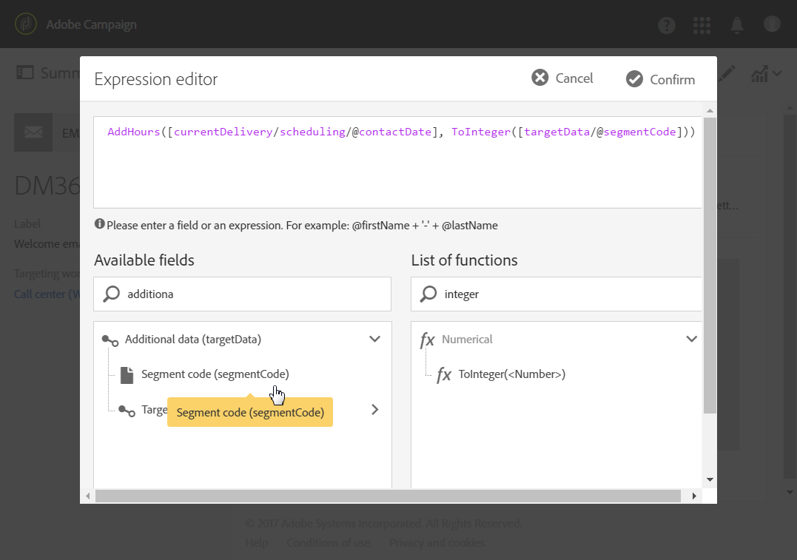

# Calcolo della data di invio{#computing-the-sending-date}

Puoi definire una formula per inviare il messaggio a ogni destinatario in una data e in un'ora specifiche.

## Personalizzazione della formula data {#customizing-date-formula}

Ad esempio, potete utilizzare l'ottimizzazione del tempo di invio durante il processo di rampa.

Quando le e-mail vengono inviate utilizzando una nuova piattaforma, i provider di servizi Internet (ISP) sono sospetti rispetto agli indirizzi IP non riconosciuti. Se grandi quantità di e-mail vengono inviate improvvisamente, gli ISP spesso le contrassegnano come spam.

Per evitare di essere contrassegnati come spam, potete aumentare progressivamente il volume inviato distribuendo grandi quantità di e-mail in tempi diversi. Questo dovrebbe garantire uno sviluppo uniforme della fase di avvio e consentire di ridurre il tasso complessivo di indirizzi non validi.

Ad esempio, potete segmentare il pubblico di destinazione in modo casuale per inviarlo in cinque batch. Il primo batch che rappresenta il 10% del pubblico di destinazione verrà inviato il 1° giugno alle 10:00, il secondo batch 24 ore dopo con il 15% del pubblico e così via.

Puoi pianificare questa operazione tramite un flusso di lavoro.


1. Accedi all'elenco delle attività di marketing e crea un nuovo flusso di lavoro. Consultate [Creazione di un flusso di lavoro](../../automating/using/building-a-workflow.md#creating-a-workflow).
1. Trascinate e rilasciate un'attività **Query** nel flusso di lavoro per aprirla. Vedere la sezione [Query](../../automating/using/query.md) .
1. Selezionate un'audience, ad esempio tutti i clienti Gold e fate clic **[!UICONTROL Confirm]** per salvare la query.
1. Trascina e rilascia un’attività di **segmentazione** nel flusso di lavoro per aprirla. Vedere la sezione [Segmentazione](../../automating/using/segmentation.md) .
1. Definire cinque segmenti. Per ciascun segmento:

   * Compila il **[!UICONTROL Segment code]** campo: immettete manualmente la data e l’ora desiderate per l’invio del messaggio.

      Ad esempio, si desidera inviare il primo batch il 1° giugno alle 00:00 GMT+1. Utilizzate il formato seguente: **AAAA-MM-GG hh:mm:ss+tz**.

      

      Per inviare il batch successivo il giorno successivo, immettere **2017-06-02 10:00:00+01** per il secondo segmento.

      Per i segmenti rimanenti, definire i batch successivi come segue:

      * **2017-06-03 10:00:00+01**
      * **2017-06-04 10:00:00+01**
      * **2017-06-05 10:00:00+01**
   * Accertatevi di selezionare l' **[!UICONTROL Limit the population of this segment]** opzione.

      Nella **[!UICONTROL Limitation]** scheda, selezionate **[!UICONTROL Random sampling]** e inserite la percentuale desiderata per ciascun segmento: 10 per il primo batch, 15 per il secondo e così via.

      


1. Una volta definiti tutti i segmenti, seleziona **[!UICONTROL Generate all segments in the same transition]** e fai clic su **[!UICONTROL Confirm]**.

   

1. Trascinate e rilasciate un’attività di consegna **tramite e-** mail nel flusso di lavoro per aprirla. Consultate la sezione [Invio](../../automating/using/email-delivery.md) e-mail.
1. Fate clic sulla **[!UICONTROL Schedule]** sezione nel dashboard e-mail e selezionate **[!UICONTROL Messages to be sent automatically on the date specified below]**.
1. Nel **[!UICONTROL Start sending from]** campo, definire una data di contatto.
1. Dal menu a discesa Ottimizzazione tempo di invio, scegliete **[!UICONTROL Send at a custom date defined by a formula]**.
1. Fare clic sul **[!UICONTROL Edit an expression]** pulsante del **[!UICONTROL Custom date formula]** campo.

   

1. Create la seguente espressione utilizzando la **[!UICONTROL ToDateTime]** funzione e il **[!UICONTROL Segment code]** campo. È inoltre possibile digitare direttamente l'espressione, ma accertarsi di utilizzare sintassi e ortografia corrette.

   ```
   ToDateTime([targetData/@segmentCode])
   ```

   La **[!UICONTROL ToDateTime]** funzione trasforma il codice del segmento da una stringa di testo a un valore data e ora.

   Confermate l'espressione per tornare alla schermata precedente.

   

   Nella **[!UICONTROL Schedule]** finestra, la formula della data personalizzata viene visualizzata come segue:

   ```
   ToDateTime([targetData/@segmentCode])
   ```

   

1. Conferma la pianificazione, salva la consegna ed esegui il flusso di lavoro.

La consegna verrà inviata progressivamente a tutti i destinatari interessati nel corso di cinque giorni.

>[!NOTE]
>
>Accertatevi che tutte le date siano in futuro per confermare l'invio. In caso contrario, il messaggio verrà inviato non appena l'invio verrà confermato.

## Utilizzo di un'espressione {#using-an-expression}

L'ottimizzazione dei tempi di invio è utile anche per le campagne che coinvolgono un call center. Puoi evitare che tutti i messaggi vengano ricevuti contemporaneamente. Questo consente alla tua organizzazione di elaborare il numero di chiamate in base alla sua capacità.

Ad esempio, potete inviare un messaggio e-mail in cui si invitano i clienti a contattare un call center per ottenere un'offerta promozionale. Per evitare di sopraffare il call center, decidi di segmentare il pubblico di destinazione in modo casuale e di inviare l’e-mail in quattro batch.

Puoi pianificare questa operazione tramite un flusso di lavoro.


1. Accedi all'elenco delle attività di marketing e crea un nuovo flusso di lavoro. Consultate [Creazione di un flusso di lavoro](../../automating/using/building-a-workflow.md#creating-a-workflow).
1. Trascinate e rilasciate un'attività **Query** nel flusso di lavoro per aprirla. Vedere la sezione [Query](../../automating/using/query.md) .
1. Selezionate un'audience, ad esempio oltre 35 profili e fate clic **[!UICONTROL Confirm]** per salvare la query.
1. Trascina e rilascia un’attività di **segmentazione** nel flusso di lavoro per aprirla. Vedere la sezione [Segmentazione](../../automating/using/segmentation.md) .
1. Definire quattro segmenti. Per ciascun segmento:

   * Definite i codici dei segmenti come segue:

      * 8:00 - 10:00: **0**. Il messaggio verrà inviato al primo trimestre della popolazione destinataria alle 08:00 (data del contatto).
      * 10:00 AM - 12:00 PM: **2**. Il messaggio verrà inviato al secondo trimestre della popolazione destinataria alle 10:00 (data di contatto + 2 ore).
      * 2:00 PM - 4:00 PM: **6**. Il call center, chiuso tra le 12:00 e le 14:00, sarà inviato al terzo trimestre della popolazione destinataria alle 14:00 (data di contatto + 6 ore).
      * 4:00 PM - 6:00 PM: **8**. Il messaggio verrà inviato all'ultimo trimestre della popolazione destinataria alle 16:00 (data di contatto + 8 ore).
      >[!NOTE]
      >
      >La data del contatto verrà definita nell'attività di distribuzione e-mail più avanti nel flusso di lavoro.

   * Accertatevi di selezionare l' **[!UICONTROL Limit the population of this segment]** opzione.
   * Nella **[!UICONTROL Limitation]** scheda, selezionate **[!UICONTROL Random sampling]** e inserite la percentuale desiderata per ciascun segmento: **25**.


1. Una volta definiti tutti i segmenti, seleziona **[!UICONTROL Generate all segments in the same transition]** e fai clic su **[!UICONTROL Confirm]**.

   

1. Trascinate e rilasciate un’attività di consegna **tramite e-** mail nel flusso di lavoro per aprirla. Consultate la sezione [Invio](../../automating/using/email-delivery.md) e-mail.
1. Fate clic sulla **[!UICONTROL Schedule]** sezione nel dashboard e-mail.
1. Selezionare **[!UICONTROL Messages to be sent automatically on the date specified below]**.
1. Nel **[!UICONTROL Start sending from]** campo, definire una data di contatto.

   In questo esempio, selezionate 25 maggio alle 08:00.

1. Dal menu a discesa Ottimizzazione dell'ora di invio, scegliete **[!UICONTROL Send at a custom date defined by a formula]** e fate clic sul **[!UICONTROL Edit an expression]** pulsante.

   

1. In **[!UICONTROL Expression editor]**, impostare la data e i codici dei segmenti per calcolare i dati per ciascun cliente.

   Nell'elenco delle funzioni, selezionare **[!UICONTROL AddHours]**.

   

   Nei campi disponibili, selezionate **[!UICONTROL Current delivery]** &gt; **[!UICONTROL Delivery scheduling]** &gt; **[!UICONTROL Contact date]**.

   

   Questo consente di recuperare la data e l'ora specificate nel **[!UICONTROL Start sending from]** campo.

   Nell'elenco delle funzioni, selezionare **[!UICONTROL ToInteger]**. Nei campi disponibili, selezionate **[!UICONTROL Additional data]** &gt; **[!UICONTROL Segment code]**.

   

   Questo consente di recuperare i numeri specificati nei codici dei segmenti.

   Dovreste ottenere la seguente formula:

   ```
   AddHours([currentDelivery/scheduling/@contactDate], ToInteger([targetData/@segmentCode]))
   ```

1. Confermate il salvataggio dell'espressione. Conferma la pianificazione, salva la consegna ed esegui il flusso di lavoro.

* Il primo segmento riceverà il messaggio alla data del contatto (25 maggio alle 08:00).
* Il secondo segmento riceverà il messaggio due ore dopo (25 maggio alle 10:00).
* Il terzo segmento riceverà il messaggio sei ore dopo (25 maggio alle 2:00 PM).
* Il quarto segmento riceverà il messaggio otto ore dopo (25 maggio alle 16:00).

