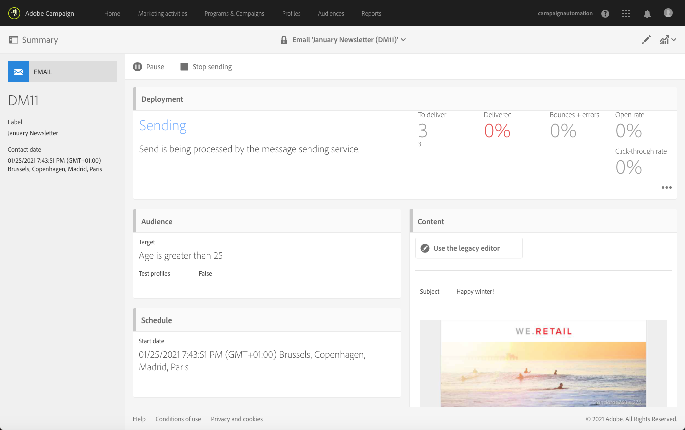

# Conferma dell’invio{#confirming-the-send}

Dopo che hai completato la preparazione dei messaggi e hai eseguito i passaggi di approvazione, puoi inviarli. Per ulteriori informazioni sulla preparazione dei messaggi, consulta [Preparazione dell’invio](../../sending/using/preparing-the-send.md).

Solo gli utenti con **[!UICONTROL Start deliveries]** Il ruolo può confermare l’invio. Per ulteriori informazioni, consulta la sezione [Elenco di ruoli](../../administration/using/list-of-roles.md).

<!--Users without this role will see the following message: 

-->

## Invio del messaggio {#sending-message}

Al termine della preparazione, segui i passaggi seguenti per inviare il messaggio.

1. Fai clic sul pulsante **[!UICONTROL Confirm send]** nella barra delle azioni del messaggio.

   

1. Per completare l’invio, fai clic sul pulsante **[!UICONTROL OK]** pulsante .

   

1. Attendi l&#39;invio del messaggio. Il blocco **[!UICONTROL Deployment]** mostra l’avanzamento dell’invio.

>[!NOTE]
>
>Se il messaggio è pianificato, viene inviato al raggiungimento dell’orario di invio. Per ulteriori informazioni sulla pianificazione dei messaggi, consulta [questa sezione](../../sending/using/about-scheduling-messages.md).

Se utilizzi una consegna ricorrente senza periodo di aggregazione, puoi richiedere conferma prima di inviarla. Quando configuri il messaggio, apri la **[!UICONTROL Schedule]** blocca il dashboard di consegna e attiva l’opzione dedicata.

## Informazioni sugli indicatori dei messaggi {#message-indicators}

Dopo l’invio del messaggio ai contatti, l’area **[!UICONTROL Deployment]** mostra i dati KPI (Key Performance Indicator), inclusi:

* Il numero dei messaggi da inviare
* Il numero dei messaggi inviati
* La percentuale dei messaggi inviati
* La percentuale dei messaggi non recapitati e degli errori
* La percentuale dei messaggi aperti
* La percentuale di clic nei messaggi (per e-mail)

   >[!NOTE]
   >
   >L’**[!UICONTROL Open rate]** e il **[!UICONTROL Click-through rate]** vengono aggiornati ogni ora.

Se l’aggiornamento dei KPI richiede troppo tempo o non riflette i risultati dei log di invio, fai clic su **[!UICONTROL Compute stats]** nel **[!UICONTROL Deployment]** finestra.

Il messaggio può essere visualizzato nella cronologia di uno dei profili di destinazione. Consulta [Integrated Customer Profile](../../audiences/using/integrated-customer-profile.md).

Una volta inviato un messaggio, puoi tenere traccia del comportamento dei destinatari e monitorarlo per misurarne l’impatto. Per ulteriori informazioni, consulta queste sezioni:

* [Tracciamento dei messaggi](../../sending/using/tracking-messages.md)
* [Monitoraggio di una consegna](../../sending/using/monitoring-a-delivery.md)

### Generazione rapporti di successo {#delivered-status-report}

>[!NOTE]
>
>Questa sezione si applica solo al canale e-mail.

In **[!UICONTROL Summary]** visualizzazione di ogni e-mail, **[!UICONTROL Delivered]** percentuale inizia al 100% e poi scende progressivamente per tutta la consegna [periodo di validità](../../administration/using/configuring-email-channel.md#validity-period-parameters), come i rimbalzi morbidi e duri vengono segnalati indietro<!--from the Enhanced MTA to Campaign-->.

Infatti, tutti i messaggi appaiono come **[!UICONTROL Sent]** in [registri di invio](../../sending/using/monitoring-a-delivery.md#sending-logs) non appena vengono correttamente inoltrati da Campaign all’MTA avanzato (Message Transfer Agent). Rimangono nello status a meno che [rimbalzo](../../sending/using/understanding-delivery-failures.md#delivery-failure-types-and-reasons) il messaggio viene comunicato nuovamente dall’MTA avanzato a Campaign.

Quando i messaggi di rimbalzo rigido vengono segnalati dall’MTA avanzato, il loro stato cambia da **[!UICONTROL Sent]** a **[!UICONTROL Failed]** e **[!UICONTROL Delivered]** la percentuale è diminuita di conseguenza.

Quando i messaggi di rimbalzo soft vengono segnalati dall’MTA avanzato, vengono comunque visualizzati come **[!UICONTROL Sent]** e **[!UICONTROL Delivered]** percentuale non ancora aggiornata. I messaggi di rimbalzo morbido vengono quindi [nuovo](../../sending/using/understanding-delivery-failures.md#retries-after-a-delivery-temporary-failure) per tutto il periodo di validità della consegna:

* Se un nuovo tentativo ha esito positivo prima della fine del periodo di validità, lo stato del messaggio rimane uguale a **[!UICONTROL Sent]** e **[!UICONTROL Delivered]** La percentuale rimane invariata.

* In caso contrario, lo stato viene modificato in **[!UICONTROL Failed]** e **[!UICONTROL Delivered]** la percentuale è diminuita di conseguenza.

Pertanto, è necessario attendere fino alla fine del periodo di validità per visualizzare il **[!UICONTROL Delivered]** e il numero finale di **[!UICONTROL Sent]** e **[!UICONTROL Failed]** messaggi.

### Servizio di feedback e-mail (versione beta) {#email-feedback-service}

Grazie alla funzionalità EFS (Email Feedback Service), lo stato di ogni e-mail viene riportato con precisione, in quanto il feedback viene acquisito direttamente dall’MTA avanzato (Message Transfer Agent).

>[!IMPORTANT]
>
>Il servizio e-mail e-mail e’ attualmente disponibile come funzionalità beta.

Una volta avviata la consegna, non vi è alcuna modifica nella **[!UICONTROL Delivered]** percentuale quando il messaggio viene inviato correttamente da Campaign all’MTA avanzato.

I registri di consegna mostrano le **[!UICONTROL Pending]** stato per ogni indirizzo di destinazione.

Quando la consegna del messaggio ai profili di destinazione viene segnalata nuovamente in tempo reale dall’MTA avanzato, i registri di consegna mostrano i **[!UICONTROL Sent]** stato per ogni indirizzo che ha ricevuto correttamente il messaggio. La **[!UICONTROL Delivered]** viene aumentata di conseguenza con ogni consegna riuscita.

Quando i messaggi di rimbalzo rigido vengono segnalati dall’MTA avanzato, lo stato del registro cambia da **[!UICONTROL Pending]** a **[!UICONTROL Failed]** e **[!UICONTROL Bounces + errors]** la percentuale viene aumentata di conseguenza.

Quando i messaggi di rimbalzo non recapitati vengono segnalati dall’MTA avanzato, anche il loro stato di registro cambia da **[!UICONTROL Pending]** a **[!UICONTROL Failed]** e **[!UICONTROL Bounces + errors]** la percentuale viene aumentata di conseguenza. La **[!UICONTROL Delivered]** La percentuale rimane invariata. I messaggi di rimbalzo temporaneo vengono quindi ritentati durante l’intera consegna [periodo di validità](../../administration/using/configuring-email-channel.md#validity-period-parameters):

* Se un nuovo tentativo ha esito positivo prima della fine del periodo di validità, lo stato del messaggio cambia in **[!UICONTROL Sent]** e **[!UICONTROL Delivered]** la percentuale viene aumentata di conseguenza.

* In caso contrario, lo stato rimane uguale a **[!UICONTROL Failed]**. La **[!UICONTROL Delivered]** e **[!UICONTROL Bounces + errors]** Le percentuali rimangono invariate.

>[!NOTE]
>
>Per ulteriori informazioni sui rimbalzi rigidi e morbidi, vedi [questa sezione](../../sending/using/understanding-delivery-failures.md#delivery-failure-types-and-reasons).
>
>Per ulteriori informazioni sui nuovi tentativi dopo un errore temporaneo di consegna, consulta [questa sezione](../../sending/using/understanding-delivery-failures.md#retries-after-a-delivery-temporary-failure).

<!--Soft-bouncing messages increment an error counter. When the error counter reaches the limit threshold or when the validity period is over, the address goes into quarantine and the status remains as **[!UICONTROL Failed]**. For more on conditions for sending an address to quarantine, see [this section](../../help/sending/using/understanding-quarantine-management.md#conditions-for-sending-an-address-to-quarantine).-->

### Modifiche introdotte dall&#39;EFS {#changes-introduced-by-efs}

Le tabelle riportate di seguito mostrano le modifiche apportate ai KPI e agli stati dei registri di invio introdotte dalla funzionalità EFS.

**Con il servizio di feedback via e-mail**

| Passaggio nel processo di invio | Riepilogo KPI | Stato dei registri di invio |
|--- |--- |--- |
| Il messaggio viene inviato correttamente da Campaign all’MTA avanzato | <ul><li>**[!UICONTROL Delivered]** percentuale inizia a 0%</li><li>**[!UICONTROL Bounces + errors]** percentuale inizia a 0%</li></ul> | In sospeso |
| I messaggi di rimbalzo rigido vengono segnalati nuovamente dall’MTA avanzato | <ul><li>Nessuna modifica in **[!UICONTROL Delivered]** percentuale</li><li>**[!UICONTROL Bounces + errors]** la percentuale viene aumentata di conseguenza</li></ul> | Non riuscito |
| I messaggi di rimbalzo morbido vengono segnalati nuovamente dall’MTA avanzato | <ul><li>Nessuna modifica in **[!UICONTROL Delivered]** percentuale</li><li>**[!UICONTROL Bounces + errors]** la percentuale viene aumentata di conseguenza</li></ul> | Non riuscito |
| I nuovi tentativi dei messaggi di rimbalzo non sono riusciti | <ul><li>**[!UICONTROL Delivered]** la percentuale viene aumentata di conseguenza</li><li>**[!UICONTROL Bounces + errors]** la percentuale diminuisce di conseguenza</li></ul> | Inviato |
| Messaggi di rimbalzo morbido non riusciti | <ul><li> Nessuna modifica in **[!UICONTROL Delivered]** percentuale </li><li> Nessuna modifica in **[!UICONTROL Bounces + errors]** percentuale </li></ul> | Non riuscito |

**Servizio senza feedback e-mail**

| Passaggio nel processo di invio | Riepilogo KPI | Stato dei registri di invio |
|--- |--- |--- |
| Il messaggio viene inviato correttamente da Campaign all’MTA avanzato | <ul><li>**[!UICONTROL Delivered]** percentuale inizia al 100%</li><li>**[!UICONTROL Bounces + errors]** percentuale inizia a 0%</li></ul> | Inviato |
| I messaggi di rimbalzo rigido vengono segnalati nuovamente dall’MTA avanzato | <ul><li>**[!UICONTROL Delivered]** la percentuale diminuisce di conseguenza</li><li>**[!UICONTROL Bounces + errors]** la percentuale viene aumentata di conseguenza</li></ul> | Non riuscito |
| I messaggi di rimbalzo morbido vengono segnalati nuovamente dall’MTA avanzato | <ul><li>Nessuna modifica in **[!UICONTROL Delivered]** percentuale</li><li>Nessuna modifica in **[!UICONTROL Bounces + errors]** percentuale</li></ul> | Inviato |
| I nuovi tentativi dei messaggi di rimbalzo non sono riusciti | <ul><li>Nessuna modifica in **[!UICONTROL Delivered]** percentuale</li><li>Nessuna modifica in **[!UICONTROL Bounces + errors]** percentuale</li></ul> | Inviato |
| Messaggi di rimbalzo morbido non riusciti | <ul><li>**[!UICONTROL Delivered]** la percentuale diminuisce di conseguenza</li><li>**[!UICONTROL Bounces + errors]** la percentuale viene aumentata di conseguenza</li></ul> | Non riuscito |
