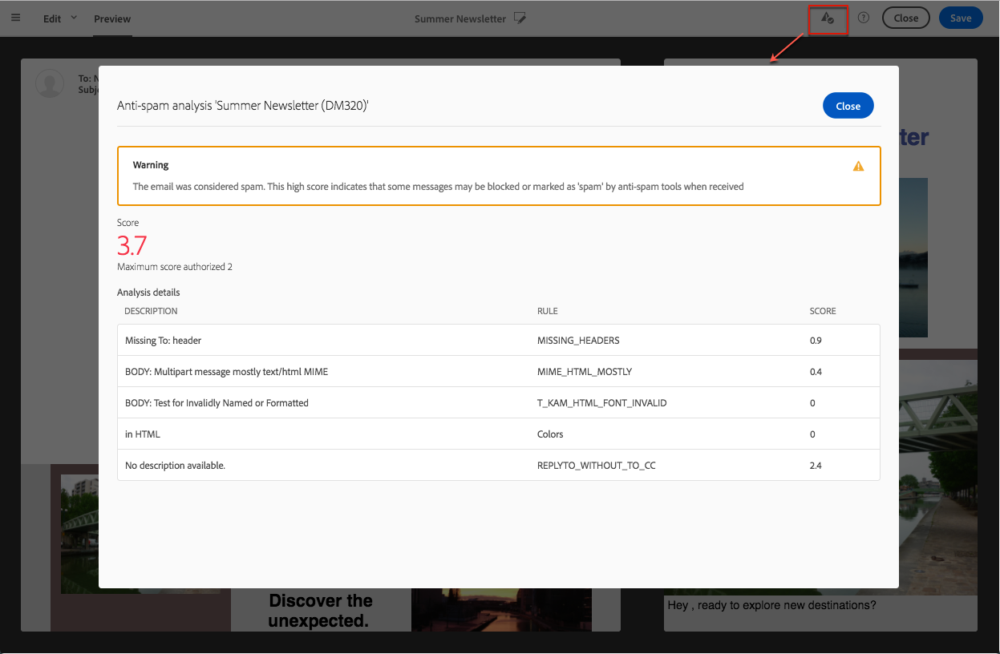

# Controllo dei contenuti dell’e-mail{#control-email-content}

<!--TO KEEP because specific to Campaign-->

Per fare in modo che le e-mail raggiungano i destinatari e migliorare il tasso di recapito dei messaggi e-mail, devono rispettare una serie di regole. In caso contrario, il contenuto di alcuni messaggi potrebbe essere rilevato come spam. Adobe Campaign fornisce diversi strumenti per rendere i contenuti conformi a queste regole.

Durante la progettazione del contenuto del messaggio, segui i principi elencati di seguito:

* [Nome e indirizzo mittente](#sender-name): l&#39;indirizzo deve identificare esplicitamente il mittente. Il dominio deve essere di proprietà del mittente e deve essere registrato presso di esso. Impossibile privatizzare il Registro di sistema del dominio.
  <!--**Subject**: Avoid excessive capitalization and punctuation, and words that are frequently used by spammers ("Win", "Free", etc.).-->
* [Personalization e ottimizzazione del tempo di invio](#perso-send-time-optimization): la personalizzazione del contenuto e la definizione di un tempo di invio per destinatario aumentano le possibilità di apertura del messaggio.
* Immagini e testo: rispetta un rapporto testo/immagine decente (ad esempio 60% di testo e 40% di immagini).
* [Collegamento per l&#39;annullamento dell&#39;abbonamento](#opt-out) e pagina di destinazione: il collegamento per l&#39;annullamento dell&#39;abbonamento è essenziale. Deve essere visibile e valido e il modulo deve essere funzionale.
* Anteprima: utilizza gli strumenti offerti da Adobe Campaign per verificare e ottimizzare il contenuto dell&#39;e-mail ([Analisi anti-spam](#anti-spam-analysis), [Rendering e-mail](#message-responsiveness)).

Per ulteriori suggerimenti per ottimizzare il recapito messaggi durante la progettazione del contenuto, consulta la [Guida alle best practice per il recapito messaggi di Adobe](https://experienceleague.adobe.com/docs/deliverability-learn/deliverability-best-practice-guide/content-best-practices-for-optimal-delivery.html).

>[!NOTE]
>
>Per ulteriori informazioni sulla modifica del contenuto delle e-mail, consulta la [Panoramica di E-mail Designer](../../designing/using/designing-content-in-adobe-campaign.md) e le [Best practice per la progettazione dei messaggi](../../designing/using/designing-content-in-adobe-campaign.md#content-design-best-practices).

## Nome e indirizzo del mittente {#sender-name}

Alcuni ISP verificano la validità dell&#39;indirizzo del mittente (**[!UICONTROL From]**) prima di accettare i messaggi. Un indirizzo con formato non corretto può comportare il rifiuto da parte del server ricevente.

È necessario assicurarsi che venga fornito un indirizzo corretto a livello di istanza o negli scenari utilizzati più di frequente. A questo scopo, contatta l’amministratore.

Per ulteriori informazioni, consulta [Definizione del mittente di un&#39;e-mail](../../designing/using/subject-line.md#email-sender).

## Personalization e ottimizzazione del tempo di invio {#perso-send-time-optimization}

Per migliorare l’esperienza dei destinatari e farli aprire l’e-mail, Adobe Campaign consente di personalizzare i messaggi. Per ulteriori informazioni, consulta [questa sezione](../../designing/using/personalization.md).

Per aumentare il tasso di apertura dei messaggi, puoi anche definire manualmente un orario di invio per destinatario. Laddove possibile, ogni profilo riceverà il messaggio alla data e all’orario specificati. Per ulteriori informazioni, consulta [Ottimizzazione del tempo di invio](../../sending/using/optimizing-the-sending-time.md).

## Collegamento e modulo per la rinuncia {#opt-out}

Per impostazione predefinita, quando il messaggio viene analizzato, una regola di tipologia controlla se è stato incluso un collegamento di rinuncia e, in caso contrario, genera un avviso. Per ulteriori informazioni sulla gestione dei collegamenti, vedere [questa sezione](../../designing/using/links.md).

Prima di ogni invio, verifica che il collegamento di rinuncia funzioni correttamente. Ad esempio, quando [invia la bozza](../../sending/using/sending-proofs.md), assicurati che il collegamento sia valido, che il modulo sia in linea e che la convalida verifichi le caselle **[!UICONTROL No longer contact]**. Dovresti effettuare questo controllo in modo sistematico perché è sempre possibile un errore umano durante l’immissione del collegamento o la modifica del modulo. Per ulteriori informazioni sulla gestione del consenso e della rinuncia, consulta [questa sezione](../../audiences/using/managing-opt-in-and-opt-out-in-campaign.md).

Se viene rilevato un problema relativo all’annullamento dell’abbonamento dopo l’avvio della consegna, è ancora possibile eseguire manualmente un annullamento dell’abbonamento (ad esempio, utilizzando la funzione di aggiornamento di massa) per i destinatari che fanno clic sul collegamento di rinuncia anche se non sono stati in grado di confermare la scelta.

Come regola generale, non devi tentare di ostacolare i destinatari che desiderano rinunciare richiedendo loro di compilare campi come, ad esempio, il loro indirizzo e-mail o nome. La pagina di destinazione per l’annullamento dell’abbonamento deve avere un solo pulsante di convalida.

La richiesta di conferma aggiuntiva non è affidabile: un utente può avere due indirizzi e-mail reindirizzati alla stessa casella (ad esempio: firstname.lastname@club.com e firstname.lastname@internet-club.com). Se il profilo è in grado di ricordare solo il primo indirizzo e desidera annullare l’abbonamento tramite un messaggio inviato all’altro, il modulo lo rifiuterà perché l’identificatore crittografato e l’indirizzo e-mail inserito non corrisponderanno.

## Analisi anti-spam {#anti-spam-analysis}

L&#39;editor di messaggi di Adobe Campaign integra una **analisi anti-spam** che consente di valutare le e-mail per determinare se un messaggio corre il rischio di essere considerato come spam dagli strumenti anti-spam utilizzati al momento della ricezione. Per ulteriori informazioni, vedere [Anteprima dei messaggi](../../sending/using/previewing-messages.md).

Nell&#39;editor del contenuto del messaggio fare clic su **[!UICONTROL Preview]**. Un messaggio ti avvisa se il controllo anti-spam ha rilevato un rischio elevato per questo messaggio. Fare clic su **[!UICONTROL Anti-spam analysis]** per visualizzare i dettagli.

## Rendering e-mail {#message-responsiveness}

Prima di inviare il messaggio, puoi verificarne la reattività controllando come si presenterà su diversi dispositivi. In questo modo, si assicurerà che venga visualizzato in modo ottimale su diversi client web, servizi di posta sul web e dispositivi.

Per ottenere questo risultato, Adobe Campaign acquisisce il rendering e lo rende disponibile in un report dedicato. Questo ti permette di visualizzare in anteprima il messaggio inviato nei vari contesti in cui potrebbe essere ricevuto.

Per ulteriori informazioni, consulta [Rendering e-mail](../../sending/using/email-rendering.md).
