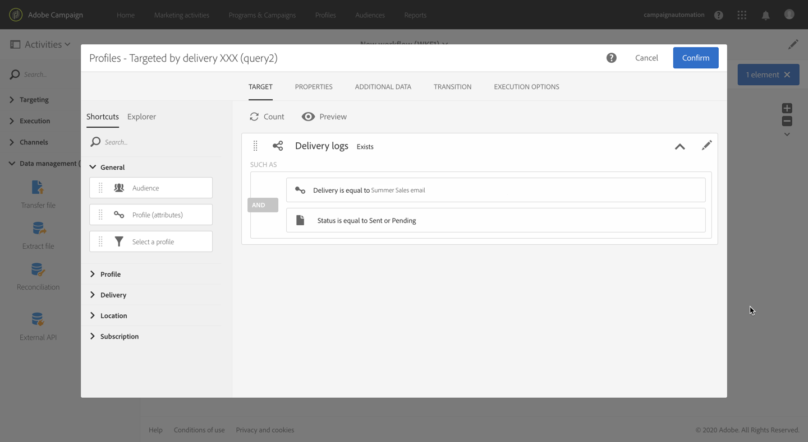

# Aggiunta di un gruppo di controlli {#adding-control-group}

Potete utilizzare i gruppi di controllo per evitare di inviare messaggi a una parte del pubblico al fine di misurare l&#39;impatto delle campagne.

Per eseguire questa operazione in  Adobe Campaign, create un gruppo <b>di</b> controllo quando definite la destinazione della distribuzione. I profili vengono aggiunti al gruppo di controllo in modo casuale, filtrati o meno oppure in base ai criteri.

Potrete quindi confrontare il comportamento della popolazione di destinazione che ha ricevuto il messaggio con il comportamento dei contatti non mirati. In base ai registri di invio, puoi anche eseguire il targeting di un gruppo di controllo in campagne future.

<!--The control group is built when the delivery is prepared.-->

## Panoramica {#overview}

Il gruppo di controllo può essere estratto in modo casuale dal bersaglio principale e/o selezionato da una popolazione specifica. Di conseguenza, è possibile definire un gruppo di controllo in due modi principali:
* **Estraete** un certo numero di profili dalla destinazione principale.
* **Escludete** alcuni profili in base ai criteri definiti in una query.

È possibile utilizzare entrambi i metodi per definire un gruppo di controllo.

Tutti i profili che fanno parte del gruppo di controllo nella fase di preparazione della consegna verranno rimossi dalla destinazione principale. Non riceveranno il messaggio una volta inviato.

## Estrazione dalla popolazione bersaglio {#extraction-target-population}

Per definire un gruppo di controllo, potete scegliere di estrarre, in modo casuale o in base a un ordinamento, una percentuale o un numero fisso di profili dalla popolazione di destinazione.

### Estrazione Target {#target-extraction}

Innanzitutto, definite il modo in cui i profili verranno estratti dalla destinazione: **in modo casuale** o basato su un **ordinamento**.

Nella **[!UICONTROL Target extraction]** sezione , selezionare una delle opzioni seguenti:

* **[!UICONTROL Random sampling]**: durante la preparazione della consegna,  Adobe Campaign estrarrà in modo casuale un numero di profili corrispondente alla percentuale o al numero massimo che verrà impostato come limite [di](#size-limit)dimensioni.

   Ad esempio, se successivamente imposti la soglia su 10 nella **[!UICONTROL Limits]** sezione, il gruppo di controllo sarà composto da 10% selezionato in modo casuale dalla popolazione di destinazione.<!--Change screenshot to match example)-->

   

* **[!UICONTROL Keep only the first records after sorting]**: questa opzione consente di definire un limite basato su uno o più ordini di ordinamento.

   Ad esempio:

   * Selezionare il **[!UICONTROL Age]** campo come criterio di ordinamento.
   * Definire 100 come soglia nella **[!UICONTROL Limits]** sezione (vedere Limite dimensioni).
   * Lasciate selezionata l&#39; **[!UICONTROL Descending sort]** opzione.

   Di conseguenza, il gruppo di controllo sarà composto dai 100 destinatari più anziani.<!--Change screenshot to match example)-->

   

   Può essere interessante definire un gruppo di controllo che includa profili che effettuino acquisti limitati o frequenti e confrontare il loro comportamento con quello dei destinatari contattati.

>[!NOTE]
>
>Selezionate **[!UICONTROL No extraction]** se non desiderate utilizzare l&#39; **[!UICONTROL Target extraction]** opzione.

<!---->

### Limite dimensione {#size-limit}

Sia che abbiate selezionato **[!UICONTROL Random sampling]** o **[!UICONTROL Keep only the first records after sorting]**, dovete impostare il modo in cui limitare il numero di profili estratti dalla destinazione principale. Effettuate una delle seguenti operazioni:

* Selezionate **[!UICONTROL Size (as a % of the initial population)]** e riempite il fotogramma corrispondente.

   Ad esempio, se impostate 10, a seconda dell’opzione selezionata in precedenza,  Adobe Campaign:
   * Estrarre casualmente il 10% della popolazione di destinazione.
   * Se avete selezionato il **[!UICONTROL Age]** campo come criterio di ordinamento, estraete i profili meno recenti al 10% dalla popolazione di destinazione.

   >[!NOTE]
   >
   >Se deselezionate l’ **[!UICONTROL Descending sort]** opzione, verranno estratti i profili più giovani del 10%.

* Selezionate **[!UICONTROL Maximum size]** e riempite il fotogramma corrispondente.

   Ad esempio, se impostate 100,  Adobe Campaign:
   * Estrarre casualmente 100 profili dalla popolazione di destinazione.
   * Se avete selezionato il **[!UICONTROL Age]** campo come criterio di ordinamento, estraete i 100 profili meno recenti dalla popolazione di destinazione.

   >[!NOTE]
   >
   >Se deselezionate l’ **[!UICONTROL Descending sort]** opzione, verranno estratti i 100 profili più giovani.

## Esclusione di una popolazione specifica {#excluding-specific-population}

Un altro modo per definire un gruppo di controllo consiste nell&#39;escludere una popolazione specifica dalla destinazione utilizzando una query.

Per eseguire questa operazione:

1. From the **[!UICONTROL Target exclusion]** section, click **[!UICONTROL Define target exclusion]**.

   

1. Definite i criteri di esclusione utilizzando l&#39;editor query. Potete anche selezionare un&#39; [audience](../../audiences/using/about-audiences.md) creata in precedenza.

   

1. Fai clic su **[!UICONTROL Confirm]**.

I profili che corrispondono al risultato della query saranno esclusi dalla destinazione.

<!--For more on using the query editor, see the [Editing queries](../../automating/using/editing-queries.md) section.-->

## Caso di utilizzo: impostare un gruppo di controllo {#control-group-example}

Di seguito è riportato un esempio che mostra come definire un gruppo di controlli utilizzando entrambi i metodi: estrazione di profili dalla destinazione principale e utilizzo di una query per escludere una popolazione specifica.

1. Creare un flusso di lavoro. I passaggi dettagliati per la creazione di un flusso di lavoro sono descritti nella sezione [Creazione di un flusso di lavoro](../../automating/using/building-a-workflow.md).
1. In **[!UICONTROL Activities]** > **[!UICONTROL Targeting]**, trascinate e rilasciate un&#39;attività [Query](../../automating/using/query.md) . Fate doppio clic sull&#39;attività e definite la destinazione. <!--For example, in **[!UICONTROL Shortcuts]**, drag and drop **[!UICONTROL Profile]**, select **[!UICONTROL Age]** with the operator **[!UICONTROL Greater than]** and type 25 in the **[!UICONTROL Value]** field.-->

1. In **[!UICONTROL Activities]** > **[!UICONTROL Channels]**, trascinate e rilasciate un&#39;attività di consegna  e-mail dopo il segmento di destinazione principale, quindi modificatela.
1. Fate clic sul **[!UICONTROL Audience]** blocco dal dashboard di consegna.

1. Seleziona la scheda **[!UICONTROL Control group]**. 

   

1. Dalla **[!UICONTROL Target extraction]** sezione, selezionare **[!UICONTROL Keep only the first records after sorting]**.
1. Ordinate in base alla pagina e lasciate selezionata l’opzione di **[!UICONTROL Descending]** ordinamento.

   

1. Impostare 100 come dimensione massima. Verranno estratti i 100 profili più vecchi dalla destinazione.

1. Dalla **[!UICONTROL Target exclusion]** sezione, definite i profili che verranno esclusi dalla destinazione, in base ai criteri scelti dall&#39;utente tramite l&#39;editor [di](../../automating/using/editing-queries.md)query. Ad esempio, &quot;L&#39;età è inferiore a 20&quot;.

   

   Saranno esclusi i profili di età inferiore ai 20 anni.

1. Avviate la preparazione [di](../../sending/using/preparing-the-send.md) consegna e [confermate l&#39;invio](../../sending/using/confirming-the-send.md).

I profili estratti (i 100 profili meno recenti) e quelli definiti in base alla query (profili inferiori a 20) verranno ritirati dalla destinazione principale. Non riceveranno il messaggio.

## Confronto dei risultati {#delivery-logs}

Ora che hai inviato la consegna, cosa puoi fare con il gruppo di controllo?

È possibile estrarre i registri **di** invio per confrontare il comportamento del gruppo di controllo che non ha ricevuto la comunicazione rispetto alla destinazione effettiva. Potete anche utilizzare i registri di consegna per **creare un altro targeting**.

>[!IMPORTANT]
>
>Per poter connettersi a  Adobe Campaign, è necessario disporre di un ruolo  Amministratore e appartenere all&#39;unità **[!UICONTROL All]**  organizzativa. Se desiderate limitare l’accesso a un particolare utente o gruppo di utenti, non collegatelo alle **[!UICONTROL All]** unità per poter accedere ai registri di consegna.

### Controllo dei registri di consegna {#checking-logs}

Per vedere quali profili sono stati rimossi dalla destinazione dopo l&#39;invio del messaggio, controlla **[!UICONTROL Delivery logs]**. Per ulteriori informazioni sui registri di distribuzione e su come accedervi, consulta [questa sezione](../../sending/using/monitoring-a-delivery.md#delivery-logs).

* Nella **[!UICONTROL Sending logs]** scheda, potete visualizzare i profili estratti ed esclusi. Hanno lo **[!UICONTROL Ignored]** status e **[!UICONTROL Control group]** come motivo di fallimento.

   

* È inoltre possibile controllare la **[!UICONTROL Exclusion causes]** scheda per visualizzare il numero di profili non inclusi nella consegna.

   

### Utilizzo dei registri dei gruppi di controllo {#using-logs}

Una volta inviata la consegna, puoi usare i registri di consegna per filtrare i profili che non hanno ricevuto il messaggio. Effettuate le seguenti operazioni:

1. Creare un flusso di lavoro. I passaggi dettagliati per la creazione di un flusso di lavoro sono descritti nella sezione [Creazione di un flusso di lavoro](../../automating/using/building-a-workflow.md).
1. In **[!UICONTROL Activities]** > **[!UICONTROL Targeting]**, trascinate e rilasciate un&#39;attività [Query](../../automating/using/query.md) .
1. Nella **[!UICONTROL Properties]** scheda, impostare **[!UICONTROL Delivery logs]** come **[!UICONTROL Resource]** e **[!UICONTROL Profile]** come **[!UICONTROL Targeting dimension]**.

   

1. Nella scheda **[!UICONTROL Target]**, fai clic su **[!UICONTROL Delivery logs]**.
1. Trascinare **[!UICONTROL Status]** e selezionare **[!UICONTROL Ignored]** come condizione del filtro.

   

1. Fai clic su **[!UICONTROL Confirm]**.

1. Fissa nella **[!UICONTROL Target]** scheda, trascinala **[!UICONTROL Nature of failure]** e seleziona **[!UICONTROL Control group]** come condizione del filtro.

   

1. Fai clic su **[!UICONTROL Confirm]**.

   

È quindi possibile esportare i dati di registro utilizzando un&#39;attività di file **** Extract seguita ad esempio da un&#39;attività di file **** Transfer. Questo vi consentirà di analizzare nel vostro strumento di reporting i risultati della campagna sulla destinazione effettiva rispetto al gruppo di controllo. For more on exporting logs, see [this section](../../automating/using/exporting-logs.md).

### Targeting del gruppo di controllo {#targeting-control-group}

Per eseguire un targeting basato sui profili che non hanno ricevuto il messaggio, potete anche utilizzare i registri di consegna. Effettuate le seguenti operazioni:

1. Creare un flusso di lavoro. I passaggi dettagliati per la creazione di un flusso di lavoro sono descritti nella sezione [Creazione di un flusso di lavoro](../../automating/using/building-a-workflow.md).
1. In **[!UICONTROL Activities]** > **[!UICONTROL Targeting]**, trascinare e rilasciare una prima attività [Query](../../automating/using/query.md) .
1. Nella **[!UICONTROL Properties]** scheda, accertatevi che la **[!UICONTROL Profile]** risorsa sia selezionata come **[!UICONTROL Resource]** e **[!UICONTROL Targeting dimension]**.

   

1. Nella **[!UICONTROL Target]** scheda, espandere **[!UICONTROL Delivery]** e trascinare **[!UICONTROL Delivery logs]**.

   

1. Nella **[!UICONTROL Add a rule]** finestra, trascinare **[!UICONTROL Delivery]**.

   

1. Selezionate il messaggio e-mail inviato come condizione del filtro. Fai clic su **[!UICONTROL Confirm]**.

   

1. Nella **[!UICONTROL Add a rule]** finestra, trascinare **[!UICONTROL Status]** e selezionare **[!UICONTROL Ignored]** come condizione del filtro. Fai clic su **[!UICONTROL Confirm]**.

   

1. Trascinare **[!UICONTROL Nature of failure]** e selezionare **[!UICONTROL Control group]** come condizione del filtro. Fai clic su **[!UICONTROL Confirm]**.

   

1. Assicurarsi che le condizioni siano tutte allineate con l&#39;operatore booleano **AND** .

   

1. Fai clic su **[!UICONTROL Confirm]**.

Ora potete eseguire il targeting dei profili che non hanno ricevuto il primo messaggio perché facevano parte del gruppo di controllo e inviargli un&#39;altra e-mail.

Nello stesso flusso di lavoro, potete anche creare un’altra query per eseguire il targeting dei profili che hanno ricevuto l’e-mail e inviare loro un messaggio diverso.

