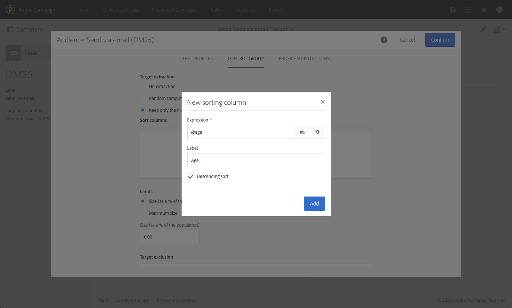

# Aggiunta di un gruppo di controllo {#adding-control-group}

Puoi utilizzare i gruppi di controllo per evitare di inviare messaggi a una parte del pubblico, in modo da misurare l’impatto delle campagne.

Per eseguire questa operazione in Adobe Campaign, crea un <b>gruppo di controllo</b> mentre definisci il target della consegna. I profili vengono aggiunti al gruppo di controllo in modo casuale, filtrati o meno oppure in base a alcuni criteri.

Puoi quindi confrontare il comportamento della popolazione di destinazione che ha ricevuto il messaggio con il comportamento dei contatti non mirati. In base ai registri di invio, puoi anche eseguire il targeting di un gruppo di controllo in campagne future.

<!--The control group is built when the delivery is prepared.-->

## Panoramica {#overview}

Il gruppo di controllo può essere estratto in modo casuale dal target principale e/o selezionato da una popolazione specifica. Ci sono quindi due vie principali per definire un gruppo di controllo:
* **Estrarre** un certo numero di profili dal target principale.
* **Escludere** alcuni profili in base ai criteri definiti in una query.

È possibile ricorrere a entrambi i metodi.

Tutti i profili che fanno parte del gruppo di controllo nella fase di preparazione della consegna verranno rimossi dal target principale, quindi non riceveranno il messaggio inviato.

## Estrazione dalla popolazione target {#extraction-target-population}

Per definire un gruppo di controllo, puoi scegliere di estrarre dalla popolazione target una percentuale o un numero fisso di profili, in modo casuale o in base a un ordinamento.

### Estrazione Target {#target-extraction}

Innanzitutto, definisci il modo in cui i profili verranno estratti dal target: **in modo casuale** o in base a un **ordinamento**.

Nella sezione **[!UICONTROL Target extraction]**, seleziona una delle opzioni seguenti:

* **[!UICONTROL Random sampling]**: durante la preparazione della consegna, Adobe Campaign estrarrà in modo casuale un numero di profili corrispondente alla percentuale o al numero massimo che verrà impostato come [limite di dimensioni](#size-limit).

   Ad esempio, se in seguito scegli di impostare su 10 la soglia nella sezione **[!UICONTROL Limits]**, il gruppo di controllo sarà composto da un 10% selezionato in modo casuale dalla popolazione target.<!--Change screenshot to match example)-->

   

* **[!UICONTROL Keep only the first records after sorting]**: questa opzione consente di definire un limite basato su uno o più criteri di ordinamento.

   Ad esempio:

   * Seleziona il **[!UICONTROL Age]** campo come criterio di ordinamento.
   * Inserisci 100 come soglia nella sezione **[!UICONTROL Limits]** (vedi [Limite di dimensioni](#size-limit)).
   * Lascia selezionata l’opzione **[!UICONTROL Descending sort]**.

   In questo modo il gruppo di controllo sarà composto dai 100 destinatari più anziani.<!--Change screenshot to match example)-->

   

   Può essere interessante definire un gruppo di controllo che includa profili che effettuino acquisti limitati o frequenti e confrontare il loro comportamento con quello dei destinatari contattati.

>[!NOTE]
>
>Seleziona **[!UICONTROL No extraction]** se non desideri utilizzare l’opzione **[!UICONTROL Target extraction]**.

<!---->

### Limite di dimensioni {#size-limit}

Selezionando sia **[!UICONTROL Random sampling]** che **[!UICONTROL Keep only the first records after sorting]**, è necessario impostare il modo in cui limitare il numero di profili estratti dal target principale. Effettua una delle seguenti operazioni:

* Seleziona **[!UICONTROL Size (as a % of the initial population)]** e riempi il fotogramma corrispondente.

   Ad esempio, impostando 10, a seconda dell’opzione selezionata in precedenza, Adobe Campaign:
   * Estrae casualmente il 10% della popolazione target.
   * Selezionando il campo **[!UICONTROL Age]** come criterio di ordinamento, estrae dalla popolazione target il 10% dei profili più anziani.

   >[!NOTE]
   >
   >Deselezionando l’opzione **[!UICONTROL Descending sort]**, estrae il 10% dei profili più giovani.

* Seleziona **[!UICONTROL Maximum size]** e riempi il fotogramma corrispondente.

   Ad esempio, impostando 100, Adobe Campaign:
   * Estrae casualmente 100 profili dalla popolazione target.
   * Selezionando il campo **[!UICONTROL Age]** come criterio di ordinamento, estrae dalla popolazione target i 100 profili più anziani.

   >[!NOTE]
   >
   >Deselezionando l’opzione **[!UICONTROL Descending sort]**, estrae i 100 profili più giovani.

## Esclusione di una popolazione specifica {#excluding-specific-population}

Un altro modo per definire un gruppo di controllo consiste nell’escludere una popolazione specifica dal target utilizzando una query.

Per eseguire questa operazione:

1. Dalla sezione **[!UICONTROL Target exclusion]**, fai clic su **[!UICONTROL Define target exclusion]**.

   

1. Definisci i criteri di esclusione utilizzando l’[editor delle query](../../automating/using/editing-queries.md). Puoi anche selezionare un’[audience](../../audiences/using/about-audiences.md) creata in precedenza.

   

1. Fai clic su **[!UICONTROL Confirm]**.

I profili che corrispondono al risultato della query saranno esclusi dal target.

<!--For more on using the query editor, see the [Editing queries](../../automating/using/editing-queries.md) section.-->

## Caso d’uso: impostazione di un gruppo di controllo {#control-group-example}

Di seguito è riportato un esempio che mostra come definire un gruppo di controllo utilizzando entrambi i metodi: estrazione di profili dal target principale e utilizzo di una query per escludere una popolazione specifica.

1. Creazione di un flusso di lavoro. I passaggi dettagliati per la creazione di un flusso di lavoro sono descritti nella sezione [Creazione di un flusso di lavoro](../../automating/using/building-a-workflow.md).
1. In **[!UICONTROL Activities]** > **[!UICONTROL Targeting]**, trascina e rilascia un’attività [Query](../../automating/using/query.md) . Fai doppio clic sull’attività e definisci il target. <!--For example, in **[!UICONTROL Shortcuts]**, drag and drop **[!UICONTROL Profile]**, select **[!UICONTROL Age]** with the operator **[!UICONTROL Greater than]** and type 25 in the **[!UICONTROL Value]** field.-->

1. In **[!UICONTROL Activities]** > **[!UICONTROL Channels]**, trascina e rilascia un’attività di [Consegna e-mail](../../automating/using/email-delivery.md) dopo il segmento di destinazione principale, quindi modificala.
1. Fai clic sul blocco **[!UICONTROL Audience]** dalla dashboard di consegna.

1. Seleziona la scheda **[!UICONTROL Control group]**.

   

1. Dalla sezione **[!UICONTROL Target extraction]**, seleziona **[!UICONTROL Keep only the first records after sorting]**.
1. Ordina in base all&#39;età e lascia selezionata l’opzione di ordinamento **[!UICONTROL Descending]**.

   

1. Imposta 100 come dimensione massima. In questo modo, dal target vengono estratti i 100 profili più anziani.

1. Dalla sezione **[!UICONTROL Target exclusion]**, definisci i profili da escludere dal target in base ai criteri scelti dall’utente tramite l’[editor delle query](../../automating/using/editing-queries.md). Ad esempio, &quot;Età inferiore a 20&quot;.

   

   Questo criterio esclude i profili con età inferiore ai 20 anni.

1. Avvia la [preparazione della consegna](../../sending/using/preparing-the-send.md) e la [conferma dell’invio](../../sending/using/confirming-the-send.md).

I profili estratti (i 100 profili più anziani) e quelli definiti in base alla query (profili con età inferiore a 20 anni) vengono esclusi dal target principale e non riceveranno il messaggio.

## Confronto dei risultati {#delivery-logs}

Una volta inviata la consegna, cosa puoi fare con il gruppo di controllo?

È possibile estrarre i **registri di invio** per confrontare il comportamento del gruppo di controllo che non ha ricevuto la comunicazione rispetto a quello del target effettivo. Puoi anche utilizzare i registri di consegna per **generare un altro targeting**.

>[!IMPORTANT]
>
>Per connettersi a Adobe Campaign, è necessario disporre di un [Ruolo di amministratore](../../administration/using/users-management.md#functional-administrators) e appartenere all’**[!UICONTROL All]** [unità organizzativa](../../administration/using/organizational-units.md). Se desideri limitare l’accesso a un particolare utente o a un gruppo di utenti, non collegarlo alle unità **[!UICONTROL All]** per accedere ai registri di consegna.

### Controllo dei registri di consegna {#checking-logs}

Per vedere quali profili sono stati rimossi dal target dopo l’invio del messaggio, controlla **[!UICONTROL Delivery logs]**. Per ulteriori informazioni sui registri di consegna e su come accedervi, consulta [questa sezione](../../sending/using/monitoring-a-delivery.md#delivery-logs).

* Nella scheda **[!UICONTROL Sending logs]** puoi visualizzare i profili estratti ed esclusi. Possiedono lo status **[!UICONTROL Ignored]** e **[!UICONTROL Control group]** come causa dell’esclusione.

   

* È inoltre possibile controllare la scheda **[!UICONTROL Exclusion causes]** per visualizzare il numero di profili non inclusi nella consegna.

   

### Utilizzo dei registri dei gruppi di controllo {#using-logs}

Una volta inviata la consegna, puoi usare i registri di consegna per filtrare i profili che non hanno ricevuto il messaggio. Segui i passaggi seguenti:

1. Creazione di un flusso di lavoro. I passaggi dettagliati per la creazione di un flusso di lavoro sono descritti nella sezione [Creazione di un flusso di lavoro](../../automating/using/building-a-workflow.md).
1. In **[!UICONTROL Activities]** > **[!UICONTROL Targeting]**, trascina e rilascia un’attività [Query](../../automating/using/query.md) .
1. Nella scheda **[!UICONTROL Properties]**, imposta **[!UICONTROL Delivery logs]** come **[!UICONTROL Resource]** e **[!UICONTROL Profile]** come **[!UICONTROL Targeting dimension]**.

   

1. Nella scheda **[!UICONTROL Target]**, fai clic su **[!UICONTROL Delivery logs]**.
1. Trascina **[!UICONTROL Status]** e seleziona **[!UICONTROL Ignored]** come condizione del filtro.

   

1. Fai clic su **[!UICONTROL Confirm]**.

1. Sempre nella scheda **[!UICONTROL Target]**, trascina **[!UICONTROL Nature of failure]** e seleziona **[!UICONTROL Control group]** come condizione del filtro.

   

1. Fai clic su **[!UICONTROL Confirm]**.

   

A questo punto puoi esportare i dati di registro utilizzando l’attività **Extract file** seguita ad esempio da un’attività **Transfer file**. Questo ti consente di analizzare nel tool di reportistica i risultati della campagna sul target effettivo rispetto al gruppo di controllo. Per ulteriori informazioni sull’esportazione dei registri, consulta [questa sezione](../../automating/using/exporting-logs.md).

### Targeting del gruppo di controllo {#targeting-control-group}

Per eseguire un targeting basato sui profili che non hanno ricevuto il messaggio, puoi anche utilizzare i registri di consegna. Segui i passaggi seguenti:

1. Creazione di un flusso di lavoro. I passaggi dettagliati per la creazione di un flusso di lavoro sono descritti nella sezione [Creazione di un flusso di lavoro](../../automating/using/building-a-workflow.md).
1. In **[!UICONTROL Activities]** > **[!UICONTROL Targeting]**, trascina e rilascia una prima attività [Query](../../automating/using/query.md) .
1. Nella scheda **[!UICONTROL Properties]**, accertati che la risorsa **[!UICONTROL Profile]** sia selezionata come **[!UICONTROL Resource]** e **[!UICONTROL Targeting dimension]**.

   

1. Nella scheda **[!UICONTROL Target]**, espandi **[!UICONTROL Delivery]** e trascina **[!UICONTROL Delivery logs]**.

   

1. Nella finestra **[!UICONTROL Add a rule]**, trascina **[!UICONTROL Delivery]**.

   

1. Seleziona l’e-mail inviata come condizione del filtro. Fai clic su **[!UICONTROL Confirm]**.

   

1. Sempre nella finestra **[!UICONTROL Add a rule]**, trascina **[!UICONTROL Status]** e seleziona **[!UICONTROL Ignored]** come condizione del filtro. Fai clic su **[!UICONTROL Confirm]**.

   

1. Trascina **[!UICONTROL Nature of failure]** e seleziona **[!UICONTROL Control group]** come condizione del filtro. Fai clic su **[!UICONTROL Confirm]**.

   

1. Assicurati che le condizioni siano tutte allineate con l’operatore booleano **AND**.

   

1. Fai clic su **[!UICONTROL Confirm]**.

Ora puoi eseguire il targeting dei profili che non hanno ricevuto il primo messaggio perché facevano parte del gruppo di controllo e inviare loro un’altra e-mail.

Nello stesso flusso di lavoro, puoi anche creare un’altra query per eseguire il targeting dei profili che hanno ricevuto l’e-mail e inviare loro un messaggio diverso.

