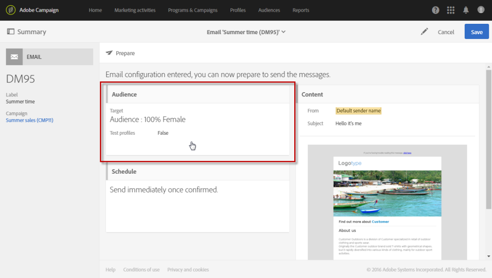
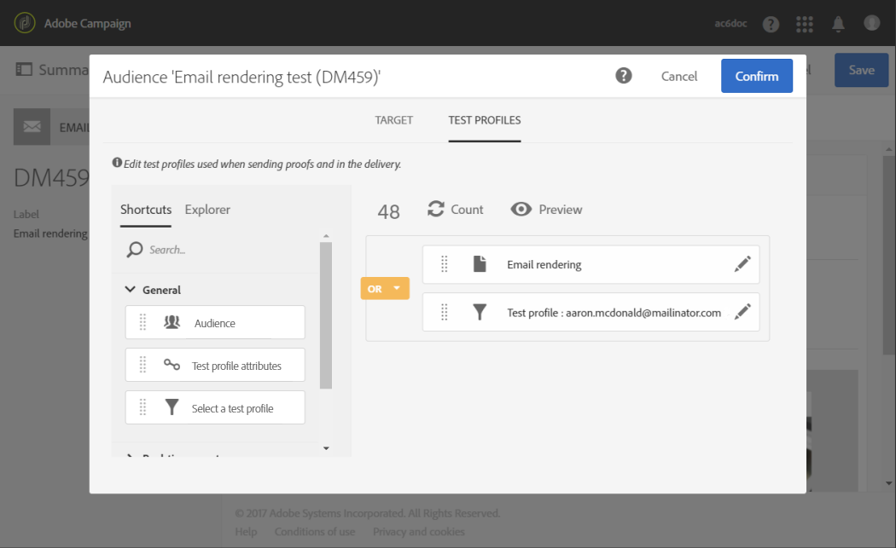
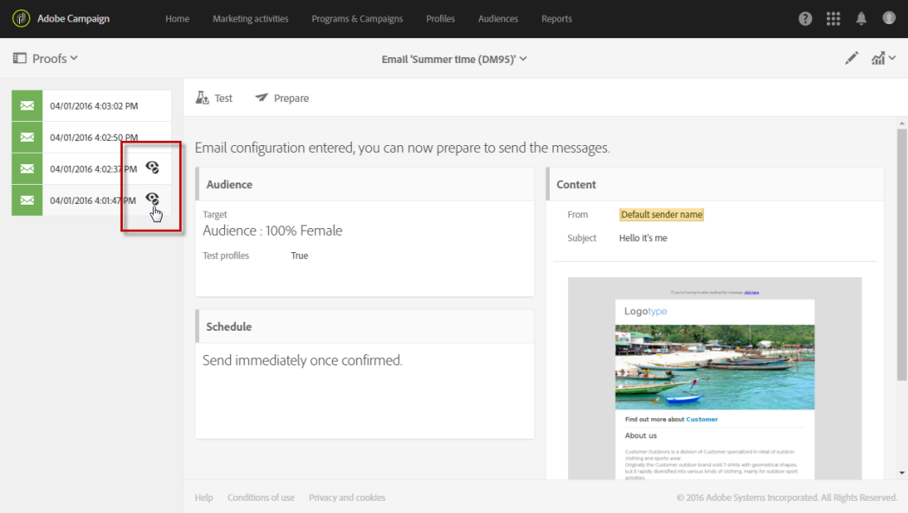
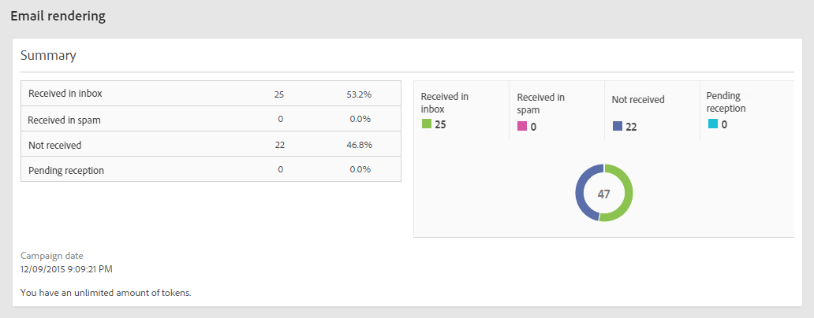

# Rendering e-mail{#email-rendering}

Prima di premere il pulsante **[!UICONTROL Send]**, accertati che il messaggio venga visualizzato in modo ottimale in vari client web, servizi di posta sul web e dispositivi.

Per ottenere questo risultato, Adobe Campaign acquisisce il rendering e lo rende disponibile in un report dedicato. Questo ti permette di visualizzare in anteprima il messaggio inviato nei vari contesti in cui potrebbe essere ricevuto.

I client per dispositivi mobili, messaggistica e webmail disponibili per **Rendering e-mail** all’interno di Adobe Campaign sono elencati nel [sito web](https://litmus.com/email-testing) di Litmus (fai clic su **View all email clients**).

## Generazione del rendering di e-mail {#checking-the-email-rendering-report}

Dopo aver creato la consegna e-mail e averne definito il contenuto e la popolazione target, effettua le seguenti operazioni.

1. Fai clic su **Pubblico** per accedere alla scheda **[!UICONTROL Test profiles]**.

   

1. Utilizza l’editor di query per definire i profili di test che desideri utilizzare, inclusi quelli per **Rendering e-mail**. Consulta [Informazioni sui profili di test](../../audiences/using/managing-test-profiles.md).

   

1. Controlla e conferma la query, quindi salva le modifiche.
1. Fai clic sul pulsante **[!UICONTROL Test]** nella barra delle azioni.

   

1. Seleziona l’opzione **[!UICONTROL Email rendering]** e fai clic su **[!UICONTROL OK]**.

   

   >[!NOTE]
   >
   >L’opzione **[!UICONTROL Proof + Email rendering]** consente di inviare una bozza e utilizzare contemporaneamente la funzione di rendering delle e-mail. Puoi far approvare il messaggio dai destinatari della bozza e al contempo verificare la modalità in cui verrà ricevuto a seconda delle caselle in entrata a cui è destinato. In questo caso, è necessario selezionare anche i profili di test di bozza. Consulta [Informazioni sui profili di test](../../audiences/using/managing-test-profiles.md).

   Viene inviata la consegna del test.

1. Le miniature di rendering sono disponibili dopo pochi minuti dall’invio dei messaggi. Per accedervi, seleziona **[!UICONTROL Proofs]** nell’elenco a discesa **[!UICONTROL Summary]**.

   

1. Dall’elenco **[!UICONTROL Proofs]**, fai clic sull’icona **[!UICONTROL Access email rendering]**.

   

Viene visualizzato il rapporto specifico Rendering e-mail. Consulta [Descrizione del rapporto Rendering e-mail](#email-rendering-report-description).

**Argomenti correlati**:

* [Creazione di un messaggio e-mail](../../channels/using/creating-an-email.md)
* [Invio di bozze](../../sending/using/sending-proofs.md)
* [Editor query](../../automating/using/editing-queries.md#about-query-editor)

## Rapporto di rendering di e-mail {#email-rendering-report-description}

Questo rapporto presenta i rendering delle e-mail così come sono visualizzate al destinatario. I rendering delle e-mail possono variare a seconda della modalità con cui il destinatario apre la consegna e-mail: in un browser, su un dispositivo mobile o tramite un’applicazione e-mail.

### Token di rendering di e-mail

Il numero di rendering disponibili è elencato nel contratto di licenza. Ogni consegna con **Rendering di e-mail** abilitato diminuisce di un&#39;unità i rendering disponibili, denominati token.

I token rappresentano ogni singolo rendering e non l’intero report di rendering di e-mail, il che significa che:

* **Ogni volta** che viene generato il report di rendering di e-mail, viene dedotto un token per ogni client di messaggistica: un token per il rendering di Outlook 2000, uno per il rendering di Outlook, uno per il rendering di Apple Mail e così via.

* **Per la stessa consegna**, se generi nuovamente il rendering di e-mail, il numero di token disponibili viene nuovamente ridotto del numero di rendering generati.

### Riepilogo del rapporto

Il riepilogo del report mostra il numero di messaggi ricevuti, indesiderati (spam), non ricevuti o in attesa di ricezione.

Il report è diviso in tre parti: **[!UICONTROL Mobile]**, **[!UICONTROL Messaging clients]** e **[!UICONTROL Webmails]**. Per visualizzare tutti i rendering raggruppati in queste tre categorie, scorri il report verso il basso.

Per ottenere i dettagli di ciascun report, fai clic sulla scheda corrispondente. Viene visualizzato il rendering per il metodo di ricezione selezionato.

La scheda **[!UICONTROL Technical data]** ti consente di ottenere ulteriori informazioni, ad esempio le date di ricezione e acquisizione e le intestazioni complete dei messaggi e-mail.
