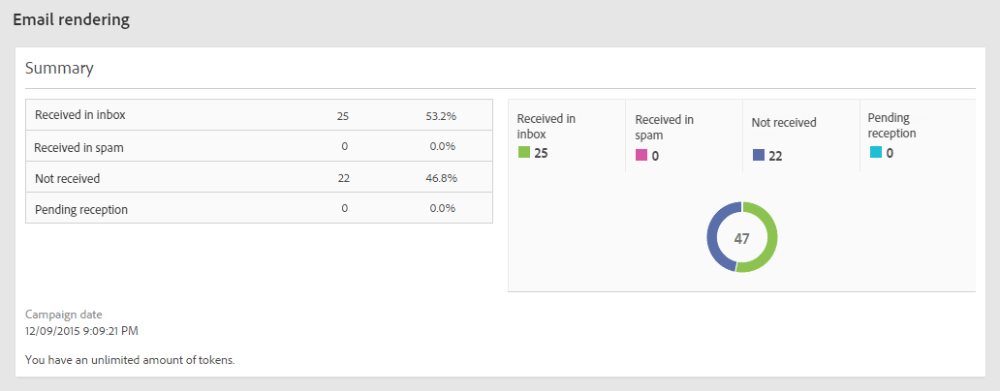

# Email rendering{#email-rendering}

Before hitting the **[!UICONTROL Send]** button, make sure that your message will be displayed in an optimal way on a variety of web clients, web mails and devices.

A tal fine, Adobe Campaign acquisisce il rendering e lo rende disponibile in un rapporto dedicato. Questo consente di visualizzare in anteprima il messaggio inviato nei diversi contesti in cui potrebbe essere ricevuto.

The mobile, messaging and webmail clients available for **Email rendering** in Adobe Campaign are listed on the Litmus [website](https://litmus.com/email-testing) (click **View all email clients**).

## Checking the Email rendering report {#checking-the-email-rendering-report}

Dopo aver creato e definito e definito il contenuto e la popolazione di destinazione, attenetevi alla procedura seguente.

1. Click **Audience** to access the **[!UICONTROL Test profiles]** tab.

   

1. Use the query editor to define the test profiles that you want to use, including the test profiles that are for **Email rendering** use. See [About test profiles](../../sending/using/managing-test-profiles-and-sending-proofs.md#about-test-profiles).

   

1. Controllate e confermate la query, quindi salvate le modifiche.
1. Click the **[!UICONTROL Test]** button in the action bar.

   

1. Select the **[!UICONTROL Email rendering]** option then click **[!UICONTROL OK]**.

   

   >[!NOTE]
   >
   >The **[!UICONTROL Proof + Email rendering]** option enables you to send a proof and use the email rendering feature simultaneously. Il messaggio può essere approvato dai destinatari della prova e contemporaneamente sarà possibile verificare il modo in cui verrà ricevuto il messaggio in base alle inbox impostate come destinazione. In tal caso, dovete anche selezionare Prova profili di prova. See [About test profiles](../../sending/using/managing-test-profiles-and-sending-proofs.md#about-test-profiles).

   La consegna del test viene inviata.

1. Le miniature di rendering sono disponibili qualche minuto dopo l'invio dei messaggi. To access them, select **[!UICONTROL Proofs]** in the **[!UICONTROL Summary]** drop-down list.

   

1. From the **[!UICONTROL Proofs]** list, click the **[!UICONTROL Access email rendering]** icon.

   

Viene visualizzato il rapporto dedicato sul rendering delle e-mail. See [Email rendering report description](../../sending/using/email-rendering.md#email-rendering-report-description).

**Argomenti correlati**:

* [Creazione di un'e-mail](../../channels/using/creating-an-email.md)
* [Gestione dei profili di prova e invio di prove](../../sending/using/managing-test-profiles-and-sending-proofs.md)
* [Editor query](../../automating/using/editing-queries.md#about-query-editor)

## Email rendering report description {#email-rendering-report-description}

In questo rapporto vengono presentati i rendering e-mail che vengono visualizzati al destinatario. I rendering e-mail possono variare in base alla modalità di apertura della consegna e-mail da parte del destinatario: in un browser, su un dispositivo mobile o tramite un'applicazione e-mail.

>[!NOTE]
>
>Il numero di rendering disponibili è elencato nel contratto di licenza. Each delivery with **Email rendering** enabled decreases your available renderings (known as tokens) by one. Se siete un client Litmus, potete utilizzare il vostro account Lettermus per effettuare il provisioning e utilizzare il rendering e-mail in Adobe Campaign. Per ulteriori informazioni, contattate il vostro responsabile commerciale di Adobe.

Il riepilogo del report mostra il numero di messaggi ricevuti, non desiderati (spam), non ricevuti o in attesa di ricezione.

The report is divided into three parts: **[!UICONTROL Mobile]**, **[!UICONTROL Messaging clients]**, and **[!UICONTROL Webmails]**. Scorrete verso il basso il rapporto per visualizzare tutti i rendering raggruppati in queste tre categorie.

Per ottenere i dettagli per ogni rapporto, fai clic sulla scheda corrispondente. Il rendering viene visualizzato per il metodo di ricezione selezionato.

The **[!UICONTROL Technical data]** tab allows you to get more information, such as the receiving and capture dates, and the complete headers of emails.
