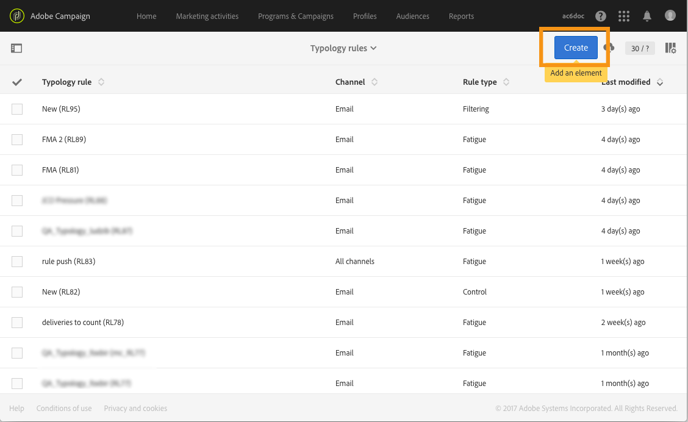
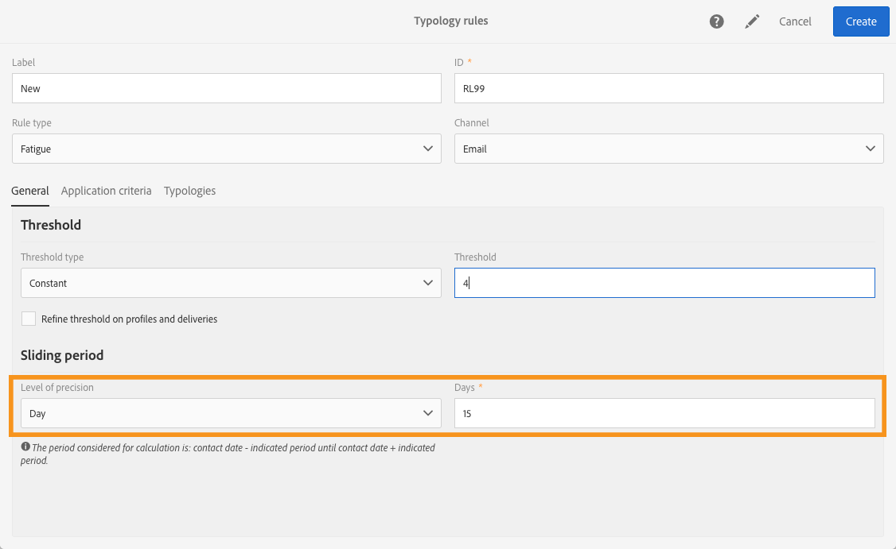
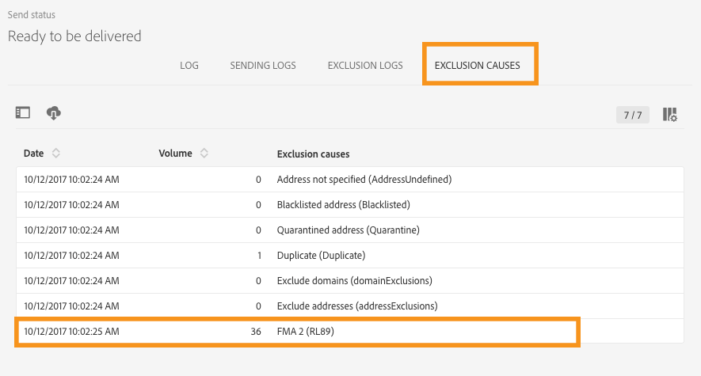
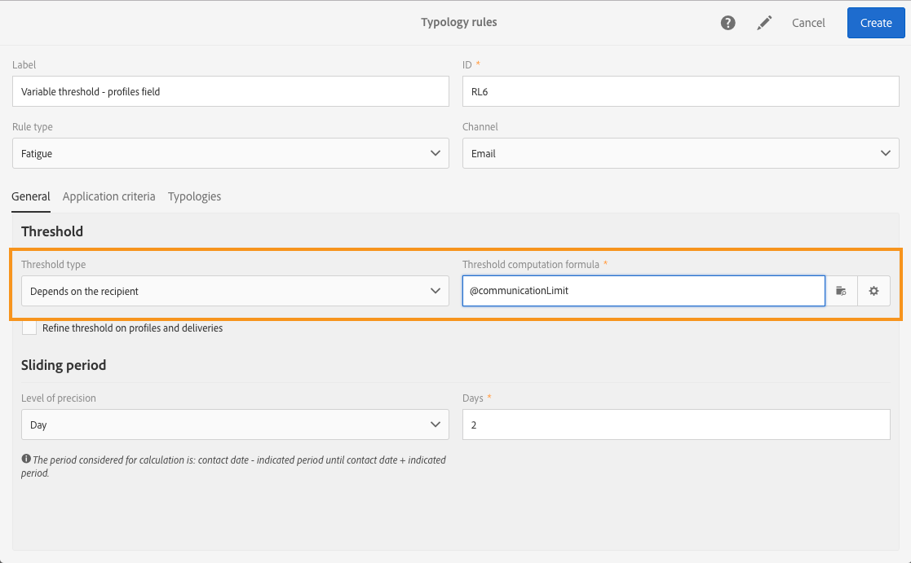

# Regole di affaticamento{#fatigue-rules}

## Informazioni sulle regole di affaticamento {#about-fatigue-rules}

Le regole di affaticamento consentono agli esperti di marketing di impostare regole di business globali cross-channel che escluderanno automaticamente dalle campagne i profili sollecitati in modo eccessivo.

Per implementare le regole di affaticamento, devi definire un numero massimo di messaggi per profilo e selezionare un periodo in cui applicare la regola. Durante la preparazione della consegna, i profili sono esclusi dalla consegna se applicabile, in base al numero di messaggi già inviati.

>[!NOTE]
>
>Per applicare le regole di affaticamento, devi definire una data di contatto per la consegna. Se scegli di inviare messaggi immediatamente, la regola di affaticamento non verrà applicata.

Argomenti correlati:

* [Preparazione](../../administration/using/configuring-email-channel.md#preparation)
* [Gestione delle tipologie](../../sending/using/managing-typologies.md)
* [Regole di tipologia](../../sending/using/managing-typology-rules.md)
* [Ottimizzazione della frequenza di comunicazione per evitare l’affaticamento del contatto](https://helpx.adobe.com/it/campaign/kb/simplify-campaign-management.html#Engageyourcustomersateverystep)

## Creazione di una regola di affaticamento {#creating-a-fatigue-rule}

Per creare e configurare una regola di tipologia **[!UICONTROL Fatigue]**, attieniti alla seguente procedura:

1. Fai clic sul logo Adobe Campaign, nell’angolo in alto a sinistra dell’interfaccia, quindi seleziona **[!UICONTROL Administration]** > **[!UICONTROL Channels]** > **[!UICONTROL Typologies]** > **[!UICONTROL Typology rules]**.

   

1. Nell’elenco delle regole di tipologia, fai clic su **[!UICONTROL Create]**.

   

1. Nel campo **[!UICONTROL Rule type]** seleziona **[!UICONTROL Fatigue]**.

   

1. Nel campo **[!UICONTROL Channel]**, seleziona il canale a cui applicare la regola. Puoi selezionare un singolo canale (e-mail, SMS, direct mailing, app mobile) oppure **[!UICONTROL All channels]**. Consulta [Scelta del canale](#choosing-the-channel).

   

1. Nella scheda **[!UICONTROL General]**, definisci il metodo di calcolo del numero massimo di messaggi per profilo. Puoi scegliere una soglia costante o una variabile. Puoi anche ottimizzare la soglia per profili e consegne. Per ulteriori informazioni, consulta [Definizione della soglia](#defining-the-threshold).

   

1. Scegli un **[!UICONTROL Sliding period]** in cui la regola di tipologia verrà applicata. Per ulteriori informazioni, consulta [Impostazione del periodo scorrevole](#setting-the-sliding-period).

   

   In questo esempio (vedi le schermate precedenti), abbiamo scelto di inviare un numero massimo di 4 messaggi in un periodo scorrevole di 15 giorni.

1. Nella scheda **[!UICONTROL Application criteria]**, puoi scegliere di applicare questa regola a tutte le consegne o limitare l’applicabilità della regola in base al messaggio da inviare. La regola verrà eseguita solo se la condizione di applicazione viene soddisfatta. Ad esempio, puoi applicare la regola solo ai messaggi con un’etichetta che inizia con una determinata parola o con un ID che contiene determinate lettere. Consulta [Limitazione dell’applicabilità di una regola di filtro](../../sending/using/filtering-rules.md#restricting-the-applicability-of-a-filtering-rule).

   

1. Seleziona la scheda **[!UICONTROL Typologies]** e collega la regola di tipologia alla tipologia utilizzata per le consegne. Consulta [Gestione delle tipologie](../../sending/using/managing-typologies.md) e [Regole di tipologia](../../sending/using/managing-typology-rules.md).

   

   >[!NOTE]
   >
   >La tipologia può essere definita nel modello di consegna, da applicare automaticamente a tutte le consegne create utilizzando questo modello.

Durante la preparazione della consegna, i profili sono esclusi dalla consegna se applicabile, in base al numero di consegne già inviate. Puoi visualizzare i risultati dell’esecuzione della regola di affaticamento nei log di consegna. Consulta [Visualizzazione dei risultati dell’affaticamento](#viewing-the-fatigue-results).

>[!IMPORTANT]
>
>Affinché le regole di affaticamento funzionino, devi definire una data di contatto per la consegna. Se scegli di inviare messaggi immediatamente, la regola di affaticamento non verrà applicata.

## Scelta del canale {#choosing-the-channel}

Le regole di affaticamento sono disponibili per diversi canali. Il canale è definito nel campo **[!UICONTROL Channel]** delle impostazioni delle regole di tipologia. Puoi selezionare un singolo canale oppure **[!UICONTROL All channels]**.

**Canali disponibili**

Sono disponibili i seguenti canali:

* E-mail
* Dispositivo mobile (SMS)
* direct mailing
* App mobile: questo canale ti consente di inviare notifiche push ai profili o agli abbonati all’app. Se scegli di inviare notifiche ai profili, saranno compatibili con le regole di affaticamento multicanale.

   >[!IMPORTANT]
   >
   >Le regole di affaticamento non sono compatibili con le notifiche push inviate agli abbonati all’app. Se invii messaggi agli abbonati all’app, le regole di affaticamento non saranno applicabili.

* Tutti i canali: questa opzione ti consente di applicare la regola a tutti i canali. Ad esempio, puoi decidere di inviare un massimo di 3 messaggi al mese su qualsiasi canale. Se la scorsa settimana hai inviato 2 e-mail a un profilo e oggi provi a inviare una notifica push, quello stesso profilo verrà escluso.

**Tipi di consegna**

Le regole di affaticamento sono compatibili con tutti i tipi di consegna: invii una tantum, consegne ricorrenti, consegne di flussi di lavoro e messaggi transazionali.

La **messaggistica transazionale** può essere utilizzata per inviare messaggi di servizio destinati a un evento (rtEvent) e messaggi di marketing (destinati a profili), ad esempio un messaggio di remarketing. Le regole di affaticamento sono compatibili solo con i messaggi di marketing (destinati a profili). I messaggi transazionali relativi agli eventi non contengono informazioni sui profili, pertanto non sono compatibili con le regole di affaticamento (anche nel caso di un arricchimento con profili). Grazie al supporto dei messaggi di marketing nella messaggistica transazionale, puoi **applicare una regola di affaticamento a tutti i canali, compresi i messaggi di marketing transazionali**.

## Definizione della soglia {#defining-the-threshold}

Ogni regola di affaticamento definisce una soglia, ovvero il numero massimo di messaggi che possono essere inviati a un profilo in un dato periodo. Una volta raggiunta tale soglia, non potranno più essere effettuate ulteriori consegne fino alla fine del periodo considerato. Questo processo ti consente di escludere automaticamente un profilo da una consegna se un messaggio supera la soglia impostata, evitando in tal modo una sollecitazione eccessiva.

I valori di soglia possono essere costanti o variabili. Ciò significa che per un dato periodo le soglie possono variare da un profilo all’altro, o anche per lo stesso profilo.

**Utilizzo di una soglia fissa**

La soglia rappresenta il numero massimo di messaggi che possono essere inviati a un profilo durante il periodo in questione.

Per impostazione predefinita, la soglia è costante e devi indicare un numero massimo di messaggi autorizzati dalla regola.

**Utilizzo di una soglia variabile**

Per definire una soglia di variabile, seleziona il valore **[!UICONTROL Depends on the recipient]** nel campo **[!UICONTROL Threshold type]**.

Hai quindi a disposizione due opzioni:

* selezionare un campo del profilo: la soglia varia per ciascun profilo in base al campo selezionato. Ad esempio, se hai esteso la risorsa dei profili con un campo “Frequenza di comunicazione”, fai clic sul pulsante a destra del campo **[!UICONTROL Threshold computation formula]** e seleziona il campo. Per ciascun profilo, la soglia assume il valore del campo “Frequenza di comunicazione”.

   

* definire una formula: fai clic sul secondo pulsante a destra del campo **[!UICONTROL Threshold computation formula]** per definire una formula di calcolo della soglia avanzata. Ad esempio, puoi indicizzare il numero di messaggi autorizzati in base al segmento al quale il profilo appartiene. Ciò significa che un profilo appartenente al segmento “Web” potrebbe ricevere più messaggi rispetto ad altri profili. Una formula di tipo **[!UICONTROL Iif (@origin='Web', 5, 3)]** autorizza la consegna di 5 messaggi ai profili del segmento Web e di 3 per altri segmenti.

   

**Ottimizzazione della soglia per profili e consegne**

Per impostazione predefinita, tutti i messaggi vengono presi in considerazione per il calcolo della soglia. Seleziona la casella **[!UICONTROL Refine Threshold on profiles and deliveries]** per filtrare i profili e le consegne da conteggiare durante la preparazione della consegna.

Nell’esempio seguente, vengono conteggiati solo i profili maschili e le consegne con un’etichetta che inizia con **Newsletter**.

La definizione della soglia sulle consegne è diversa dalla limitazione dell’applicabilità dell’intera regola (scheda **[!UICONTROL Application criteria]**):

* **[!UICONTROL Application criteria]**: scegli di eseguire la regola o meno in base a criteri specifici. Ad esempio, se la condizione di applicazione è “Etichetta inizia con Newsletter”, la regola si applica solo alle consegne che rispettano questa condizione. Se l’etichetta della consegna inizia con “Promozione”, la regola non verrà eseguita.
* **[!UICONTROL Refine threshold on profiles and deliveries > Deliveries to count]**: tutte le consegne che utilizzano questa regola di tipologia eseguiranno la regola, ma sarai tu a decidere quali desideri conteggiare tra le consegne passate e quelle pianificate. Ad esempio, se il limite è “Etichetta inizia con Newsletter”, la regola verrà eseguita anche se l’etichetta di consegna inizia con “Promo”. Nel periodo scorrevole selezionato, sarà conteggiato il numero di consegne la cui etichetta inizia con “Newsletter”.

## Impostazione del periodo scorrevole {#setting-the-sliding-period}

Le regole di affaticamento vengono definite in periodi continui di n giorni. Il periodo è configurato nella sezione **[!UICONTROL Sliding period]**, ad esempio 2 settimane, 7 giorni o 5 ore.

Durante l’esecuzione della regola, vengono prese in considerazione sia le consegne passate sia le consegne pianificate. Ciò garantisce che la soglia non venga mai superata in un dato periodo scorrevole.

Ad esempio, se definisci un periodo di 48 ore, il sistema controllerà 48 ore **prima della data di contatto** e 48 ore **dopo la data di contatto**. Pertanto, il periodo selezionato è raddoppiato per consentire l’integrazione delle consegne future e di quelle precedenti.

Per limitare le consegne prese in considerazione a un periodo di 2 settimane, immetti **Giorno** e **7** o 1 settimana nella sezione **Periodo scorrevole**. Saranno prese in considerazione nel calcolo le consegne inviate fino a 7 giorni prima della data di consegna e pianificate fino a 7 giorni dopo la data di consegna in cui viene applicata la regola.

## Visualizzazione dei risultati dell’affaticamento {#viewing-the-fatigue-results}

Durante la preparazione della consegna, i profili sono esclusi dalla consegna se applicabile, in base al numero di consegne già inviate. Per visualizzare i risultati dell’esecuzione della regola di affaticamento, fai clic sul pulsante nell’angolo in basso a destra del blocco **[!UICONTROL Deployment]**.

Sono disponibili tre schede che ti mostrano i dettagli dei risultati dell’esecuzione dell’affaticamento, compreso il nome della regola applicata:

* Log di consegna:

   

* Log di esclusione:

   

* Cause di esclusione:

   

## Visualizzazione del report di riepilogo della regola di affaticamento {#viewing-the-fatigue-rule-summary-report}

Adobe Campaign dispone di un rapporto dedicato sulle regole di affaticamento per aiutarti a comprendere come vengono applicate alle campagne. Ciò ti consente di scoprire l’impatto reciproco delle campagne e di apportare le dovute modifiche.

Il report **[!UICONTROL Fatigue rules summary]** è accessibile dal pulsante **[!UICONTROL Reports]**, nell’angolo in alto a destra di ogni programma, campagna e messaggio.

Nella parte sinistra della schermata, puoi filtrare i dati del report in base alla data di contatto delle consegne. Per impostazione predefinita, il periodo selezionato inizia 15 giorni prima della data corrente e termina 15 giorni dopo. Puoi anche filtrare per una regola di affaticamento specifica.

Il grafico a torta visualizza le seguenti informazioni per il periodo selezionato:

* **[!UICONTROL Total targeted]**: il target totale prima della preparazione del messaggio
* **[!UICONTROL Excluded]**: il numero totale di esclusioni dovute all’applicazione della regola di affaticamento
* **[!UICONTROL Other exclusions]**: il numero totale di esclusioni dovute ad altre regole di tipologia
* **[!UICONTROL To deliver]**: il numero totale dei messaggi da consegnare dopo la preparazione del messaggio (**[!UICONTROL To deliver]** = **[!UICONTROL Total targeted]** - **[!UICONTROL Excluded]** - **[!UICONTROL Other exclusions]**)

Sulla destra del grafico, troverai il numero di esclusioni suddiviso per regola di affaticamento.

Nella tabella in basso sono visualizzate tutte le consegne nel periodo selezionato. Per ogni consegna, puoi vedere le regole di affaticamento applicate e le esclusioni corrispondenti. Nella tabella sono visualizzate anche le consegne che non hanno una data di contatto.

* **[!UICONTROL 0]** significa che la regola di affaticamento è stata applicata ma non vi è stata alcuna esclusione.
* **[!UICONTROL -N]** significa che si sono verificate N esclusioni.
* un campo vuoto indica che la regola di affaticamento non è stata applicata.

>[!NOTE]
>
>I dati visualizzati non sono contestuali al programma, al messaggio o alla campagna da cui accedi al report. Questo report mostra tutte le regole di affaticamento e le consegne per tutte le unità organizzative. Ciò ti consente di ottenere una visione globale di tutte le consegne, al fine di comprendere in che modo le campagne vengono influenzate dalle altre.

## Esempi {#examples}

Vi sono molte possibilità in termini di implementazione della gestione dell’affaticamento. Di seguito sono riportati alcuni esempi delle operazioni che puoi effettuare:

* Creare una regola di affaticamento utilizzando una **soglia costante** applicabile a **tutti i canali**:

   Supponiamo che tu crei una regola multicanale con una soglia costante di 3 su un periodo scorrevole di 7 giorni.

   La settimana scorsa, i profili premium hanno ricevuto un’e-mail promozionale e un’e-mail di remarketing transazionale. Hai inoltre pianificato un SMS che verrà inviato la prossima settimana. Oggi decidi di inviare una notifica push destinata a tutti i profili. I profili premium saranno esclusi dalla notifica push di oggi poiché è già stato raggiunto il numero massimo di messaggi in un periodo di 2 settimane.

   

* Creare una regola di affaticamento utilizzando una **soglia variabile** basata su un **campo del profilo**:

   Hai esteso la risorsa dei profili con un campo “Limite di comunicazione”, per definire una soglia diversa per ciascun profilo. Nella regola di affaticamento, definisci una soglia variabile in base a questo campo e selezioni un periodo scorrevole di 2 giorni. Prendiamo due esempi di profili: John ha un limite di comunicazione di 1 e David ha una soglia di 2. Entrambi hanno già ricevuto ieri un’e-mail della newsletter. Oggi decidi di inviare loro un’altra e-mail. Solo David la riceverà, perché John è stato escluso dal target.

   

* Creare una regola di affaticamento utilizzando una **formula di calcolo della soglia**:

   Desideri modificare la soglia in base all’età dei profili. Desideri definire un limite di 4 se un profilo ha un’età minore di 40 anni e un limite di 2 per i profili con età maggiore. Invece di definire questa soglia per ciascun profilo con un campo esteso, puoi creare una formula direttamente nella regola di affaticamento per calcolare la soglia in base all’età dei profili. Nel nostro esempio, la formula sarebbe **[!UICONTROL Iif (@age<40, 4, 2)]**.

   

   >[!NOTE]
   >
   >Questa sezione include anche un esempio guidato di una regola di affaticamento che utilizza una formula di calcolo della soglia.

* Creare una regola di affaticamento che **ottimizza la soglia** per profili e consegne:

   Hai esteso la risorsa dei profili con un campo “Punteggio” e inoltre hai esteso la risorsa delle consegne con un campo “Tipo”. Desideri definire una soglia costante di 3 ma vuoi escludere dal conteggio tutte le consegne del tipo “Avviso” o “Black Friday” e tutti i profili con un punteggio superiore a 10. Quando la regola verrà eseguita, essa conteggerà, tra le consegne passate e pianificate, tutte le consegne che non sono del tipo “Avviso” o “Black Friday” inviate a profili con punteggio inferiore a 10.

   

Di seguito è riportato un esempio guidato di una regola di affaticamento che utilizza una formula di calcolo della soglia.

In questo caso di utilizzo, vogliamo creare una regola di tipologia per impedire la consegna di più di 2 messaggi alla settimana ai profili premium e di 2 messaggi alla settimana ai profili standard.

Per identificare clienti e potenziali clienti, abbiamo esteso la risorsa dei profili con il campo **[!UICONTROL Status]**, che contiene 0 per i profili premium e 1 per i profili standard.

Per creare la regola, esegui i seguenti passaggi:

1. Crea una nuova regola di tipologia di tipo **Affaticamento**.
1. Nella sezione **[!UICONTROL Threshold]**, vogliamo creare una formula per calcolare la soglia in base a ciascun profilo. Seleziona il valore **[!UICONTROL Depends on the recipient]** nel campo **[!UICONTROL Threshold type]**, quindi fai clic sull’icona del secondo pulsante a destra del campo **[!UICONTROL Threshold computation formula]**.

   

1. Nella sezione **[!UICONTROL List of functions]**, fai doppio clic sulla funzione **Iif** nel nodo **[!UICONTROL Others]**.

   

1. Quindi seleziona lo **stato** del profilo nella sezione **[!UICONTROL Available fields]**.

   

1. Immetti i valori desiderati per creare la formula seguente: **Iif(@status=0,2,4)**

   

   Questa formula ti consente di assegnare il valore 2 se lo stato è uguale a 0 e il valore 4 per tutti gli altri stati.

1. Fai clic su **[!UICONTROL Confirm]** per approvare la formula.
1. Indica il **[!UICONTROL Sliding period]** nel quale la regola sarà applicata: 7 giorni in questo caso, per limitare le consegne prese in considerazione a un periodo di 2 settimane.

   

1. Collega ora la regola appena creata a una tipologia per applicarla alle consegne. A questo scopo, seleziona la scheda **[!UICONTROL Typologies]**, fai clic su **[!UICONTROL Create element]** e seleziona la tipologia utilizzata per le consegne.

   

1. Salva la regola per approvare la creazione.

La regola verrà applicata a tutte le consegne in base alla tipologia.
