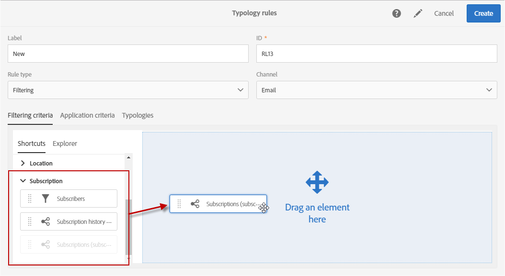
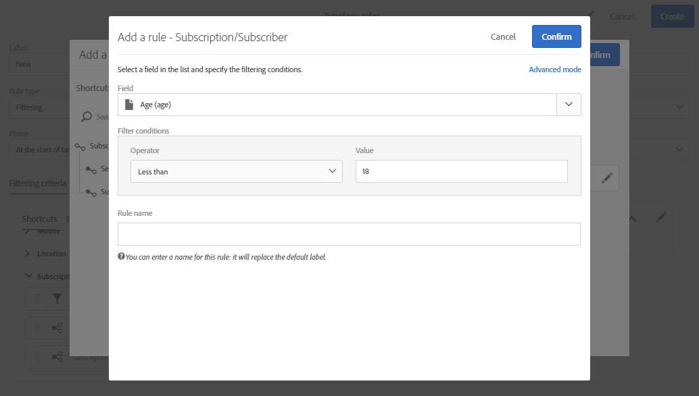
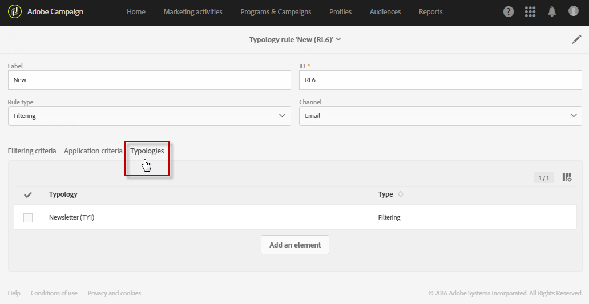
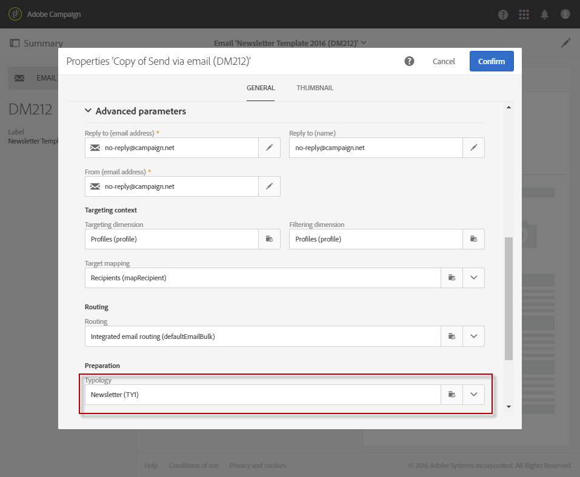
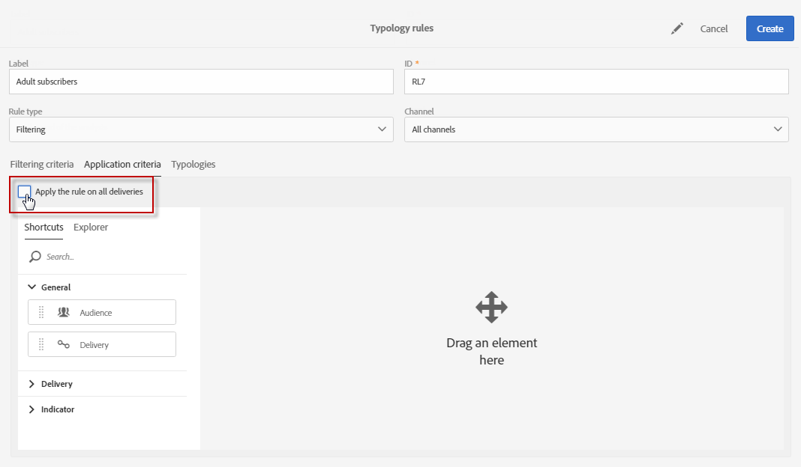
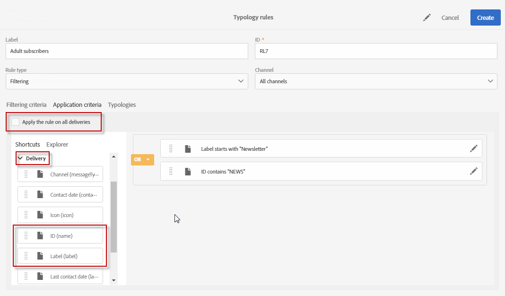

# Regole di filtro {#filtering-rules}

Le regole di filtro consentono di escludere una parte del target del messaggio in base ai criteri definiti in una query, ad esempio profili in quarantena o profili che hanno ricevuto già un certo numero di e-mail.

## Regole di tipologia di filtro predefinite {#default-filtering-typology-rules}

La tabella seguente fornisce informazioni sulle regole di filtro predefinite e sui relativi canali.

| Etichetta | Canale | Descrizione |
| ---------|----------|---------|
| **[!UICONTROL Address not specified]** | Tutti | Esclude la popolazione target senza indirizzo specificato (e-mail, indirizzo postale, ecc. in base al canale selezionato). |
| **[!UICONTROL Address on denylist]** | Tutti | Esclude gli indirizzi presenti nel inserisco nell&#39;elenco Bloccati di. |
| **[!UICONTROL Duplicate]** | Tutti | Esclude i duplicati in base al campo della popolazione di destinazione **[!UICONTROL Address]**. |
| **[!UICONTROL Exclude mobile applications]** | App mobile | Sono escluse le sottoscrizioni di app che non corrispondono a quelle dell’app mobile definita nel messaggio. |
| **[!UICONTROL Exclude mobile applications for In-App]** | In-app | Sono escluse le sottoscrizioni di app che non corrispondono a quelle definite nel messaggio per app mobili (modello in-app). |
| **[!UICONTROL Exclude mobile applications for In-App broadcast]** | In-app | Esclude gli abbonamenti alle app che non corrispondono a quelli dell’app mobile definita nel messaggio (modello di trasmissione in-app) |
| **[!UICONTROL Exclude mobile applications for Push]** | App mobile | Esclude gli abbonamenti alle app che non corrispondono a quelli dell’app mobile definita nel messaggio (per push) |
| **[!UICONTROL Quarantined address]** | Tutti | Esclude gli indirizzi messi in quarantena. |
| **[!UICONTROL Target limited in size]** | Tutti | Controlla se è stata raggiunta la dimensione massima di consegna per la destinazione. Si applica alle consegne di direct mailing con l’opzione &quot;delivery limit&quot; attivata. |

Oltre a queste regole di filtro predefinite, sono disponibili due regole di esclusione:

* **[!UICONTROL Exclusion of addresses]** ( **[!UICONTROL addressExclusions]** )
* **[!UICONTROL Exclusion of domains]** ( **[!UICONTROL domainExclusions]** ).

Durante l’analisi e-mail, queste regole confrontano gli indirizzi e-mail dei destinatari con gli indirizzi o i nomi di dominio non consentiti contenuti in un elenco di soppressione globale crittografato gestito nell’istanza di recapito messaggi. In caso di corrispondenza, il messaggio non viene inviato al destinatario.

Questo per evitare di essere aggiunti al inserisco nell&#39;elenco Bloccati di a causa di attività dannose, in particolare l’utilizzo di uno Spamtrap. Ad esempio, se utilizzi uno Spamtrap per abbonarti tramite uno dei tuoi moduli web, un’e-mail di conferma viene inviata automaticamente a quello Spamtrap, e il tuo indirizzo viene aggiunto automaticamente al inserisco nell&#39;elenco Bloccati di.

>[!NOTE]
>
>Gli indirizzi e i nomi di dominio contenuti nell’elenco di soppressione globale sono nascosti. Nei registri di analisi della consegna è indicato solo il numero di destinatari esclusi.

## Creazione di una regola di filtro {#creating-a-filtering-rule}

Puoi creare regole di filtro personalizzate in base alle tue esigenze. Ad esempio, puoi filtrare la popolazione target delle newsletter in modo che gli abbonati di età inferiore ai 18 anni non ricevano mai comunicazioni.

Per creare una regola di tipologia di filtro, effettua le seguenti operazioni:

1. Crea una nuova regola di tipologia. I passaggi principali per la creazione di regole di tipologia sono descritti in [questa sezione](../../sending/using/managing-typology-rules.md).

1. Selezionare il tipo di regola **[!UICONTROL Filtering]**, quindi specificare il canale desiderato.

1. Nella scheda **[!UICONTROL Filtering criteria]** selezionare le sottoscrizioni nella categoria **[!UICONTROL Subscription]**.

   

1. Nella scheda **[!UICONTROL Explorer]** dell&#39;editor delle query, trascina e rilascia il nodo **[!UICONTROL Subscriber]** nella parte principale della schermata.

   

1. Selezionare il campo **[!UICONTROL Age]** e definire le condizioni di filtro in modo che l&#39;età degli abbonati sia inferiore a 18 anni.

   

1. Nella scheda **[!UICONTROL Typologies]**, collega questa regola a una tipologia.

   

1. Assicurati che la tipologia sia selezionata nel modello di consegna o consegna che desideri utilizzare. Per ulteriori informazioni al riguardo, consulta [questa sezione](../../sending/using/managing-typologies.md#applying-typologies-to-messages).

   

Ogni volta che questa regola viene utilizzata in un messaggio, gli abbonati considerati minori verranno automaticamente esclusi.

## Configurazione del contesto di targeting delle regole di filtro {#configuring-filtering-rules-targeting-context}

Campaign Standard consente di configurare le dimensioni **Targeting** e **Filtro** da utilizzare in base ai dati di destinazione.

A questo scopo, apri le proprietà della regola di tipologia, quindi accedi alla sezione **[!UICONTROL Advanced information]**.

Per impostazione predefinita, il filtro viene eseguito su **[!UICONTROL Profiles]**. Ad esempio, se la regola è destinata a un&#39;app mobile, **[!UICONTROL Filtering dimension]** può essere modificato in **[!UICONTROL Subscriptions to an application]**.

## Limitazione dell’applicabilità di una regola di filtro {#restricting-the-applicability-of-a-filtering-rule}

Puoi limitare l’applicabilità di una regola di filtro in base al messaggio da inviare.

1. Nella scheda **[!UICONTROL Application criteria]** della regola di tipologia, deseleziona l&#39;opzione **[!UICONTROL Apply the rule on all deliveries]**, che è abilitata per impostazione predefinita.

   

1. Utilizza l’editor delle query per definire un filtro. Ad esempio, puoi applicare la regola solo ai messaggi la cui etichetta inizia con una determinata parola o il cui ID contiene determinate lettere.

   

In questo caso, la regola viene applicata solo ai messaggi che corrispondono ai criteri definiti.
