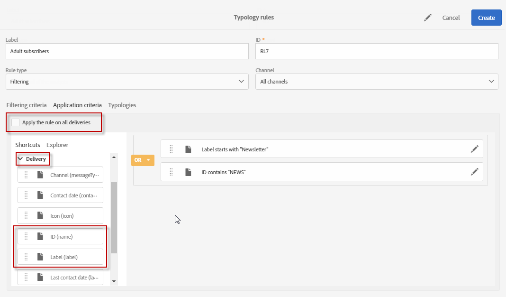

# Regole di filtro {#filtering-rules}

Le regole di filtro consentono di escludere una parte della destinazione del messaggio in base ai criteri definiti in una query, ad esempio profili o profili in quarantena già inviati da un certo numero di e-mail.

## Regole di tipo filtro predefinite {#default-filtering-typology-rules}

La tabella seguente fornisce informazioni sulle regole di filtraggio pronte all’uso, nonché sui relativi canali.

| Etichetta | Canale | Descrizione |
---------|----------|---------
| **[!UICONTROL Address not specified]** | Tutto | Esclude la popolazione di destinazione senza un indirizzo specifico (indirizzo e-mail, indirizzo postale, ecc.) secondo il canale selezionato). |
| **[!UICONTROL Denylisted address]** | Tutto | Esclude gli indirizzi che si trovano sul elenco Bloccati. |
| **[!UICONTROL Duplicate]** | Tutto | Esclude i duplicati in base al **[!UICONTROL Address]** campo popolazione di destinazione. |
| **[!UICONTROL Exclude mobile applications]** | Applicazione mobile | Sono escluse le iscrizioni all&#39;app che non corrispondono all&#39;applicazione mobile definita nel messaggio. |
| **[!UICONTROL Exclude mobile applications for In-App]** | In-App | Sono escluse le iscrizioni all&#39;app che non corrispondono all&#39;applicazione mobile definita nel messaggio (modello in-app). |
| **[!UICONTROL Exclude mobile applications for In-App broadcast]** | In-App | Esclude le iscrizioni alle app che non corrispondono all&#39;applicazione mobile definita nel messaggio (modello di trasmissione in-app) |
| **[!UICONTROL Exclude mobile applications for Push]** | Applicazione mobile | Esclude le iscrizioni alle app che non corrispondono all&#39;applicazione mobile definita nel messaggio (per push) |
| **[!UICONTROL Quarantined address]** | Tutto | Esclude gli indirizzi posti in quarantena. |
| **[!UICONTROL Target limited in size]** | Tutto | Controlla se è stata raggiunta la dimensione massima di consegna per la destinazione. Si applica alle consegne per corrispondenza diretta con l&#39;opzione &quot;limite di consegna&quot; attivata. |

Sono inoltre disponibili due regole di esclusione per le seguenti regole di filtro predefinite:

* **[!UICONTROL Exclusion of addresses]** ( **[!UICONTROL addressExclusions]** )
* **[!UICONTROL Exclusion of domains]** ( **[!UICONTROL domainExclusions]** ).

Durante l&#39;analisi delle e-mail, queste regole confrontano gli indirizzi e-mail dei destinatari con gli indirizzi o i nomi di dominio vietati contenuti in un elenco di soppressione globale crittografato gestito nell&#39;istanza di recapito. In caso di corrispondenza, il messaggio non viene inviato al destinatario.

Questo per evitare di essere inserita nell&#39;elenco Bloccati a causa di attività dannose, soprattutto l&#39;uso di uno Spamtrap. Ad esempio, se si utilizza uno Spamtrap per effettuare la sottoscrizione tramite uno dei moduli Web, viene automaticamente inviato un messaggio e-mail di conferma a tale Spamtrap, con conseguente aggiunta automatica dell&#39;indirizzo al elenco Bloccati.

>[!NOTE]
>
>Gli indirizzi e i nomi di dominio contenuti nell&#39;elenco di soppressione globale sono nascosti. Solo il numero di destinatari esclusi è indicato nei registri di analisi della consegna.

## Creating a filtering rule {#creating-a-filtering-rule}

Potete creare regole di filtro personalizzate in base alle vostre esigenze. Ad esempio, potete filtrare il pubblico di destinazione delle newsletter in modo che gli utenti con meno di 18 anni non ricevano mai comunicazioni.

Per creare una regola di tipo filtro, effettuate le seguenti operazioni:

1. Creare una nuova regola di tipologia. I passaggi principali per creare le regole di tipologia sono descritti in [questa sezione](../../sending/using/managing-typology-rules.md).

1. Selezionate il tipo di **[!UICONTROL Filtering]** regola, quindi specificate il canale desiderato.

1. Nella **[!UICONTROL Filtering criteria]** scheda, selezionate le iscrizioni nella **[!UICONTROL Subscription]** categoria.

   

1. Nella **[!UICONTROL Explorer]** scheda dell&#39;editor di query, trascinare il **[!UICONTROL Subscriber]** nodo nella parte principale dello schermo.

   

1. Selezionate il **[!UICONTROL Age]** campo e definite le condizioni di filtraggio in modo che l’età degli abbonati sia pari o superiore a 18 anni.

   

1. Nella **[!UICONTROL Typologies]** scheda, collegate questa regola a una tipologia.

   

1. Accertatevi che la tipologia sia selezionata nel modello di consegna o consegna che desiderate utilizzare. Per ulteriori informazioni al riguardo, consulta [questa sezione](../../sending/using/managing-typologies.md#applying-typologies-to-messages).

   

Ogni volta che questa regola viene utilizzata in un messaggio, gli abbonati che sono considerati minori verranno automaticamente esclusi.

## Configurazione del contesto di targeting delle regole di filtro {#configuring-filtering-rules-targeting-context}

Campaign Standard consente di configurare le dimensioni **Targeting** e **Filtraggio** in base ai dati da utilizzare.

A questo scopo, aprire le proprietà della regola di tipologia, quindi accedere alla **[!UICONTROL Advanced information]** sezione.

By default, filtering is carried out on the **[!UICONTROL Profiles]**. Ad esempio, se la regola è indirizzata a un&#39;applicazione mobile, **[!UICONTROL Filtering dimension]** è possibile modificarla in **[!UICONTROL Subscriptions to an application]**.

## Restricting the applicability of a filtering rule {#restricting-the-applicability-of-a-filtering-rule}

È possibile limitare l&#39;applicabilità di una regola di filtro in base al messaggio da inviare.

1. Nella **[!UICONTROL Application criteria]** scheda della regola di tipologia, deselezionare l&#39;opzione **[!UICONTROL Apply the rule on all deliveries]** , abilitata per impostazione predefinita.

   

1. Utilizzate l&#39;editor di query per definire un filtro. Ad esempio, puoi applicare la regola solo ai messaggi la cui etichetta inizia con una determinata parola o il cui ID contiene determinate lettere.

   

In questo caso, la regola viene applicata solo ai messaggi che corrispondono ai criteri definiti.
