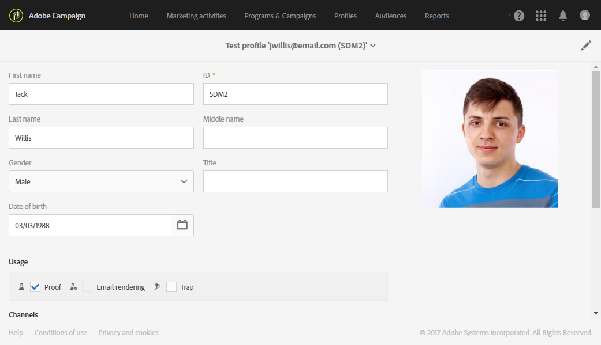

# Gestione dei profili di prova e invio di prove{#managing-test-profiles-and-sending-proofs}

## Informazioni sui profili di prova {#about-test-profiles}

I profili di prova consentono di eseguire il targeting di altri destinatari che non corrispondono ai criteri di targeting definiti. Vengono aggiunte al pubblico di un messaggio per rilevare qualsiasi uso fraudolento del database dei destinatari o per assicurarsi che le e-mail arrivino nelle inbox.

Potete gestire i profili di prova dal menu **[!UICONTROL Profiles & audiences > Test profiles]** avanzato.

Un profilo di prova contiene informazioni fittizie di contatto o informazioni di contatto controllate dal mittente, che possono quindi essere utilizzate in un messaggio nei seguenti contesti:

* Per l'invio **di prove**: la prova è un messaggio specifico utilizzato per controllare il messaggio prima di inviare la consegna finale ai destinatari. Un profilo Test prova è incaricato di controllare la consegna, in relazione al contenuto e al formato. Consultate [Invio di prove](../../sending/using/managing-test-profiles-and-sending-proofs.md#sending-proofs).
* Per **Rendering e-mail**: il profilo del test di rendering e-mail viene utilizzato per controllare il modo in cui viene visualizzato un messaggio in base alla casella in entrata del messaggio che la riceve. Ad esempio, webmail, servizio messaggio, mobile, ecc. Consultate [Rendering e-mail](../../sending/using/email-rendering.md).

   L'utilizzo **di rendering** e-mail è di sola lettura. I profili di test con questo utilizzo sono disponibili solo in Adobe Campaign.

* **Come abbondanza**: il messaggio viene inviato al profilo di prova esattamente come viene inviato alla destinazione principale. Vedere [Uso delle abbondanze](../../sending/using/managing-test-profiles-and-sending-proofs.md#using-traps).
* Per **visualizzare l'anteprima** dei messaggi: un profilo di prova può essere selezionato durante l'anteprima di un messaggio per testare gli elementi di personalizzazione. Consultate [Anteprima dei messaggi](/help/sending/using/previewing-messages.md).

## Gestione dei profili di prova {#managing-test-profiles}

### Creazione di profili di prova {#creating-test-profiles}

1. Dal menu avanzato, tramite il logo Adobe Campaign, seleziona **Profili e pubblico &gt; Prova profili** per accedere all'elenco dei profili di prova.

   

1. Dal **[!UICONTROL Test profiles]** dashboard, fate clic **su Crea**.

   

1. Inserite i dati per questo profilo.

   

1. Selezionate l'utilizzo che intendete utilizzare per il profilo di prova.

   

1. Inserite i canali **[!UICONTROL Email, Telephone, Mobile, Mobile app]** di contatto, nonché l'indirizzo del profilo di prova, se necessario.

   >[!NOTE]
   >
   >È possibile definire un formato e-mail preferito: **[!UICONTROL Text]** oppure **[!UICONTROL HTML]**.

1. Specificate un tipo di evento e i dati per questo evento se desiderate utilizzare questo profilo di prova per testare la personalizzazione di un messaggio di transazione.
1. Fate clic su **[!UICONTROL Create]** per salvare il profilo di prova.

Il profilo di prova verrà quindi aggiunto all'elenco dei profili.

**Argomento correlato:**

[Creazione di un video profilo](https://helpx.adobe.com/campaign/kt/acs/using/acs-test-profiles-feature-video-use.html) di prova

### Modifica dei profili di prova {#editing-test-profiles}

Per modificare un profilo di prova e consultare i dati che vi sono collegati oppure per modificarli:

1. Selezionate il profilo di prova che desiderate modificare facendo clic sulla relativa immagine.
1. Consulta o modifica i campi.

   

1. Fate clic **[!UICONTROL Save]** se avete inserito le modifiche, oppure selezionate il nome del profilo di prova **[!UICONTROL Test profiles]** nella sezione nella parte superiore della schermata per tornare alla dashboard dei profili di prova.

## Invio di prove {#sending-proofs}

Una prova è un messaggio specifico che consente di testare un messaggio prima di inviarlo alla destinazione principale.

I destinatari della prova possono approvare il messaggio (contenuto e modulo). Sono definiti nei profili **di test**. Per ulteriori informazioni, consultate [Gestione dei profili di prova](../../sending/using/managing-test-profiles-and-sending-proofs.md#managing-test-profiles).

Per inviare una prova, i profili di prova devono essere inclusi nell'audience del messaggio.

In un messaggio:

1. Fate clic sul **[!UICONTROL Send a test]** pulsante.

   

1. Selezionate il tipo di prova da utilizzare:

   * **[!UICONTROL Email rendering]**: Selezionate questa opzione per verificare il modo in cui il messaggio viene ricevuto in base alle inbox di destinazione. Per ulteriori informazioni, consultate Rendering [e-mail](../../sending/using/email-rendering.md).
   * **[!UICONTROL Proof]**: Selezionate questa opzione per testare il messaggio prima di inviarlo alla destinazione principale. I destinatari della prova hanno la responsabilità di approvare la consegna, controllando sia il contenuto che il formato.
   * **[!UICONTROL Proof + Email rendering]**: questa opzione combina le due opzioni precedenti.
   

1. Confermate la scelta.

   Le prove vengono inviate ai profili di prova.

   

1. Puoi visualizzare le tue prove utilizzando l'elenco **[!UICONTROL Proofs]** a discesa.

   

1. Selezionate una prova per accedere al relativo riepilogo. Se hai selezionato l' **opzione di rendering** e-mail come tipo di prova, l' **[!UICONTROL Access email rendering]** icona viene visualizzata a destra dell'etichetta della prova. Consultate [Rendering e-mail](../../sending/using/email-rendering.md).

   

A seconda dei commenti delle persone che ricevono la prova, potrebbe essere necessario modificare il contenuto della consegna. Una volta apportate le modifiche, dovete riavviare la preparazione e-mail e inviare nuovamente una prova. Ogni nuova prova è accessibile mediante il **[!UICONTROL Show proofs]** pulsante.

Devi inviare tutte le prove necessarie fino alla finalizzazione del contenuto della distribuzione. Una volta effettuata questa operazione, potete inviarla alla destinazione principale e chiudere il processo di approvazione.

**Argomento correlato:**

[Invio di un test, preparazione e invio di un](https://helpx.adobe.com/campaign/kt/acs/using/acs-sending-test-preparing-sending-email-feature-video-use.html) video e-mail

## Utilizzo delle abbondanze {#using-traps}

Quando si utilizzano le abbondanze, il messaggio viene inviato al profilo di prova esattamente come viene inviato alla destinazione principale, come mezzo per determinare se il file client è utilizzato in modo fraudolento.

Le abbondanze erano inizialmente progettate per le consegne dirette. Consentono di:
* Verifica che il provider di posta diretta stia inviando effettivamente la comunicazione.
* Ricevere il messaggio e-mail contemporaneamente e nelle stesse condizioni dei clienti.
* Conserva una copia esatta della posta inviata.
* Verificate che l'elenco client non venga utilizzato per il vostro provider di posta diretta. In realtà, se all'indirizzo del profilo di prova viene inviata una qualsiasi altra comunicazione, il file client potrebbe essere stato utilizzato senza che sia noto. Per questo motivo, l'indirizzo del profilo di prova deve essere utilizzato solo a questo scopo.

Per ulteriori informazioni sull'aggiunta di abbondanze al pubblico di una posta diretta, consultate [Aggiunta di profili di test e abbondanza](../../channels/using/defining-the-direct-mail-audience.md#adding-test-and-trap-profiles).

Per gli altri canali di comunicazione, potete aggiungere profili di prova abbondanza alla destinazione principale per:
* Verificate che il messaggio sia stato inviato correttamente.
* Ottieni e mantieni una copia esatta del messaggio.
* Monitora quando è stata inviata e ricevuta.

Per utilizzare un profilo di prova come abbondanza, deve essere incluso nell'audience del messaggio.

>[!NOTE]
>
>Invece di testare profili utilizzati per [prove](../../sending/using/managing-test-profiles-and-sending-proofs.md#sending-proofs) di rendering o [per il rendering delle e-mail](../../sending/using/email-rendering.md), il messaggio viene inviato contemporaneamente alla destinazione principale e ai profili di test utilizzati come abbondanza.

Quando si definisce l'audience di un messaggio:

1. Nella **[!UICONTROL Test profiles]** scheda, selezionate un profilo di prova. Accertatevi che sia utilizzato **[!UICONTROL Trap]** come destinazione.

   

1. Una volta che il contenuto del messaggio è pronto, fai clic sul **[!UICONTROL Prepare]** pulsante. Consultate [Preparazione dell'invio](../../sending/using/preparing-the-send.md).
   >[!NOTE]
   >
   >Verificate di aver selezionato una destinazione principale. In caso contrario, il messaggio non può essere inviato.

1. Fate clic sul **[!UICONTROL Confirm]** pulsante. Consultate [Conferma dell'invio](../../sending/using/confirming-the-send.md).

   

Il messaggio viene inviato alla destinazione principale e al profilo di prova.

>[!NOTE]
>
>Quando si utilizza un profilo di prova come abbondanza, per qualsiasi campo arricchito di un messaggio, i dati aggiuntivi corrispondenti vengono selezionati in modo casuale da un profilo di destinazione reale e assegnati al profilo di prova dell'abbondanza. Per ulteriori informazioni sull'arricchimento, consultate [questo esempio](../../automating/using/enrichment.md#example--enriching-profile-data-with-data-contained-in-a-file).
