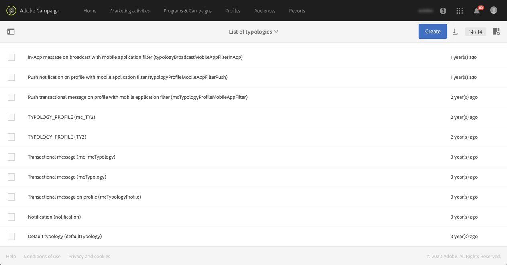

# Gestione delle tipologie {#managing-typologies}

## Informazioni sulle tipologie {#about-typologies}

Le tipologie sono set di regole che ti consentono di verificare la validità del messaggio prima di inviarlo. Ad esempio: il contenuto del messaggio non è vuoto, è presente un annullamento dell’abbonamento, l’esclusione di duplicati, ecc.

Le tipologie sono accessibili tramite il menu **[!UICONTROL Administration]** > **[!UICONTROL Channels]** > **[!UICONTROL Typologies]**. Per impostazione predefinita, nell’applicazione è disponibile una tipologia predefinita. In base alle esigenze puoi creare tipologie personalizzate o modificare quelle esistenti.

Per ogni tipologia la sezione **[!UICONTROL Typology rules]** elenca il set di regole che vengono eseguite al momento di utilizzare la tipologia con un messaggio.

>[!NOTE]
>
>Per visualizzare ulteriori dettagli su una delle regole di tipologia, fai doppio clic su di essa. La regola viene visualizzata in modalità di sola lettura.

## Creazione di una tipologia {#creating-a-typology}

Per creare una nuova tipologia, segui questi passaggi:

1. Accedi al menu **[!UICONTROL Administration]** > **[!UICONTROL Channels]** > **[!UICONTROL Typologies]**.

1. Viene visualizzato l’elenco delle tipologie. Fai clic sul pulsante **[!UICONTROL Create]**.

   

1. Definisci la tipologia **[!UICONTROL Label]**, quindi fai clic sul pulsante **[!UICONTROL Add an element]** per selezionare le regole di tipologia che desideri includervi. Per ulteriori informazioni sulle regole di tipologia, consulta [questa sezione](../../sending/using/managing-typology-rules.md).

   

   >[!NOTE]
   >
   >Il campo **[!UICONTROL IP affinity]** ti consente di gestire le affinità in base alla configurazione. Vengono definite nel file di configurazione dell’istanza. Se desideri utilizzare le affinità, contatta l’amministratore.

1. Fai clic su **[!UICONTROL Create]** per confermare la selezione. La tipologia è ora pronta per essere utilizzata nei messaggi.

## Applicazione delle tipologie ai messaggi {#applying-typologies-to-messages}

Durante l’associazione di una tipologia a un messaggio o a un relativo modello, le regole di tipologia incluse in essa vengono eseguite per verificare la validità del messaggio.

>[!NOTE]
>
>È possibile assegnare una sola tipologia a ogni messaggio o al relativo modello.

Per collegare una tipologia a un messaggio, segui questi passaggi:

1. Accedi alle proprietà del messaggio. I modelli di messaggio sono accessibili dal menu di navigazione **[!UICONTROL Resources]** > **[!UICONTROL Templates]**.

1. Nella sezione **[!UICONTROL Advanced parameters]** > **[!UICONTROL Preparation]**, seleziona la tipologia da collegare al messaggio.

   

1. Fai clic su **[!UICONTROL Confirm]**.

   La tipologia selezionata è ora collegata al messaggio. Tutte le relative regole di tipologia associate vengono eseguite per verificare la validità del messaggio.
