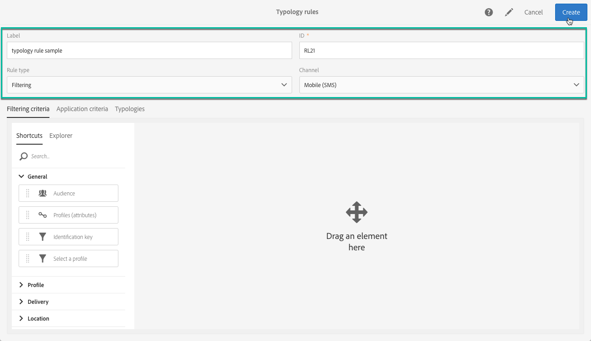
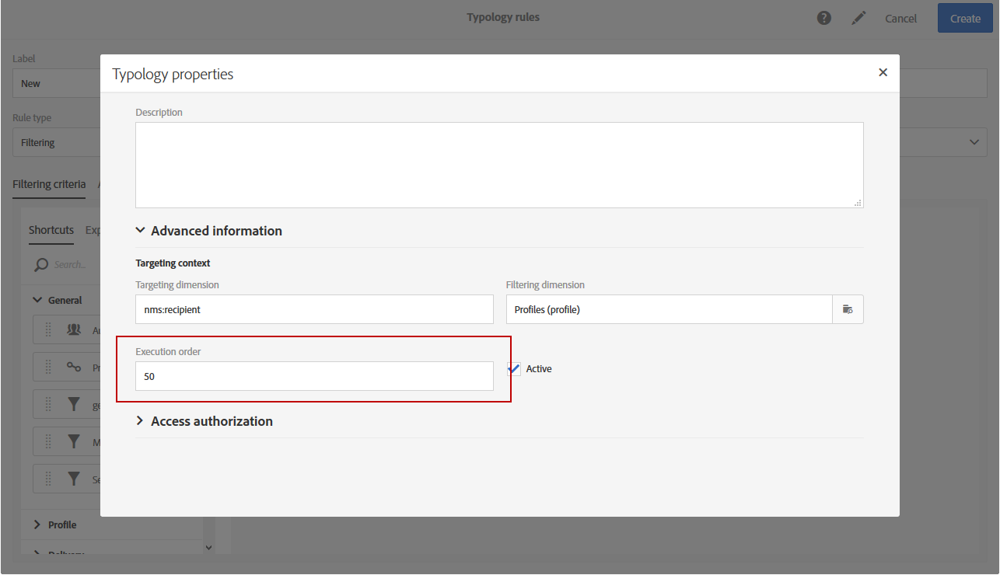

# Gestione delle regole di tipologia {#managing-typology-rules}

## Informazioni sulle regole di tipologia {#about-typology-rules}

Le regole di tipologia sono regole aziendali che ti consentono di eseguire controlli e filtrare il messaggio prima di inviarlo. I tipi disponibili di regole di tipologia sono:

* **Regole di filtro**: questo tipo di regola ti consente di escludere una parte del target del messaggio in base ai criteri definiti in una query, ad esempio profili in quarantena o profili che hanno ricevuto già un certo numero di e-mail. Per ulteriori informazioni, consulta [questa sezione](../../sending/using/filtering-rules.md).

* **Regole di affaticamento**: questo tipo di regole ti permette di definire un numero massimo di messaggi per profilo, in modo da evitare di richiederli in eccesso. Per ulteriori informazioni, consulta [questa sezione](../../sending/using/fatigue-rules.md).

* **Regole di controllo**: questo tipo di regole consente all’utente di verificare la validità e la qualità dei messaggi prima che siano inviati, come la visualizzazione del carattere, la dimensione del messaggio SMS, il formato dell’indirizzo e così via. Per ulteriori informazioni, consulta [questa sezione](../../sending/using/control-rules.md).

Le regole di tipologia sono disponibili nel menu **[!UICONTROL Administration]** > **[!UICONTROL Channels]** > **[!UICONTROL Typologies]** > **[!UICONTROL Typology rules]**.

Per impostazione predefinita, sono disponibili diverse regole predefinite di **filtraggio** e di **controllo**. Sono descritte in dettaglio nelle sezioni [Regole di filtraggio](../../sending/using/fatigue-rules.md) e [Regole di controllo](../../sending/using/control-rules.md).

In base alle tue esigenze, puoi modificare le regole di tipologia esistenti o crearne di nuove, ad eccezione delle regole **[!UICONTROL Control]**, che sono di sola lettura e non possono essere modificate.

## Creazione di una regola di tipologia {#creating-a-typology-rule}

I passaggi principali per creare una regola di tipologia sono i seguenti:

1. Accedi al menu **[!UICONTROL Administration]**/**[!UICONTROL Channels]**/**[!UICONTROL Typologies]**/**[!UICONTROL Typology rules]**, quindi fai clic su **[!UICONTROL Create]**.

   

1. Immetti la tipologia **[!UICONTROL Label]**, quindi specifica il **[!UICONTROL Channel]** a cui deve essere applicata la regola.

   

1. Specifica la regola di tipologia **[!UICONTROL Type]**, quindi configurala in base alle tue esigenze. La configurazione delle regole di tipologia varia a seconda del tipo. Per ulteriori informazioni, consulta le sezioni **[Regole di filtraggio](../../sending/using/filtering-rules.md)** e **[Regole di affaticamento](../../sending/using/fatigue-rules.md)**.

1. Seleziona le tipologie in cui desideri includere la nuova regola. A questo scopo, scegli la scheda **[!UICONTROL Typologies]**, quindi fai clic sul pulsante **[!UICONTROL Create element]**.

   

1. Seleziona la tipologia desiderata, quindi fai clic su **[!UICONTROL Confirm]**.

   

1. Dopo aver selezionato tutte le tipologie, fai clic su **[!UICONTROL Create]** per confermare la creazione della regola di tipologia.

## Ordine di esecuzione delle regole di tipologia {#typology-rules-execution-order}

Le regole di tipologia vengono eseguite in un ordine specificato durante le fasi di targeting, analisi e personalizzazione dei messaggi.

Nella modalità operativa standard, le regole vengono applicate nella sequenza seguente:

1. Regole di controllo, se applicate all’inizio del targeting.
1. Regole di filtro:

   * Regole di applicazione native per la qualifica degli indirizzi: indirizzo definito / indirizzo non verificato / indirizzo inserita nell&#39;elenco Bloccati / indirizzo messo in quarantena / qualità indirizzo.
   * Regole di filtro definite dall’utente.

1. Regole di controllo, se applicate alla fine del targeting.
1. Regole di controllo, se applicate all’inizio della personalizzazione.
1. Regole di controllo, se applicate al termine della personalizzazione.

Tuttavia, è possibile adattare l’ordine di esecuzione dello stesso tipo di regole in ogni tipologia. Infatti, quando più regole vengono eseguite durante la stessa fase di elaborazione dei messaggi, puoi scegliere l’ordine in cui vengono applicate.

Ad esempio, una regola di filtro il cui ordine di esecuzione è posizionato al numero 20 verrà eseguita prima di una regola di filtro il cui ordine di esecuzione è posizionato al numero 30.

Nel caso **[!UICONTROL Properties]** di una regola di tipologia, puoi impostarne l’ordine di esecuzione. Quando è necessario applicare più regole, l’ordine di esecuzione di ciascuna regola determina quelle da elaborare per prime. Per ulteriori informazioni, fai riferimento alla sezione [Ordine di esecuzione delle regole di tipo](#typology-rules-execution-order).

Una regola di tipologia può essere disattivata tramite le relative **[!UICONTROL Properties]** se non desideri che venga applicata nel momento in cui viene effettuata l’analisi dei messaggi interessati dalla regola.

