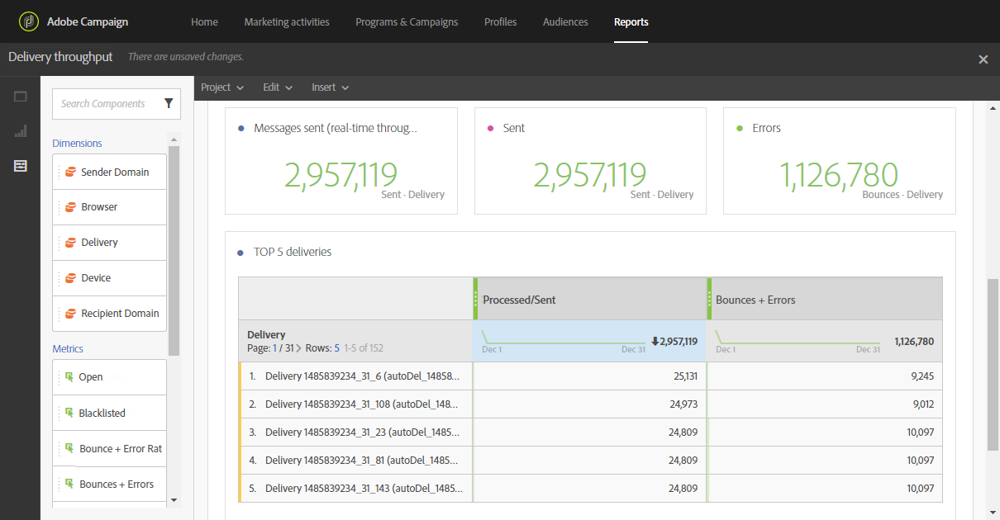

# Monitoraggio della consegna messaggi{#monitor-deliverability}

Di seguito sono riportati i dettagli relativi al rapporto **[!UICONTROL Delivery throughput]** e ai diversi strumenti di monitoraggio offerti da  Adobe Campaign. Seguono alcune linee guida aggiuntive sul monitoraggio della recapito:
* Controllate regolarmente la velocità di consegna per l&#39;intera piattaforma per verificare se è coerente con la configurazione originale.
* Verificate che i tentativi siano impostati correttamente (30 minuti per il periodo di tentativi e più di 20 tentativi) nei modelli di consegna.
* Verificare regolarmente che la casella di posta non riuscita sia accessibile e che l&#39;account non stia per scadere.
* Controllate ogni throughput di distribuzione per assicurarvi che sia coerente con la validità del contenuto di distribuzione (ad es. Le vendite flash devono essere consegnate in minuti, non in giorni).
* Quando si utilizzano le onde, verificare che ogni onda disponga di tempo sufficiente per terminare prima che venga attivata la successiva.
* Verificate che il numero di errori e di nuove quarantena siano coerenti con altre consegne.
* Consultate attentamente i registri di consegna per verificare il tipo di errori evidenziati (elenco Bloccati, problemi DNS, regole anti-spam, ecc.).

## Velocità effettiva di consegna {#delivery-throughput}

Questo rapporto contiene informazioni sulla velocità di consegna dell&#39;intera piattaforma per un determinato periodo, per misurare la velocità di consegna dei messaggi.

Per ulteriori informazioni, vedere [Trasmissione consegna](../../reporting/using/delivery-throughput.md).

Potete configurare i valori visualizzati modificando la scala cronologica.

Sono disponibili altri rapporti, ad esempio **[!UICONTROL Delivery summary]** o **[!UICONTROL Non-deliverables and bounces]**. Per ulteriori informazioni, vedere [Report dinamici](../../reporting/using/about-dynamic-reports.md).

## Monitoraggio delle consegne {#monitoring-deliveries}

Il dashboard dei messaggi consente di accedere ai registri di distribuzione: **[!UICONTROL Sending logs]**, **[!UICONTROL Exclusion logs]**, **[!UICONTROL Exclusion causes]**, **[!UICONTROL Tracking logs]** e **[!UICONTROL Tracked URLs]**. Mostrano i dettagli dell’invio, quale target è stato escluso e perché, nonché le informazioni di tracciamento come aperture e clic.

Per ulteriori informazioni, vedere [Monitoraggio di una consegna](../../sending/using/monitoring-a-delivery.md).

## Ricezione avvisi {#receiving-alerts}

La funzione **[!UICONTROL Delivery alerting]** è un sistema di gestione degli avvisi che consente a un gruppo di utenti di ricevere automaticamente le notifiche contenenti informazioni sull&#39;esecuzione delle consegne.

Per ulteriori informazioni, vedere [Ricezione di avvisi in caso di guasti](../../sending/using/receiving-alerts-when-failures-happen.md).

## Spam di segnale {#signal-spam}

Signal Spam è un servizio francese che offre un report anonimo sul loop di feedback per gli ISP francesi (Orange, SFR).

Questo servizio consente di seguire la reputazione degli ISP francesi e di monitorare l&#39;evoluzione dell&#39;attività dei clienti.

Il segnale Spam fornisce inoltre reclami diretti che gli utenti finali accedono attraverso un&#39;interfaccia dedicata. Tali reclami vengono quindi messi in quarantena dal database degli indirizzi e-mail.

## 250ok {#solution-250ok}

250ok è una soluzione di monitoraggio che fornisce elenco Bloccati IP e dominio, nonché indicatori di reputazione.

Le informazioni fornite sono in tempo reale, il che consente un&#39;assistenza proattiva. 250ok una soluzione complementare agli strumenti interni di recapito del Adobe .
