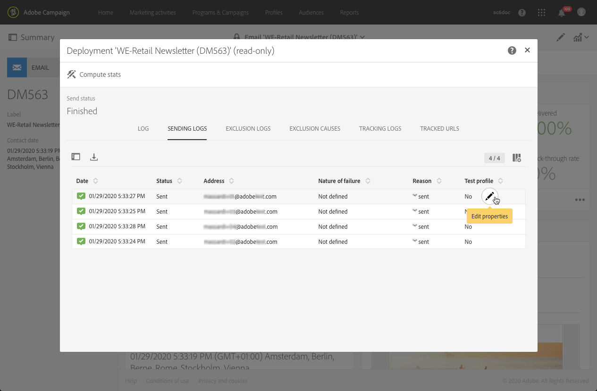

# Monitoraggio di una consegna{#monitoring-a-delivery}

Esistono diversi modi per monitorare una consegna e misurarne l’impatto:

* **Log dei messaggi**: questi log sono accessibili direttamente dal dashboard dei messaggi. Mostrano i dettagli dell’invio, quale target è stato escluso e perché, nonché le informazioni di tracciamento come aperture e clic.

   Per visualizzare i log dei messaggi, fai clic sull’icona in basso a destra del blocco **[!UICONTROL Deployment]**.

   Diverse schede contengono informazioni (se presenti) relative a **[!UICONTROL Sending logs]**, **[!UICONTROL Exclusion logs]**, **[!UICONTROL Exclusion causes]**, **[!UICONTROL Tracking logs]** e **[!UICONTROL Tracked URLs]**. Consulta [Log di consegna](#delivery-logs).

   

   I log contengono tutti i messaggi relativi alla consegna e alle bozze. Le icone specifiche consentono di identificare errori o avvisi. Per ulteriori informazioni, consulta la sezione [Approvazione dei messaggi](../../sending/using/previewing-messages.md).

   Puoi esportare i log facendo clic sul pulsante **[!UICONTROL Export list]**.

   

* **Avvisi di consegna**: per tenere traccia dei successi o degli errori di consegna, Adobe Campaign fornisce un sistema di avvisi e-mail che invia notifiche per informare gli utenti di importanti attività del sistema.
* **Rapporti**: puoi accedere a diversi rapporti per questo messaggio specifico dal dashboard dei messaggi. Hai anche a disposizione un menu **[!UICONTROL Reports]** che ti consente di accedere a un elenco completo di rapporti integrati o personalizzati da utilizzare per delineare metriche specifiche correlate al messaggio o alla campagna.
* Un amministratore può anche esportare i log in un file separato che è possibile elaborare con strumenti di reporting o BI. Per ulteriori informazioni, consulta la sezione [Esportazione dei log](../../automating/using/exporting-logs.md).

**Argomenti correlati:**

* [Ricezione degli avvisi in caso di errori](../../sending/using/receiving-alerts-when-failures-happen.md)
* [Rapporti](../../reporting/using/about-dynamic-reports.md)

## Log di consegna {#delivery-logs}

### Sending logs {#sending-logs}

La scheda **[!UICONTROL Sending logs]** offre una cronologia di ogni occorrenza della consegna. L’elenco dei messaggi inviati e i relativi stati sono archiviati qui. Consente di visualizzare lo stato di consegna per ciascun destinatario.

Per ogni profilo con uno stato **[!UICONTROL Sent]**, la colonna **[!UICONTROL Date]** mostra quando è stato inviato il messaggio.

Per accedere ai dettagli di un log di invio specifico, fai clic sull’icona della matita a destra della riga corrispondente.

Tutti i dettagli dei log di invio sono di sola lettura. Puoi inoltre visualizzare un’anteprima della pagina speculare.

>[!NOTE]
>
>Per visualizzare il rendering della pagina speculare nell’interfaccia utente di Campaign, l’URL del server della pagina speculare deve essere sicuro. In questo caso, utilizza https:// anziché http:// per impostare questo URL al momento della [configurazione del brand](../../administration/using/branding.md#configuring-and-using-brands).

### Exclusion logs {#exclusion-logs}

La scheda **[!UICONTROL Exclusion logs]** elenca tutti i messaggi che sono stati esclusi dal target inviato e specifica il motivo dell’errore di invio.

### Exclusion causes {#exclusion-causes}

Nella scheda **[!UICONTROL Exclusion causes]** viene visualizzato il volume (in numero di messaggi) dei messaggi esclusi dall’invio del target.

