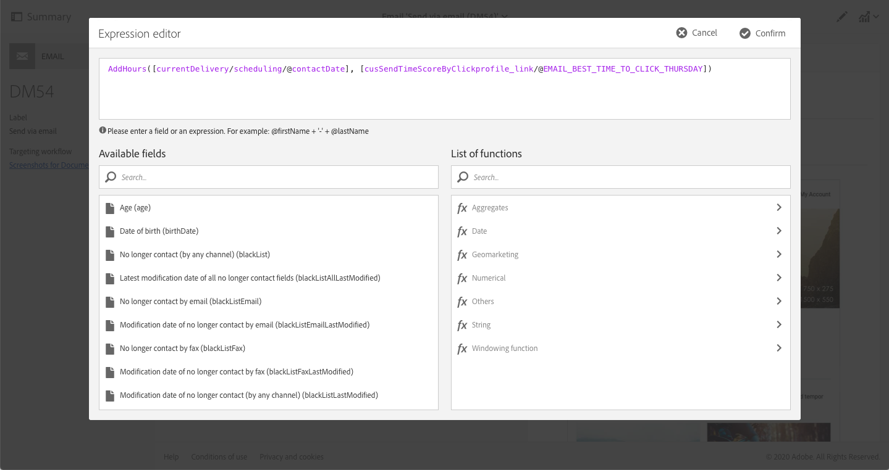

# Ottimizzazione della progettazione e della consegna con e-mail basate sull’intelligenza artificiale{#journey-ai}

## Guida introduttiva alle e-mail basate sull’intelligenza artificiale{#journey-ai-ovv}

Utilizzando Campaign, puoi ottimizzare la progettazione e la consegna dei percorsi dei clienti per prevedere le preferenze di coinvolgimento di ognuno. Basato sull’intelligenza artificiale Journey AI, Adobe Campaign può analizzare e prevedere i tassi di apertura, i tempi di invio ottimali e la probabilità di abbandono in base alle metriche di coinvolgimento storiche.

**Modelli di apprendimento automatico**

 Adobe Campaign Standard offre due nuovi modelli di apprendimento automatico: **Ottimizzazioni predittive dei tempi di invio** e **Punteggio di coinvolgimento predittivo**. Questi due modelli, insieme, sono denominati Journey AI, ovvero una classe di modelli di apprendimento automatico specifici per la progettazione e la fornitura di percorsi migliori per i clienti.

* **Ottimizzazione predittiva del tempo di invio**: l’ottimizzazione predittiva del tempo di invio prevede qual è il tempo di invio migliore per ciascun profilo destinatario per quanto riguarda l’apertura delle e-mail o i clic. Per ciascun profilo destinatario, i punteggi indicano il tempo di invio migliore per ogni giorno feriale e in quale giorno feriale si possono ottenere risultati ottimali.

* **Punteggio di coinvolgimento predittivo**: il punteggio di coinvolgimento predittivo prevede la probabilità che un destinatario sia interessato a un messaggio, ma anche la probabilità che questo annulli l’abbonamento entro i successivi 7 giorni dall’invio dell’e-mail. Le probabilità sono ulteriormente suddivise in categorie a seconda del rischio specifico di ritiro, medio o basso. Inoltre, il modello fornisce anche il grado percentile di rischio per i clienti, in modo da poter fare un confronto tra questi.

>[!CAUTION]
>Questa funzionalità non è disponibile come funzione predefinita del prodotto. La sua implementazione richiede l’intervento della Consulenza Adobe. Per maggiori informazioni, contatta un rappresentante Adobe di fiducia.
>
>La funzione richiede l’uso di un archivio di Azure, che deve essere fornito dal cliente.

## Ottimizzazione predittiva del tempo di invio{#predictive-send-time}

### Ottimizzazione di clic e aperture{#about-predictive-send-time}

l’ottimizzazione predittiva del tempo di invio prevede qual è il tempo di invio migliore per ciascun profilo destinatario per quanto riguarda l’apertura delle e-mail e i clic. Per ciascun profilo destinatario, i punteggi indicano il tempo di invio migliore per ogni giorno feriale e in quale giorno feriale si possono ottenere risultati ottimali.

Nel modello Ottimizzazione predittiva del tempo di invio sono presenti due modelli secondari:
* Il tempo di invio predittivo per l’apertura è il momento migliore per inviare una comunicazione al cliente in modo da massimizzare l’apertura dei messaggi
* Il tempo di invio predittivo per il clic è il momento migliore per inviare una comunicazione al cliente per massimizzare i clic

**Modello entrata**: registri di consegna, registri di tracciamento e attributi di profilo (non PII)

**Modello uscita**: momento migliore per inviare un messaggio (per aperture e clic)


Dettagli di uscita

* Calcola il momento migliore per l’invio di un’e-mail nei 7 giorni della settimana con intervalli di 1 ora (ad es.: 9:00, 10:00, 11:00)
* Il modello indica il giorno migliore della settimana e l’ora migliore di quel determinato giorno
* Ogni tempo ottimale viene calcolato due volte: una volta per massimizzare il tasso di apertura e una per massimizzare il click rate
* Sono forniti 16 campi (14 per ogni giorno della settimana e 2 per l’intera settimana):
   * l’orario migliore per inviare un’e-mail in modo da ottimizzare i clic di lunedì - valori compresi tra 0 e 23
   * l’orario migliore per inviare un’e-mail in modo da ottimizzare l’apertura dei messaggi di lunedì - valori compresi tra 0 e 23
   * l’orario migliore per inviare un’e-mail in modo da ottimizzare i clic di martedì - valori compresi tra 0 e 23
   * ...
   * l’orario migliore per inviare un’e-mail in modo da ottimizzare i clic di domenica - valori compresi tra 0 e 23
   * l’orario migliore per inviare un’e-mail in modo da ottimizzare l’apertura dei messaggi di domenica - valori compresi tra 0 e 23
   * ...
   * Il giorno migliore per inviare un’e-mail in modo da ottimizzare l’apertura dei messaggi per tutta la settimana - da lunedì a domenica
   * l’orario migliore per inviare un’e-mail in modo da ottimizzare l’apertura dei messaggi per tutta la settimana - valori compresi tra 0 e 23

>[!NOTE]
>
>Queste funzionalità predittive si applicano solo alle consegne delle e-mail.
>
>Il modello necessita di almeno un mese di dati per produrre risultati significativi.


### Accedere ai punteggi del profilo{#access-predictive-send-time-scores}

Una volta implementate in Campaign, le funzionalità di apprendimento automatico arricchiscono i dati dei profili con le nuove schede contenenti i punteggi migliori per apertura e clic. Le metriche sono calcolate da Journey AI e vengono inserite in Campaign utilizzando flussi di lavoro tecnici.

Per accedere a tali metriche, è necessario:

1. Aprire un profilo e fare clic sul pulsante Modifica.

1. Fare clic sulla scheda **Orario di invio per clic** o **Orario di invio per l’apertura** .

Per impostazione predefinita, i punteggi dei profili danno l’orario migliore del giorno per ogni giorno della settimana e l’orario complessivamente migliore per tutta la settimana.


### Invia messaggi al momento migliore{#use-predictive-send-time}

Affinché le e-mail possano essere inviate al momento ottimale per ogni profilo, la consegna deve essere pianificata utilizzando l’opzione **[!UICONTROL Send at a custom date defined by a formula]**.
Scopri come calcolare la data di invio [in questa sezione](../../sending/using/computing-the-sending-date.md).

La formula deve essere compilata con l’orario migliore specifico del giorno in cui la consegna verrà effettuata.


Esempio di formula:

```
AddHours([currentDelivery/scheduling/@contactDate], 
[cusSendTimeScoreByClickprofile_link/@EMAIL_BEST_TIME_TO_CLICK_WEDNESDAY])
```



>[!NOTE]
>
>Il modello dati potrebbe essere diverso a seconda dell’implementazione.


## Punteggio predittivo di coinvolgimento {#predictive-scoring}

Il punteggio predittivo di coinvolgimento consente di:

* **Selezionare un’audience**: utilizzando l’attività di query, puoi selezionare l’audience con cui interagire con un messaggio specifico
* **Escludere un’audience**: utilizzando l’attività di query, puoi rimuovere l’audience per non inviare loro il messaggio
* **Personalizzare**: personalizza i messaggi in base al livello di coinvolgimento (gli utenti altamente coinvolti riceveranno un messaggio diverso da quelli non coinvolti)

Questo modello utilizza più punteggi per indicare:

* **Punteggio di coinvolgimento per apertura/Punteggio di coinvolgimento per clic**: questo valore corrisponde alla probabilità che un utente iscritto sia interessato a un messaggio specifico (apertura o clic). I valori sono compresi tra 0,0 e 1,0.
* **Probabilità di annullamento abbonamento**: questo valore corrisponde alla probabilità che il destinatario annulli l’iscrizione al canale e-mail a causa di un messaggio e-mail aperto. I valori sono compresi tra 0,0 e 1,0.
* **Livello di mantenimento**: questo valore classifica gli utenti in tre livelli: basso, medio e alto. Con un valore alto, è molto probabile che il cliente sia interessato al marchio, mentre un valore basso implica la possibilità che annulli l’abbonamento.
* **Grado percentuale di mantenimento**: classificazione del profilo in termini di probabilità di annullamento della sottoscrizione. I valori sono compresi tra 0,0 e 1,0. Ad esempio, se la percentuale di mantenimento è 0,953, il destinatario ha più probabilità di restare con il marchio e meno probabilità di annullare l’iscrizione rispetto al 95,3% di tutti i destinatari.

>[!NOTE]
>
>Queste funzionalità predittive si applicano solo alle consegne delle e-mail.
>
>Il modello necessita di almeno un mese di dati per produrre risultati significativi.


**Modello entrata**: registri di consegna, registri di monitoraggio e attributi di profilo specifici

**Modello uscita**: un attributo di profilo che descrive la valutazione e la categoria del profilo


### Utilizzo del punteggio di coinvolgimento per il canale e-mail

Per accedere a tali metriche, è necessario:

1. Aprire un profilo e fare clic sul pulsante Modifica.

1. Fare clic sulla scheda **Punteggi di coinvolgimento per canale e-mail**.

Utilizzando un’attività di query in un flusso di lavoro, puoi utilizzare i punteggi per ottimizzare il pubblico.

Ad esempio, con i criteri del **livello di mantenimento**:


