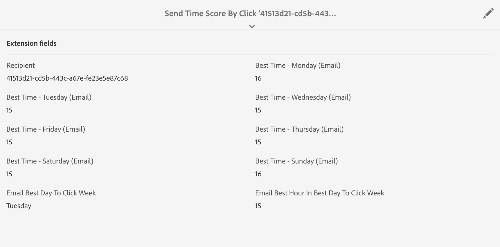

# Capacità di previsione del coinvolgimento degli utenti {#journey-ai}

Utilizzando Campaign, puoi ottimizzare la progettazione e la consegna dei percorsi dei clienti per prevedere le preferenze di coinvolgimento di ognuno. Basata sull’intelligenza artificiale e sull’apprendimento automatico, l’ottimizzazione del tempo di invio e il punteggio di coinvolgimento predittivo di Adobe Campaign possono analizzare e prevedere i tassi di apertura, i tempi di invio ottimali e la probabilità di abbandono in base a metriche di coinvolgimento storiche.

>[!IMPORTANT]
>Questa funzionalità non è disponibile come funzione predefinita del prodotto. La sua implementazione richiede l’intervento della Consulenza Adobe. Per maggiori informazioni, contatta un rappresentante Adobe di fiducia.

Adobe Campaign offre due nuovi modelli di apprendimento automatico: **Ottimizzazione predittiva del tempo di invio** e **Punteggio di coinvolgimento predittivo**. Questi due modelli sono modelli di apprendimento automatico specifici per la progettazione e la fornitura di percorsi di clienti migliori.

* **Ottimizzazione predittiva del tempo di invio** prevede qual è il tempo di invio migliore per ciascun profilo destinatario per quanto riguarda l’apertura delle e-mail o i clic e l’apertura dei messaggi push. Per ciascun profilo destinatario, i punteggi indicano il tempo di invio migliore per ogni giorno feriale e in quale giorno feriale si possono ottenere risultati ottimali.

* **Punteggio predittivo del coinvolgimento**: prevede la probabilità che un destinatario si interessi a un messaggio e la probabilità che lo rifiuti (cancellando l’abbonamento) entro i successivi 7 giorni dall’invio dell’e-mail. Le probabilità sono ulteriormente suddivise in blocchi in base al livello di coinvolgimento previsto con i contenuti: alto, medio o basso. Questi modelli forniscono anche il grado percentile del rischio di annullamento sottoscrizione per i clienti per capire dove il grado di un determinato cliente è in relazione ad altri.

## Ottimizzazione del tempo di invio predittivo{#predictive-send-time}

Predictive Send-Time Optimization prevede qual è il tempo di invio migliore per ciascun profilo destinatario per quanto riguarda l’apertura delle e-mail o i clic e l’apertura dei messaggi push. Per ciascun profilo destinatario, i punteggi indicano il tempo di invio migliore per ogni giorno feriale e in quale giorno feriale si possono ottenere risultati ottimali.

Nel modello Ottimizzazione predittiva del tempo di invio sono presenti due modelli secondari:

* **Il tempo di invio predittivo per l’apertura è il momento migliore per inviare una comunicazione al cliente in modo da massimizzare l’apertura dei messaggi**
* **Il tempo di invio predittivo per il clic è il momento migliore per inviare una comunicazione al cliente per massimizzare i clic**

**Modello entrata**: registri di consegna, registri di tracciamento e attributi di profilo (non PII)

**Modello uscita**: momento migliore per inviare un messaggio (per aperture e clic)

Dettagli di uscita

* Calcola l’ora migliore del giorno per l’invio di un’e-mail nei 7 giorni della settimana con intervalli di 1 ora (ad esempio: 9:00, 10:00, 11:00)
* Il modello indica il giorno migliore della settimana e l’ora migliore di quel determinato giorno
* Ogni tempo ottimale viene calcolato due volte: una volta per massimizzare il tasso di apertura e una per massimizzare il click rate
* Sono forniti 16 campi (14 per ogni giorno della settimana e 2 per l’intera settimana):
* L’orario migliore per inviare un’e-mail in modo da ottimizzare i clic di lunedì - valori compresi tra 0 e 23
* L’orario migliore per inviare un’e-mail in modo da ottimizzare l’apertura dei messaggi di lunedì - valori compresi tra 0 e 23
* ...
* L’orario migliore per inviare un’e-mail in modo da ottimizzare i clic di domenica - valori compresi tra 0 e 23
* L’orario migliore per inviare un’e-mail in modo da ottimizzare l’apertura dei messaggi di domenica - valori compresi tra 0 e 23
* ...
* Il giorno migliore per inviare un’e-mail in modo da ottimizzare l’apertura dei messaggi per l’intera settimana - Da lunedì a domenica
* L’orario migliore per inviare un’e-mail in modo da ottimizzare l’apertura dei messaggi per l’intera settimana - valori compresi tra 0 e 23

>[!NOTE]
>
>Il modello necessita di almeno un mese di dati per produrre risultati significativi.
>
>Queste funzionalità predittive si applicano solo ai canali e-mail e push.

Una volta implementate in Campaign, le funzionalità di apprendimento automatico arricchiscono i dati dei profili con le nuove schede contenenti i punteggi migliori per apertura e clic. Le metriche vengono calcolate e inserite in Campaign utilizzando flussi di lavoro tecnici.

Per accedere a tali metriche, è necessario:

1. Aprire un profilo e fare clic sul pulsante Modifica.

1. Fare clic sulla scheda **Orario di invio per clic** o **Orario di invio per l’apertura** .

Per impostazione predefinita, i punteggi dei profili danno l’orario migliore del giorno per ogni giorno della settimana e l’orario complessivamente migliore per tutta la settimana.



### Invia messaggi al momento migliore{#use-predictive-send-time}

Affinché le e-mail possano essere inviate al momento ottimale per ogni profilo, la consegna deve essere pianificata utilizzando l’opzione **[!UICONTROL Send at a custom date defined by a formula]**.
Scopri come calcolare la data di invio [in questa sezione](../../sending/using/computing-the-sending-date.md).

La formula deve essere compilata con l’orario migliore specifico del giorno in cui la consegna verrà effettuata.


Esempio di formula:

```
AddHours([currentDelivery/scheduling/@contactDate], 
[cusSendTimeScoreByClickprofile_link/@EMAIL_BEST_TIME_TO_CLICK_WEDNESDAY])
```


>[!NOTE]
>
>Il modello dati potrebbe essere diverso a seconda dell’implementazione.

## Valutazione del coinvolgimento predittivo {#predictive-scoring}

Il Punteggio di coinvolgimento predittivo prevede la probabilità che un destinatario si interessi a un messaggio e la probabilità che lo rifiuti (cancellando l’abbonamento) entro i successivi 7 giorni dall’invio dell’e-mail.

Le probabilità sono ulteriormente suddivise in blocchi in base al livello di coinvolgimento previsto con i contenuti: alto, medio o basso. Questi modelli forniscono anche il grado percentile del rischio di annullamento sottoscrizione per i clienti per capire dove il grado di un determinato cliente è in relazione ad altri.

Il Punteggio di coinvolgimento predittivo consente di:

* **Selezionare un pubblico**: utilizzando l’attività query, puoi selezionare il pubblico con cui interagire con un messaggio specifico
* **Escludere un pubblico**: utilizzando l’attività query, puoi rimuovere il pubblico che ha più probabilità di annullare l’iscrizione
* **Personalizza**: personalizzare i messaggi in base al livello di coinvolgimento (gli utenti altamente coinvolti riceveranno un messaggio diverso da quelli non coinvolti)

Questo modello utilizza più punteggi per indicare:

* **Punteggio di coinvolgimento per apertura/Punteggio di coinvolgimento per clic**: questo valore corrisponde alla probabilità che un utente iscritto sia interessato a un messaggio specifico (apertura o clic). I valori sono compresi tra 0,0 e 1,0.
* **Probabilità di annullamento abbonamento**: questo valore corrisponde alla probabilità che il destinatario annulli l’iscrizione al canale e-mail a causa di un messaggio e-mail aperto. I valori sono compresi tra 0,0 e 1,0.
* **Livello di mantenimento**: questo valore classifica gli utenti in tre livelli: basso, medio e alto. Con un valore alto, è molto probabile che il cliente sia interessato al marchio, mentre un valore basso implica la possibilità che annulli l’abbonamento.
* **Grado percentuale di mantenimento**: classificazione del profilo in termini di probabilità di annullamento della sottoscrizione. I valori sono compresi tra 0,0 e 1,0. Ad esempio, se la percentuale di mantenimento è 0,953, il destinatario ha più probabilità di restare con il marchio e meno probabilità di annullare l’iscrizione rispetto al 95,3% di tutti i destinatari.

>[!NOTE]
>
>Queste funzionalità predittive si applicano solo alle consegne delle e-mail.
>
>Il modello necessita di almeno un mese di dati per produrre risultati significativi.

**Modello entrata**: registri di consegna, registri di monitoraggio e attributi di profilo specifici

**Modello uscita**: un attributo di profilo che descrive la valutazione e la categoria del profilo

Per accedere a tali metriche, è necessario:

1. Aprire un profilo e fare clic sul pulsante Modifica.

1. Fare clic sulla scheda **Punteggi di coinvolgimento per canale e-mail**.

Utilizzando un’attività di query in un flusso di lavoro, puoi utilizzare i punteggi per ottimizzare il pubblico. Ad esempio, con i criteri del **livello di mantenimento**:


