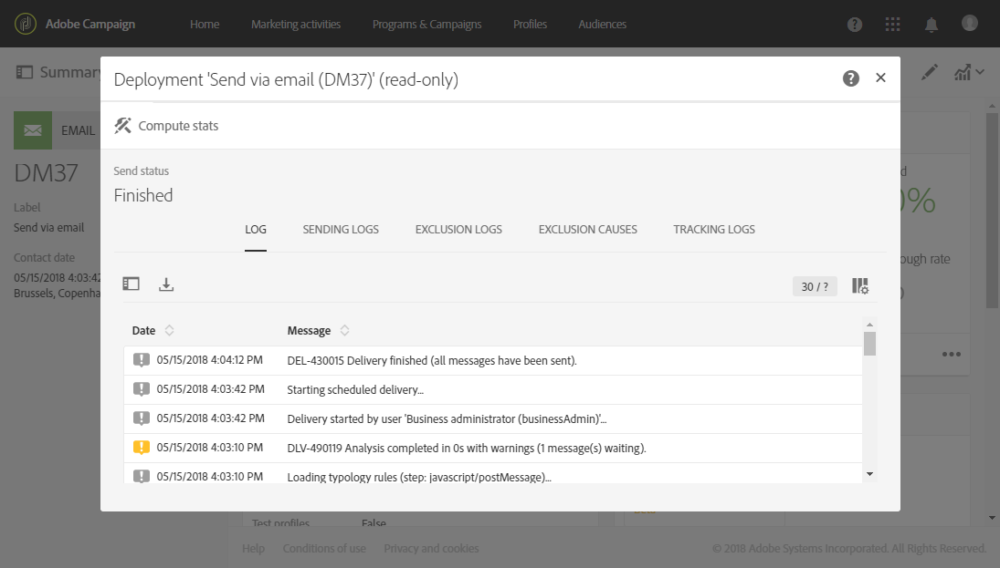

# Preparazione dell’invio{#preparing-the-send}

La preparazione corrisponde alla fase di calcolo della popolazione target e generazione del contenuto del messaggio per ciascun profilo incluso nel target. Una volta terminata la preparazione, i messaggi sono pronti per essere inviati, immediatamente o [alla data e ora](../../sending/using/about-scheduling-messages.md)previste.

1. Per iniziare a preparare l’invio, fai clic sul pulsante **Prepara** presente nella barra delle azioni.

   

1. Il **[!UICONTROL Deployment]** blocco mostra i progressi della preparazione, quindi le statistiche di preparazione: numero di messaggi con targeting, numero di messaggi da inviare, ecc.

   A seconda delle dimensioni della popolazione interessata, questa operazione potrebbe richiedere del tempo.

   

1. Arrestate la preparazione in qualsiasi momento utilizzando il pulsante **Interrompi** , situato nella barra delle azioni.

   Durante la fase di preparazione, non vengono inviati messaggi. È quindi possibile iniziare o interrompere questo processo senza rischiare di avere un impatto su di esso.

   

1. Il messaggio viene salvato automaticamente durante la preparazione alla consegna. Se devi apportare delle modifiche alla pianificazione del messaggio dopo il passaggio di preparazione, dovrai fare di nuovo clic sul **[!UICONTROL Prepare]** pulsante per tenere conto di tali modifiche. Per ulteriori informazioni sulla pianificazione di un messaggio, consulta questa [pagina](../../sending/using/about-scheduling-messages.md).

   

1. Per visualizzare i registri di preparazione, fare clic sul pulsante situato in basso a destra del blocco.

   

1. Si apre la **[!UICONTROL Deployment]** finestra, correggete eventuali errori e riavviate la preparazione.

   Nell'ultimo messaggio di registro sono visualizzati tutti i messaggi di errore e il numero di errori. Un'icona specifica mostra il tipo di errore rilevato: l’icona gialla indica un errore di elaborazione non critico; l’icona rossa indica un errore critico che impedisce l’avvio della consegna.

   

1. Controllare le statistiche di preparazione prima di confermare l'invio dei messaggi. Se il numero di messaggi da inviare non corrisponde alla configurazione, modificate la popolazione di destinazione (consultate [Selezione di un'audience in un messaggio](../../audiences/using/selecting-an-audience-in-a-message.md)) e riavviate la preparazione.

Una volta completata la preparazione, il messaggio è pronto per essere inviato. Per ulteriori informazioni, vedere [Conferma dell’invio](../../sending/using/confirming-the-send.md).

**Regole di tipologia**

Adobe Campaign viene fornito con un set di regole di tipologia integrate applicate durante la preparazione dei messaggi. Vengono utilizzati per verificare se un messaggio è valido e soddisfa i criteri di qualità. Vedere [Tipologie](../../administration/using/about-typology-rules.md). Potete definire regole di tipologia personalizzate, ad esempio impostare regole di affaticamento tra canali globali che escludano automaticamente i profili con eccesso di sollecitazione dalle campagne. Consultate [Regole](../../administration/using/fatigue-rules.md)di fatica.

**Controllo messaggi SMS**

Se hai inserito campi di personalizzazione o testo condizionale nel contenuto del messaggio SMS, questi fattori possono introdurre caratteri che non vengono presi in considerazione dalla codifica GSM. Quando viene eseguita la preparazione, viene monitorata la lunghezza del messaggio e, se supera il limite, viene visualizzato un messaggio di avviso.

Per ulteriori informazioni, consulta le sezioni Codifica [SMS, lunghezza e traslitterazione](../../administration/using/configuring-sms-channel.md#sms-encoding--length-and-transliteration) e [Personalizzazione dei messaggi](../../channels/using/personalizing-sms-messages.md) SMS.
