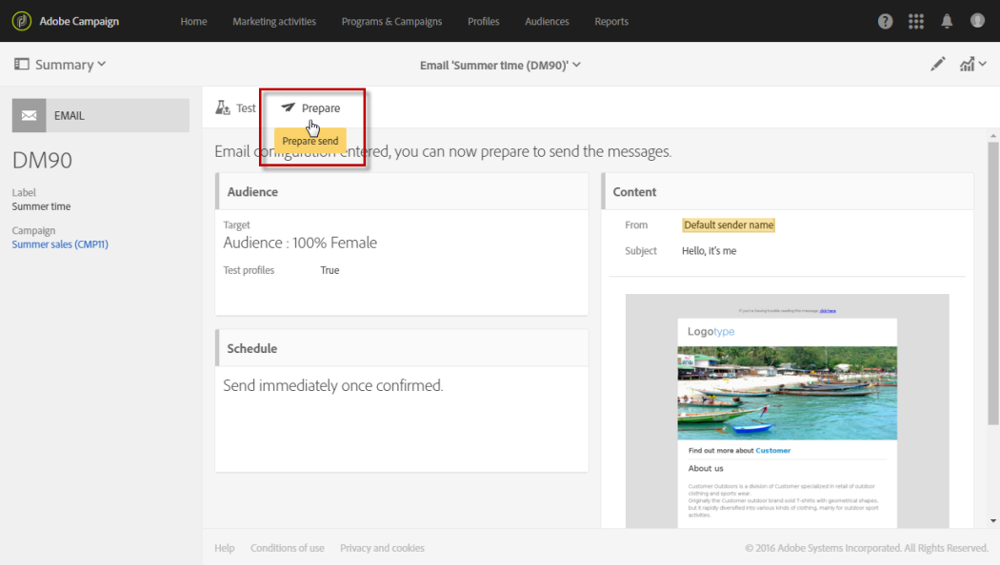
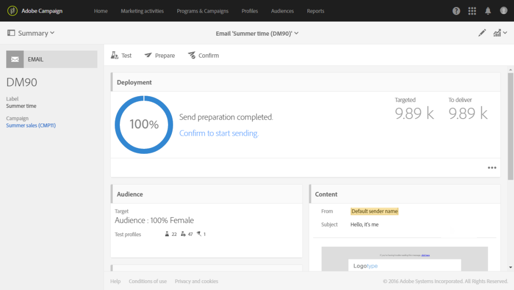
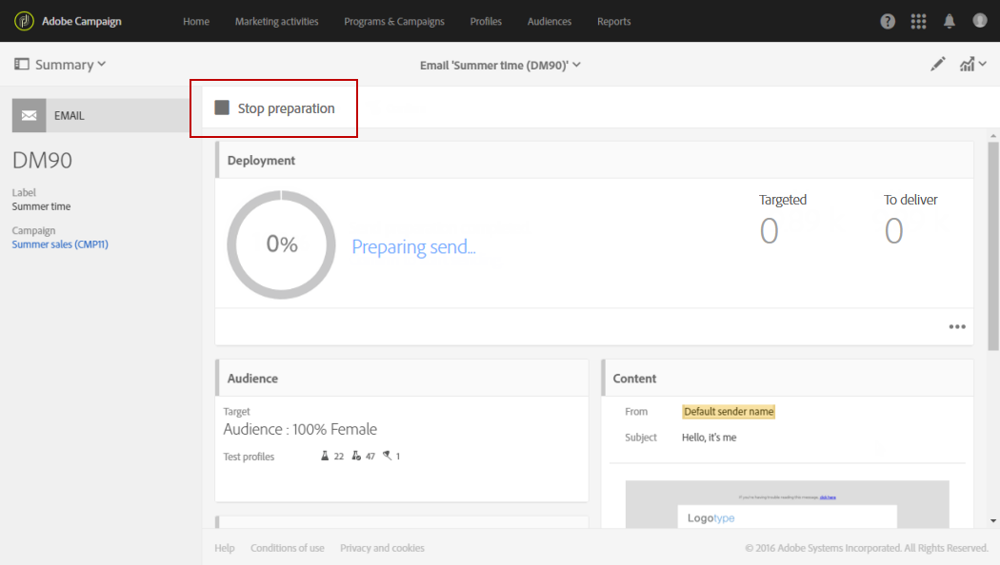
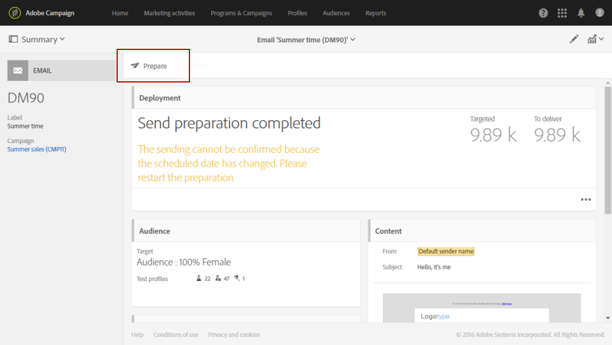
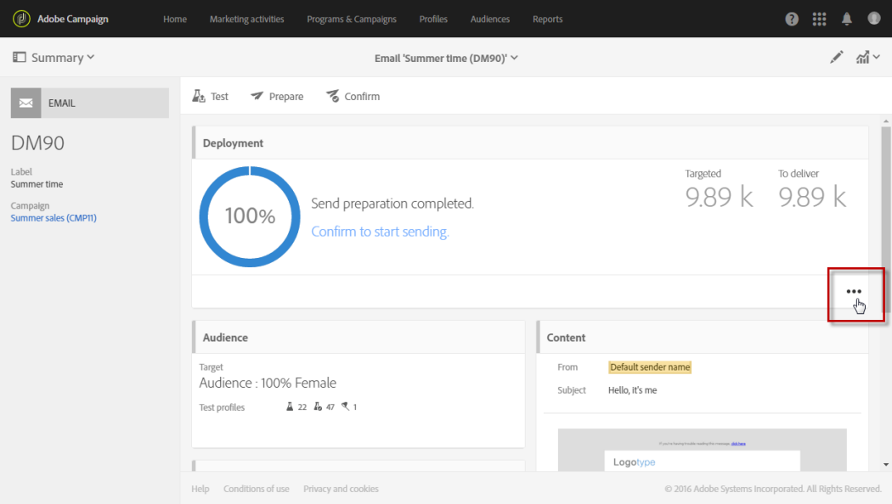
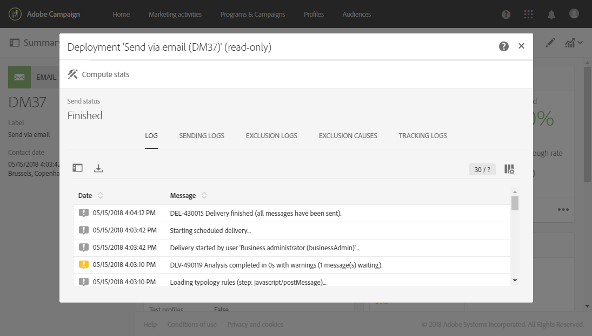

# Preparazione dell’invio{#preparing-the-send}

La preparazione corrisponde alla fase di calcolo della popolazione target e di generazione del contenuto del messaggio per ciascun profilo incluso nel target. Una volta completata la preparazione, i messaggi sono pronti per essere inviati, immediatamente o alle [date e ore pianificate](../../sending/using/about-scheduling-messages.md).

1. Per iniziare a preparare l&#39;invio, fare clic sul pulsante **Prepara** nella barra delle azioni.

   

1. Il blocco **[!UICONTROL Deployment]** mostra l&#39;avanzamento della preparazione, quindi le statistiche di preparazione: numero di messaggi di destinazione, numero di messaggi da inviare, ecc.

   A seconda della dimensione della popolazione target, questa operazione potrebbe richiedere del tempo.

   

1. Interrompi la preparazione in qualsiasi momento utilizzando il pulsante **Interrompi** nella barra delle azioni.

   Durante la fase di preparazione, non vengono inviati messaggi. È quindi possibile iniziare o interrompere questo processo senza alcun rischio.

   

1. Il messaggio viene salvato automaticamente durante la fase di preparazione per la consegna. Se è necessario apportare modifiche alla pianificazione del messaggio dopo la fase di preparazione, sarà necessario assicurarsi di fare nuovamente clic sul pulsante **[!UICONTROL Prepare]** per tenere conto di tali modifiche. Per ulteriori informazioni su come pianificare un messaggio, consulta questa [pagina](../../sending/using/about-scheduling-messages.md).

   

1. Per visualizzare i registri di preparazione, fai clic sul pulsante che si trova in basso a destra del blocco.

   

1. Viene visualizzata la finestra **[!UICONTROL Deployment]**. Correggere eventuali errori, quindi riavviare la preparazione.

   L’ultimo messaggio del registro presenta eventuali messaggi di errore e il numero di errori. Un’icona specifica mostra il tipo di errore riscontrato: l’icona gialla indica un errore di elaborazione non critico, l’icona rossa indica un errore critico che impedisce l’avvio della consegna.

   

1. Controlla le statistiche di preparazione prima di confermare l’invio dei messaggi. Se il numero di messaggi da inviare non corrisponde alla configurazione, modificare la popolazione di destinazione (vedere [Selezione di un pubblico in un messaggio](../../audiences/using/selecting-an-audience-in-a-message.md)) e riavviare la preparazione.

Una volta completata la preparazione, il messaggio è pronto per essere inviato. Per ulteriori informazioni, consulta [Conferma dell&#39;invio](../../sending/using/confirming-the-send.md).

**Regole di tipologia**

Adobe Campaign viene fornito con un set di regole di tipologia integrate che vengono applicate durante la preparazione dei messaggi. Vengono utilizzati per verificare se un messaggio è valido e soddisfa i criteri di qualità. Vedi [Tipologie](../../sending/using/about-typology-rules.md). Puoi definire regole di tipologia personalizzate, ad esempio può impostare regole di affaticamento globali cross-channel che escluderanno automaticamente dalle campagne i profili sollecitati eccessivamente. Consulta [Regole di affaticamento](../../sending/using/fatigue-rules.md).

**Controllo messaggio SMS**

Se hai inserito campi di personalizzazione o testo condizionale nel contenuto del messaggio SMS, questi fattori possono introdurre caratteri che non vengono presi in considerazione dalla codifica GSM. Quando la preparazione viene eseguita, viene monitorata la lunghezza del messaggio e, se supera il limite, viene visualizzato un messaggio di avviso.

Per ulteriori informazioni, consulta le sezioni [Codifica, lunghezza e traslitterazione di SMS](../../administration/using/configuring-sms-channel.md#sms-encoding--length-and-transliteration) e [Personalizzazione di messaggi SMS](../../channels/using/personalizing-sms-messages.md).
