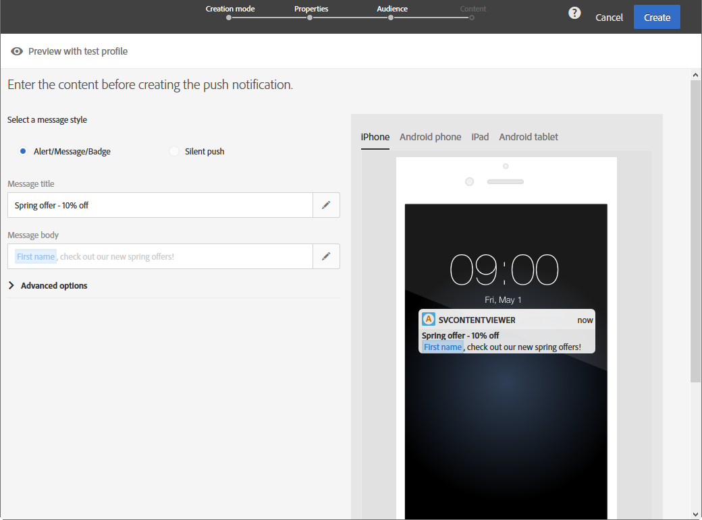
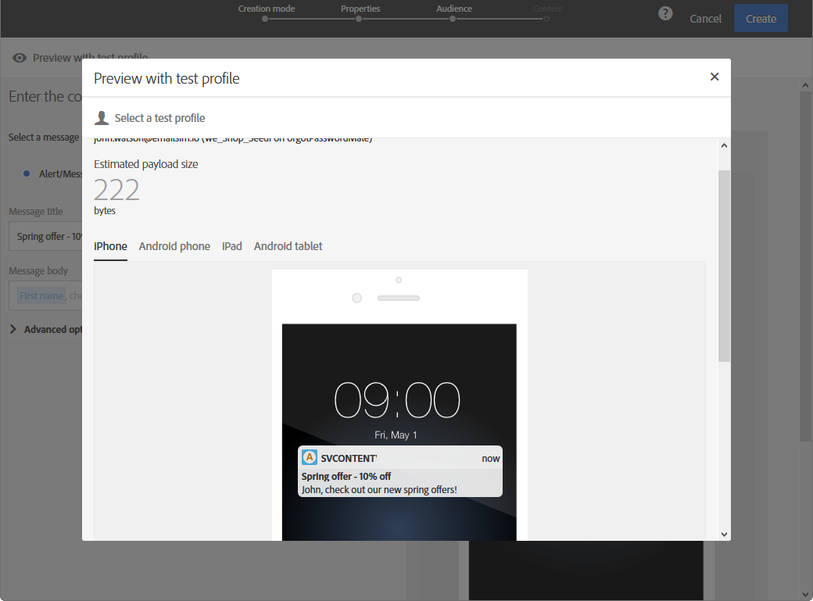

# Anteprima delle consegne {#previewing-messages}

## Anteprima dei messaggi e-mail {#previewing-emails}

Campaign Standard consente di visualizzare l&#39;anteprima dei messaggi prima dell&#39;invio, per verificarne la personalizzazione e vedere in che modo i destinatari li visualizzeranno.

L&#39;anteprima dei messaggi viene eseguita utilizzando i profili **di** test aggiunti alla destinazione del messaggio.

Per i messaggi **e-mail** , Campaign Standard consente di visualizzare in anteprima i messaggi utilizzando profili di destinazione anziché profili di test. Questo consente di ottenere una rappresentazione esatta del messaggio che un profilo specifico riceverà. Per ulteriori informazioni, consultate [Verifica dei messaggi e-mail tramite profili](../../sending/using/testing-messages-using-target.md)di destinazione.

Per visualizzare l&#39;anteprima di un messaggio utilizzando i profili di prova, effettua le seguenti operazioni:

1. In [Email Designer](../../designing/using/designing-content-in-adobe-campaign.md), fare clic sul **[!UICONTROL Preview]** pulsante.

   

   Una vista desktop e una vista mobile reattiva dell’e-mail vengono visualizzate affiancate.

1. Durante ogni anteprima viene eseguito un controllo automatico dello spam. Fare clic sul **[!UICONTROL Anti-spam analysis]** pulsante per ulteriori informazioni sull&#39;avviso.

   

1. Fate clic sul **[!UICONTROL Change profile]** pulsante per scegliere il profilo di test su cui sottoporre a test gli elementi di personalizzazione.

   

1. Per uscire dalla **[!UICONTROL Preview]** modalità, fare clic sul **[!UICONTROL Edit]** pulsante in alto a sinistra dello schermo.

   

**Argomenti correlati**

* [Gestione dei profili di test](../../audiences/using/managing-test-profiles.md)
* [Verifica dei messaggi e-mail tramite profili di destinazione](../../sending/using/testing-messages-using-target.md)
* [Invio di prove](../../sending/using/sending-proofs.md)

## Anteprima dei messaggi SMS {#previewing-sms}

Per i messaggi **SMS** , Campaign Standard consente di visualizzare in anteprima i messaggi utilizzando i profili di prova. Questo consente di ottenere una rappresentazione esatta del messaggio che un profilo specifico riceverà. Per ulteriori informazioni, consultate [Gestione dei profili](../../audiences/using/managing-test-profiles.md)di test.

Per visualizzare l&#39;anteprima di un messaggio SMS utilizzando i profili di prova, effettua le seguenti operazioni:

1. Una volta compilato il **[!UICONTROL Properties]** messaggio SMS e selezionato il pubblico, puoi personalizzare la consegna. Per ulteriori informazioni, consulta la [sezione](../../channels/using/personalizing-sms-messages.md).

   

1. Dopo aver personalizzato il contenuto, fate clic **[!UICONTROL Create]** per accedere alla **[!UICONTROL Summary]** finestra.

1. Dalla **[!UICONTROL Summary]** finestra, fate clic **[!UICONTROL Content]** per iniziare a visualizzare l’anteprima della consegna.

   

1. Fare clic **[!UICONTROL Preview]** sulla barra degli strumenti.

   

1. Fate clic **[!UICONTROL Change profile]** per selezionare il profilo di test, quindi **[!UICONTROL Confirm]**.

   

Ora puoi vedere la rappresentazione esatta del messaggio a seconda dei profili di test selezionati.

**Argomenti correlati**

* [Informazioni sui messaggi SMS](../../channels/using/about-sms-messages.md)
* [Creazione di un messaggio SMS](../../channels/using/creating-an-sms-message.md)
* [Personalizzazione dei messaggi SMS](../../channels/using/personalizing-sms-messages.md)

## Anteprima delle notifiche push {#previewing-push}

Per le notifiche **** push, Campaign Standard consente di visualizzare in anteprima i messaggi utilizzando i profili di prova. Questo consente di ottenere una rappresentazione esatta del messaggio che un profilo specifico riceverà. Per ulteriori informazioni, consultate [Gestione dei profili](../../audiences/using/managing-test-profiles.md)di test.

Per visualizzare in anteprima una notifica push utilizzando i profili di prova, effettuate le seguenti operazioni:

1. Dopo aver compilato **[!UICONTROL Properties]** la notifica push e selezionato i tipi di pubblico, potete personalizzare la distribuzione. Per ulteriori informazioni, consultate [Personalizzazione di una notifica](../../channels/using/customizing-a-push-notification.md)push.

1. Dopo aver personalizzato il contenuto, potete controllare direttamente il rendering delle notifiche push a seconda dei dispositivi e del sistema operativo nella finestra di anteprima.

   

1. Per visualizzare l&#39;anteprima della notifica push utilizzando i profili di prova, fate clic su **[!UICONTROL Preview with test profile]**.

   

1. Selezionate il profilo di test, quindi **[!UICONTROL Confirm]**.

Ora puoi vedere la rappresentazione esatta del messaggio a seconda dei profili di test selezionati.

**Argomenti correlati**

* [Informazioni sulle notifiche push](../../channels/using/about-push-notifications.md)
* [Preparazione e invio di una notifica push](../../channels/using/preparing-and-sending-a-push-notification.md)
* [Personalizzazione di una notifica push](../../channels/using/customizing-a-push-notification.md)

## Anteprima dei messaggi in-app {#previewing-in-app}

Per **In-App**, Campaign Standard consente di visualizzare in anteprima i messaggi utilizzando i profili di prova. Questo consente di ottenere una rappresentazione esatta del messaggio che un profilo specifico riceverà. Per ulteriori informazioni, consultate [Gestione dei profili](../../audiences/using/managing-test-profiles.md)di test.

Per visualizzare l&#39;anteprima di un messaggio in-app utilizzando i profili di prova, procedi come segue:

1. Dopo aver compilato **[!UICONTROL Properties]** il messaggio in-app, selezionato i tipi di pubblico e impostato il numero di destinatari, **[!UICONTROL Triggers]** potete personalizzare la distribuzione. Per ulteriori informazioni, consultate [Personalizzazione di un messaggio](../../channels/using/customizing-an-in-app-message.md)in-app.

1. Dopo aver personalizzato il contenuto, potete controllare direttamente il rendering del messaggio in-app a seconda dei dispositivi e del sistema operativo presenti nella finestra di anteprima.

   

1. Per visualizzare l&#39;anteprima del messaggio in-app utilizzando i profili di prova, fai clic su **[!UICONTROL Preview]**.

   

1. Selezionate il profilo di test, quindi **[!UICONTROL Confirm]**.

Ora puoi vedere la rappresentazione esatta del messaggio a seconda dei profili di test selezionati.

**Argomenti correlati**

* [Informazioni sulla messaggistica in-app](../../channels/using/about-in-app-messaging.md)
* [Preparazione e invio di un messaggio in-app](../../channels/using/preparing-and-sending-an-in-app-message.md)
* [Personalizzazione di un messaggio in-app](../../channels/using/customizing-an-in-app-message.md)