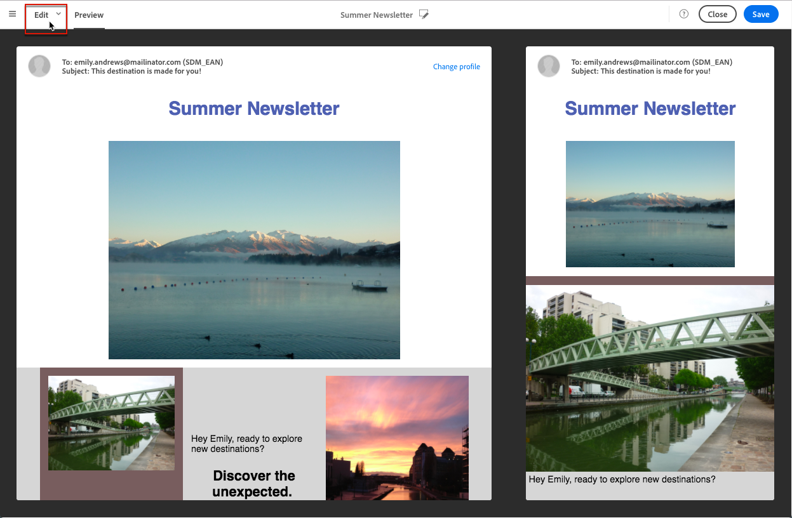

# Previewing messages{#previewing-messages}

After adding test profiles in the **[!UICONTROL Audience]** window, you can preview your message to check its personalization and how your recipients will see your delivery.

1. In the [Email Designer](../../designing/using/about-email-content-design.md#about-the-email-designer), click the **[!UICONTROL Preview]** button.

   

   Una visualizzazione desktop e una visualizzazione mobile reattiva dell'e-mail sono visualizzate affiancati.

1. Durante ogni anteprima viene eseguito un controllo antispam automatico. Click the **[!UICONTROL Anti-spam analysis]** button to find out more about the warning.

   

1. Select the **[!UICONTROL Change profile]** button to choose the test profile you want to test the personalization elements on.
1. To exit the **[!UICONTROL Preview]** mode, click the **[!UICONTROL Edit]** button on top left of the screen.

   

