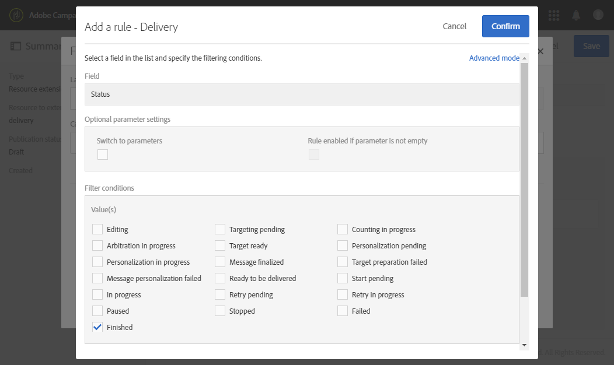

# Ricezione degli avvisi in caso di errori{#receiving-alerts-when-failures-happen}

## Informazioni sugli avvisi sulla consegna {#about-delivery-alerting}

La funzionalità **Avvisi di consegna** è un sistema di gestione degli avvisi che consente a un gruppo di utenti di ricevere automaticamente le notifiche contenenti informazioni sull&#39;esecuzione delle consegne.

Le notifiche inviate contengono un rapporto basato per impostazione predefinita sui seguenti criteri:

* Consegne non riuscite
* Consegne con preparazione non riuscita
* Consegne con una proporzione di errori di mancati recapiti non permanenti non valida
* Consegne con un rapporto di errore non recapitabile non valido
* Consegne con stato in sospeso più lungo del solito
* Consegne a bassa velocità
* Consegne in corso

I destinatari degli avvisi possono monitorare le consegne in fase di elaborazione da parte di Adobe Campaign e intraprendere azioni appropriate in caso di problemi nell’esecuzione.

Queste notifiche di avviso possono essere personalizzate in base a criteri di avviso specifici definiti tramite una dashboard nell’interfaccia di Adobe Campaign.

>[!NOTE]
>
>Le notifiche di avviso vengono inviate solo tramite e-mail.

Le notifiche inviate contengono:

* **[!UICONTROL Summary]** che mostra il numero di consegne che soddisfano i criteri definiti e l&#39;etichetta/colore scelto per ciascun criterio.
* Una sezione **[!UICONTROL Details]** che elenca tutti i criteri di consegna definiti per il dashboard corrispondente e tutte le consegne per ciascun criterio.

## Dashboard di avvisi di consegna {#delivery-alerting-dashboards}

### Informazioni sulle dashboard degli avvisi di consegna {#about-delivery-alerting-dashboards}

Per gestire i destinatari delle notifiche, definire i criteri di avviso e accedere alla cronologia degli avvisi, è necessario utilizzare le dashboard.

>[!NOTE]
>
>Per accedere e configurare le dashboard e i criteri di avviso, è necessario disporre dei diritti di amministrazione o essere inclusi nel gruppo di sicurezza **Supervisori consegna**. Gli utenti standard non possono accedere alle dashboard nell’interfaccia di Adobe Campaign. Possono solo ricevere le notifiche di avviso. Per ulteriori informazioni sugli utenti e sulla sicurezza in Adobe Campaign, consulta [Tipi di utenti](../../administration/using/users-management.md) e [Informazioni sui gruppi di sicurezza](../../administration/using/managing-groups-and-users.md#about-security-groups).

Dall’interfaccia di Adobe Campaign, puoi:

* Crea e gestisci dashboard di avviso sulla consegna. Consulta [Creazione di un dashboard di avvisi di consegna](#creating-a-delivery-alerting-dashboard).
* Definisci e gestisci i criteri di avviso di consegna per ogni dashboard. Ad esempio, puoi creare avvisi basati su consegne con preparazione non riuscita o consegne con una sola velocità effettiva ridotta. Consulta [Informazioni sui criteri di avviso](#about-alerting-criteria).
* Modificate i parametri dei criteri per ciascun quadro comandi. Vedi [Parametri dei criteri](#criteria-parameters).
* Definisci un gruppo di destinatari per ogni dashboard.

  Ad esempio, desideri informare solo gli utenti con diritti di amministrazione delle consegne non riuscite. Tuttavia, desideri che gli utenti marketing ricevano informazioni sulle consegne con una percentuale di errori non validi di soft bounce. Pertanto, devi creare due dashboard diversi e definire i criteri desiderati per ciascun gruppo di destinatari.

* Accedi alla cronologia di tutti gli avvisi inviati per ogni dashboard.

  Quando si seleziona un dashboard, per impostazione predefinita viene visualizzato l’ultimo avviso inviato per il dashboard. Tutti gli avvisi inviati sono elencati a sinistra dello schermo. Fare clic su un elemento nell&#39;elenco **[!UICONTROL History]** per accedere agli avvisi corrispondenti.

### Creazione di un dashboard di avvisi sulla consegna {#creating-a-delivery-alerting-dashboard}

Se desideri inviare notifiche in base a criteri specifici a diversi gruppi di utenti, devi utilizzare diversi dashboard. Per creare un nuovo dashboard:

1. Vai a **[!UICONTROL Administration]** > **[!UICONTROL Channels]** > **[!UICONTROL Delivery alerting]**.
1. Seleziona **[!UICONTROL Delivery alerting dashboards]** e fai clic su **[!UICONTROL Create]**.
1. Selezionare la casella **[!UICONTROL Enabled]** per attivare il dashboard corrente.

   Se questa opzione è disabilitata, le notifiche collegate a questo dashboard non vengono più inviate. Questa opzione è disabilitata per impostazione predefinita.

   

1. Selezionare il gruppo di destinatari a cui si desidera inviare la notifica dall&#39;elenco a discesa **[!UICONTROL Alert group]**. Per modificare o creare un gruppo, vedere [Creazione di un gruppo di sicurezza e assegnazione di utenti](../../administration/using/managing-groups-and-users.md#creating-a-security-group-and-assigning-users).
1. Dalla sezione **[!UICONTROL Delivery alerting criteria]**, fai clic su **[!UICONTROL Create element]** per aggiungere criteri. Consulta [Informazioni sui criteri di avviso](#about-alerting-criteria).
1. Selezionare il pulsante **[!UICONTROL Edit properties]**. Nella scheda **[!UICONTROL Criteria parameters]**, definisci come verranno applicati i criteri. Vedi [Parametri dei criteri](#criteria-parameters).
1. Fare clic su **[!UICONTROL Create]** per salvare il dashboard.

Ora, ogni volta che una consegna soddisfa i criteri definiti in questa dashboard, viene inviata una notifica di avviso al gruppo di utenti specificato.

## Criteri per gli avvisi di consegna {#delivery-alerting-criteria}

### Informazioni sui criteri di avviso {#about-alerting-criteria}

Per accedere ai criteri di avviso sulla consegna, vai a **[!UICONTROL Administration]** > **[!UICONTROL Channels]** > **[!UICONTROL Delivery alerting]** e seleziona **[!UICONTROL Delivery alerting criteria]**.

I seguenti criteri possono essere utilizzati nelle dashboard degli avvisi di consegna:

* **[!UICONTROL Deliveries failed]**: qualsiasi consegna pianificata entro un intervallo definito, con uno stato errato.
* **[!UICONTROL Deliveries with preparation failed]**: qualsiasi consegna modificata all&#39;interno di un intervallo definito, per la quale il passaggio di preparazione (calcolo della destinazione e generazione del contenuto) non è riuscito. Per ulteriori informazioni, vedere [Preparazione dell&#39;invio](../../sending/using/preparing-the-send.md).
* **[!UICONTROL Delivery with bad error ratio for soft bounces]**: qualsiasi consegna pianificata all’interno di un intervallo definito, con uno stato di almeno **[!UICONTROL In progress]**, con un rapporto di errore di mancato recapito non permanente maggiore di una percentuale definita.
* **[!UICONTROL Delivery with bad error ratio for hard bounces]**: qualsiasi consegna pianificata all’interno di un intervallo definito, con uno stato di almeno **[!UICONTROL In progress]**, con un rapporto di errore di mancato recapito permanente maggiore di una percentuale definita.
* **[!UICONTROL Deliveries with long start pending]**: qualsiasi consegna pianificata all&#39;interno di un intervallo definito, con uno stato **[!UICONTROL Start pending]** per un periodo di tempo superiore a quello definito; lo stato **[!UICONTROL Start pending]** indica che i messaggi non sono ancora stati presi in considerazione dal sistema.
* **[!UICONTROL Deliveries with low throughput]**: qualsiasi consegna iniziata per più di una durata definita, con meno di una percentuale definita di messaggi elaborati, con una velocità effettiva inferiore a un valore definito.
* **[!UICONTROL Deliveries in progress]**: qualsiasi consegna pianificata entro un intervallo definito, con lo stato **[!UICONTROL In progress]**.

>[!NOTE]
>
>Tutti i parametri che si applicano ai criteri di cui sopra hanno valori di default. Questi valori possono essere modificati nella scheda **[!UICONTROL Criteria parameters]** dei dashboard di avviso della consegna. Vedi [Parametri dei criteri](#criteria-parameters).

È possibile selezionare qualsiasi elemento dall&#39;elenco **[!UICONTROL Delivery alerting criteria]** per accedere ai relativi dettagli.

Per ciascun criterio, puoi definire le seguenti impostazioni:

* **[!UICONTROL Indicators to add in alerts]**, ovvero le colonne che verranno visualizzate nella sezione **[!UICONTROL Details]** della notifica per le consegne corrispondenti al criterio selezionato.

  

* **[!UICONTROL Alert type]**, ovvero l&#39;etichetta e il colore che verranno visualizzati accanto al criterio di consegna nel riepilogo della notifica.

  

* **[!UICONTROL Criteria frequency]**: se un criterio è soddisfatto per una consegna, viene ripetuto in ogni notifica inviata entro il periodo di monitoraggio. In caso contrario, verrà inviato un solo avviso al giorno (alla prima occorrenza) in base al criterio di avviso per una consegna.

  Per impostazione predefinita, questa opzione è impostata su una volta al giorno per tutti i criteri.

**Argomenti correlati:**

* [Registri di invio](../../sending/using/monitoring-a-delivery.md#sending-logs)
* [Frequenza degli avvisi](#alerting-frequency)
* [Icone e stati dell’attività di marketing](../../start/using/marketing-activities.md#marketing-activity-icons-and-statuses)

### Creazione di un criterio di avviso sulla consegna {#creating-a-delivery-alerting-criterion}

Puoi creare nuovi criteri di avviso sulla consegna per soddisfare meglio le tue esigenze.

Ad esempio, puoi creare un nuovo criterio che consenta di inviare una notifica elencando tutte le consegne con uno stato **[!UICONTROL Finished]**.

A questo scopo, devi innanzitutto estendere la risorsa **Delivery** e aggiungere un nuovo filtro che ti consenta di selezionare solo le consegne con uno stato **[!UICONTROL Finished]**.

1. Vai a **Adobe Campaign** > **Amministrazione** > **Sviluppo** > **Risorse personalizzate** e fai clic su **[!UICONTROL Create]**.
1. Selezionare **[!UICONTROL Extend an existing resource]**, selezionare la risorsa **[!UICONTROL Delivery]** dall&#39;elenco a discesa e fare clic su **[!UICONTROL Create]** per modificarla.

   

   Per ulteriori informazioni sull&#39;estensione di una risorsa esistente, vedere [Definire la risorsa](../../developing/using/creating-or-extending-the-resource.md).

1. Nella risorsa **[!UICONTROL Delivery]**, vai alla scheda **[!UICONTROL Filter definition]** e fai clic su **[!UICONTROL Add an element]** per creare un filtro.

   

1. Modifica la nuova definizione del filtro: nella finestra **[!UICONTROL Filter definition]**, trascina e rilascia l&#39;elemento **[!UICONTROL Status]** nell&#39;area di lavoro e seleziona **[!UICONTROL Finished]** come condizione del filtro.

   

   Per ulteriori informazioni sulla creazione e la modifica di filtri personalizzati, vedere [Definire i filtri](../../developing/using/configuring-filter-definition.md).

1. Salva le modifiche e pubblica le risorse. Per ulteriori informazioni, consulta [Pubblicazione di una risorsa personalizzata](../../developing/using/updating-the-database-structure.md#publishing-a-custom-resource).

   Il filtro viene creato e ora può essere selezionato in un nuovo criterio di avviso sulla consegna.

1. Vai a **[!UICONTROL Administration]** > **[!UICONTROL Channels]** > **[!UICONTROL Delivery alerting]**, seleziona **[!UICONTROL Delivery alerting criteria]** e fai clic su **[!UICONTROL Create]**.
1. Nell&#39;elenco a discesa **[!UICONTROL Delivery filter applied by this criterion]** selezionare il filtro appena creato.

   

   È possibile definire le impostazioni del criterio allo stesso modo dei criteri predefiniti. Consulta [Informazioni sui criteri di avviso](#about-alerting-criteria).

Una volta creati, questi criteri possono essere aggiunti a una dashboard di avvisi di consegna e ad altri criteri. Consulta [Informazioni sulle dashboard di avviso per la consegna](#about-delivery-alerting-dashboards).

**Argomento correlato:**

[Aggiunta o estensione di una risorsa](../../developing/using/key-steps-to-add-a-resource.md)

## Parametri di avviso sulla consegna {#delivery-alerting-parameters}

### Parametri dei criteri {#criteria-parameters}

Nella scheda **[!UICONTROL Criteria parameters]** di un [dashboard di avvisi di consegna](#creating-a-delivery-alerting-dashboard), puoi definire le impostazioni che si applicano ai criteri selezionati in questo dashboard.

* **[!UICONTROL Delivery target minimum size]**: ad esempio, se immetti 100 in questo campo, una notifica viene inviata solo per le consegne con una destinazione uguale o superiore a 100 destinatari. Questo parametro si applica a tutti i criteri.
* **[!UICONTROL Monitoring period before and after the contact date (in hours)]**: numero di ore prima e dopo l&#39;ora corrente. Vengono prese in considerazione solo le consegne con una data di contatto in questo intervallo di tempo. Questo parametro si applica a tutti i criteri. Per impostazione predefinita, il valore di questo campo è impostato su 24 ore.

  Per ulteriori informazioni sulla data di contatto, vedere [Informazioni sulla pianificazione](../../sending/using/about-scheduling-messages.md).

* **[!UICONTROL Maximum ratio of soft bounce errors]**: viene inviata una notifica per tutte le consegne con un rapporto di errore di mancato recapito non permanente maggiore del valore specificato. Per impostazione predefinita, il valore di questo campo è 0,05 (5%).

  Per ulteriori informazioni sugli errori di recapito non permanente, vedere [Qualifica per la posta non recapitata](../../sending/using/understanding-delivery-failures.md#bounce-mail-qualification) e [Elenco dei tipi di errori di recapito](../../sending/using/understanding-delivery-failures.md#delivery-failure-types-and-reasons).

* **[!UICONTROL Maximum ratio of hard bounce errors]**: viene inviata una notifica per tutte le consegne con un rapporto di errore di mancato recapito maggiore del valore specificato. Per impostazione predefinita, il valore di questo campo è 0,05 (5%).

  Per ulteriori informazioni sugli errori di mancato recapito, consulta [Qualificazione di mail non recapitate](../../sending/using/understanding-delivery-failures.md#bounce-mail-qualification) e [Elenco dei tipi di errori di consegna](../../sending/using/understanding-delivery-failures.md#delivery-failure-types-and-reasons).

* **[!UICONTROL Minimum time threshold for delivery in 'Start pending' status (in minutes)]**: viene inviata una notifica per tutte le consegne con stato **[!UICONTROL Start pending]** per un periodo più lungo di quello specificato in questo campo. Stato **[!UICONTROL Start pending]** indica che i messaggi non sono ancora stati presi in considerazione dal sistema.
* **[!UICONTROL Minimum time required for the computation of the throughput (in minutes)]**: per il criterio **[!UICONTROL Deliveries with low throughput]** vengono considerate solo le consegne avviate (con stato **[!UICONTROL In progress]**) per una durata superiore a quella specificata.
* **[!UICONTROL Maximum percentage of processed messages for the computation of the throughput]**: solo le consegne con una percentuale di messaggi elaborati inferiore alla percentuale specificata vengono prese in considerazione per il criterio **[!UICONTROL Deliveries with low throughput]**.
* **[!UICONTROL Minimum expected throughput (in sent messages per hour)]**: solo le consegne con una velocità effettiva inferiore al valore specificato vengono considerate per il criterio **[!UICONTROL Deliveries with low throughput]**.
* **[!UICONTROL Minimum processed ratio required for 'Deliveries in progress' criterion]**: vengono prese in considerazione solo le consegne con una percentuale di messaggi elaborati superiore alla percentuale specificata.

### Frequenza degli avvisi {#alerting-frequency}

L&#39;opzione **[!UICONTROL Frequency of delivery alerting]** consente di definire il ritardo tra due invii di avvisi. Per impostazione predefinita è impostato su 10 minuti.

È possibile modificare questa impostazione tramite il menu **[!UICONTROL Administration]** > **[!UICONTROL Application settings]** > **[!UICONTROL Options]**.

>[!NOTE]
>
>Questa opzione è applicabile a tutte le dashboard definite in Adobe Campaign. Non è possibile impostare una frequenza specifica per ogni dashboard.

## Motivi degli avvisi sulla consegna {#delivery-alerting-reasons}

La funzionalità **Avvisi di consegna** consente a tutti gli utenti Adobe Campaign coinvolti di essere automaticamente informati sullo stato di esecuzione della consegna tramite e-mail e dashboard.

Ora, quando ricevi una notifica di avviso sulla consegna, ecco alcuni suggerimenti su cosa puoi fare.

Prima di tutto, controlla la scheda **Registro** della consegna per visualizzare tutte le informazioni relative alla consegna e alle bozze. Le icone rosse e gialle consentono di identificare errori o avvisi. L’icona rossa indica un errore critico che impedisce l’avvio della consegna.

Per visualizzare la cronologia di ogni occorrenza di una consegna, selezionare la scheda **[!UICONTROL Sending logs]**. Contiene l’elenco dei messaggi inviati e i relativi stati. È possibile controllare lo stato di consegna per ogni destinatario ( **[!UICONTROL Sent]**, **[!UICONTROL Pending]**, **[!UICONTROL Failed]**, ecc.). Per ulteriori informazioni, consulta [Sending logs](../../sending/using/monitoring-a-delivery.md#sending-logs).

Di seguito sono riportati alcuni possibili motivi per ricevere notifiche di avviso in base ai criteri soddisfatti per una consegna.

* **[!UICONTROL Deliveries failed]**: questo criterio fornisce informazioni su tutte le consegne con uno stato errato. Può essere dovuto a:

   * Un problema con il server di consegna (MTA, agente di trasferimento messaggi)
   * Timeout di connessione tra il server di consegna Adobe Campaign e il server ricevente
   * Un problema di recapito messaggi
   * Un flusso di lavoro errato

  Se la consegna viene attivata con un flusso di lavoro, verifica che il flusso di lavoro sia stato avviato correttamente. Per ulteriori informazioni, vedere [Esecuzione di un flusso di lavoro](../../automating/using/about-workflow-execution.md). In caso contrario, contatta il tuo amministratore Adobe Campaign per risolvere il problema.

* **[!UICONTROL Deliveries with preparation failed]**: è possibile che si verifichi un errore durante la preparazione della consegna nei seguenti casi:

   * Oggetto mancante nella consegna.
   * Nei campi di personalizzazione è presente una sintassi errata.
   * Destinazione mancante.
   * La consegna supera il limite di dimensioni.

  Per ulteriori informazioni, vedere [Preparazione dell&#39;invio](../../sending/using/preparing-the-send.md). Tuttavia, questi errori vengono generalmente individuati durante l’analisi dei messaggi. Vedi [Regole di controllo](../../sending/using/control-rules.md).

* Le possibili cause di un avviso **[!UICONTROL Delivery with bad error ratio for soft bounces]** possono essere:

   * Il server del destinatario non è attivo.
   * La cassetta postale del destinatario è piena.

  Per ulteriori informazioni, controlla le schede **[!UICONTROL Exclusion logs]** e **[!UICONTROL Exclusion causes]** dei registri di consegna. Consulta [Registri di esclusione](../../sending/using/monitoring-a-delivery.md#exclusion-logs).

  Le possibili cause di un avviso **[!UICONTROL Delivery with bad error ratio for hard bounces]** possono essere:

   * Il destinatario viene aggiunto al inserisco nell&#39;elenco Bloccati di, il che significa che non desidera più essere contattato.
   * L’indirizzo e-mail del destinatario non esiste.
   * Il dominio del destinatario non esiste.
   * Il server del destinatario sta bloccando la consegna.

  Per evitare errori di mancato recapito non permanenti e permanenti, segui le best practice riportate di seguito:

   * Genera regole di tipologia di filtro per escludere una parte del target del messaggio durante l’analisi della consegna, ad esempio i destinatari in quarantena. Vedere [Creazione di una regola di filtro](../../sending/using/filtering-rules.md).
   * Aggiorna regolarmente il database dei clienti per mantenere processi di gestione della quarantena ottimali. Consulta [Informazioni sulla quarantena](../../sending/using/understanding-quarantine-management.md#about-quarantines).
   * In generale, migliora il più possibile il recapito messaggi. Consulta la documentazione dettagliata di Adobe Campaign [Deliverability](../../sending/using/about-deliverability.md) e contatta il tuo amministratore di Adobe Campaign per assistenza.

* **[!UICONTROL Deliveries with long start pending]**: in genere questo significa che si è verificato un problema a livello dell&#39;MTA (Message Transfer Agent). Il processo di esecuzione è in attesa della disponibilità di alcune risorse. L’MTA potrebbe non essere stato avviato.

  **[!UICONTROL Deliveries with low throughput]**: anche in questo caso, si tratta di un problema di recapito messaggi che significa che l’MTA è troppo lento.

  Per ulteriori informazioni su questi problemi, contatta il tuo amministratore Adobe Campaign.

**Argomenti correlati:**

* [Informazioni sugli errori di consegna](../../sending/using/understanding-delivery-failures.md)
* [Informazioni sulla gestione della quarantena](../../sending/using/understanding-quarantine-management.md)
* [Informazioni su consenso e rinuncia in Campaign](../../audiences/using/about-opt-in-and-opt-out-in-campaign.md)
