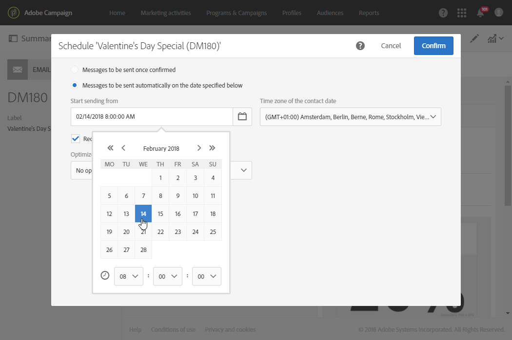

# Invio di messaggi con il fuso orario del destinatario{#sending-messages-at-the-recipient-s-time-zone}

Quando gestisci una campagna in cui la data e l’ora sono importanti, puoi pianificare una consegna che tenga conto dell’ora locale di ciascun destinatario: e-mail, SMS o notifiche push verranno ricevuti all’ora pianificata, nel relativo fuso orario.

>[!NOTE]
>
>Per utilizzare questa funzionalità, accertati che tutti i profili di destinazione per la consegna abbiano un fuso orario specificato nella sezione **[!UICONTROL Address]** delle relative proprietà. Per ulteriori informazioni sull’accesso alle proprietà dei profili, consulta questa [sezione](../../audiences/using/editing-profiles.md).

Per inviare una consegna al fuso orario del destinatario, puoi utilizzare anche l’attività **[!UICONTROL Scheduler]** in un flusso di lavoro. Per ulteriori informazioni, consulta questa [pagina](../../automating/using/scheduler.md).

Nell’esempio seguente, si desidera inviare un codice promozionale valido solo per il giorno di San Valentino a tutti i clienti in tutto il mondo. Per avere il tempo sufficiente per utilizzarlo durante il giorno, tutti i clienti devono ricevere il messaggio il 14 febbraio alle 8 in base al proprio fuso orario.

1. Nella scheda **[!UICONTROL Marketing activities]**, inizia a creare la consegna, nel nostro caso un’e-mail. Per ulteriori informazioni sulla creazione di una consegna, consulta questa [sezione](../../channels/using/creating-an-email.md).
1. Dopo aver progettato l’e-mail di San Valentino, fai clic su **[!UICONTROL Create]** per accedere al dashboard di consegna. Per ulteriori informazioni sulla progettazione delle e-mail, consulta questa [pagina](../../designing/using/personalization.md#example-email-personalization).

   

1. Dal dashboard di consegna, seleziona il blocco **[!UICONTROL Schedule]**.

   

1. Seleziona l’opzione **[!UICONTROL Messages to be sent automatically on the date]** specificata di seguito. Quindi nel campo **[!UICONTROL Start sending from]**, imposta la data di contatto, nel nostro caso il 14 febbraio alle 8 in modo tale che ogni destinatario lo riceva il giorno di San Valentino.

   

1. Nel campo **[!UICONTROL Time zone of the contact date]**, seleziona il fuso orario in cui la consegna deve essere inviata per impostazione predefinita.

   Se il **[!UICONTROL Time zone]** di un profilo viene lasciato come **[!UICONTROL Default]**, i destinatari riceveranno la consegna in base al fuso orario scelto.

1. Dal menu a discesa **[!UICONTROL Optimize the sending time per recipient]**, scegli **[!UICONTROL Send at the recipient's time zone]**. Ciò consente ai destinatari di ricevere l’e-mail del giorno di San Valentino il 14 febbraio, in base al proprio fuso orario.

   

1. Dopo aver confermato la pianificazione per la consegna, fai clic sul pulsante **[!UICONTROL Prepare]** e quindi **[!UICONTROL Confirm]** la consegna.

   Assicurati di confermare l’invio con almeno 24 ore di anticipo. In caso contrario, a seconda della loro posizione, alcuni destinatari potrebbero ricevere la consegna prima dell’evento effettivo del giorno di San Valentino.

   

Indipendentemente dal luogo in cui si trovano, tutti i destinatari riceveranno il messaggio il 14 febbraio alle 8 ora locale.
